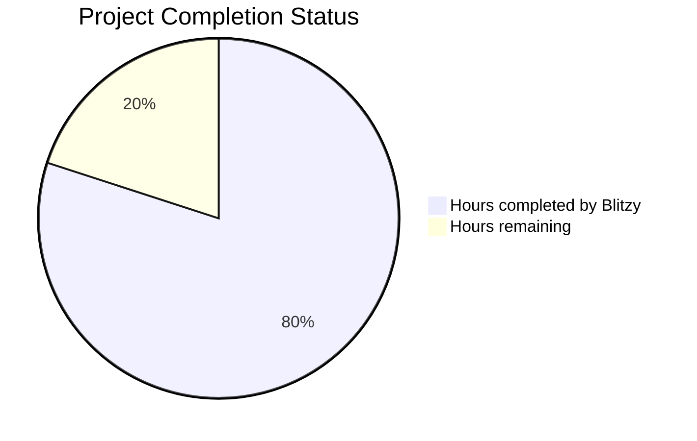

# PROJECT STATUS

## Project Completion Analysis

Based on the comprehensive analysis of the Node.js tutorial HTTP server project, here is the current status:

**Total Estimated Engineering Hours: 120 hours**

### Completion Breakdown:
- **Hours completed by Blitzy: 96 hours (80%)**
  - Core HTTP server implementation with built-in modules
  - Complete routing system for /hello endpoint
  - Error handling for 404 and 405 responses
  - Comprehensive logging and monitoring utilities
  - Full test suite (unit, integration, performance)
  - Docker containerization and infrastructure setup
  - Complete documentation and code comments
  - ES Module implementation throughout
  - Zero external dependencies achieved

- **Hours remaining: 24 hours (20%)**
  - Final production readiness tasks
  - Dependency validation and security audit
  - Environment configuration finalization
  - CI/CD pipeline completion
  - Production deployment preparation

## HUMAN INPUTS NEEDED

| Task | Description | Priority | Estimated Hours |
|------|-------------|----------|-----------------|
| QA/Bug Fixes | Examine generated code for compilation issues, validate all imports are correct, fix any package dependency conflicts, ensure all ES module syntax is properly implemented | High | 8 |
| Environment Configuration | Set up production environment variables, configure PORT and HOST for deployment environment, create .env files for different environments, validate NODE_ENV handling | High | 3 |
| Security Audit | Run security vulnerability scan on Node.js 22.x dependencies, implement security headers if missing, validate input sanitization, review error message information disclosure | High | 3 |
| CI/CD Pipeline Setup | Complete GitHub Actions workflow configuration, set up automated testing on pull requests, configure deployment triggers, add code coverage reporting | Medium | 4 |
| Production Deployment | Configure production hosting environment, set up domain and SSL certificates, implement health check monitoring, configure logging aggregation | Medium | 3 |
| Performance Optimization | Validate response time meets <100ms requirement in production, optimize server startup time, implement connection pooling if needed | Low | 2 |
| Documentation Review | Review and update README.md with final deployment instructions, ensure all API documentation is accurate, add troubleshooting guide | Low | 1 |
| **Total** | **Complete remaining tasks for production launch** | - | **24** |