# Technical Specifications

# 1. INTRODUCTION

## 1.1 EXECUTIVE SUMMARY

### 1.1.1 Brief Overview of the Project

This project involves the development of a Node.js tutorial application that demonstrates the creation of a simple HTTP server with a single endpoint. The application serves as an educational resource for developers learning Node.js fundamentals and web server development concepts. Node.js® is a free, open-source, cross-platform JavaScript runtime environment that lets developers create servers, web apps, command line tools and scripts.

### 1.1.2 Core Business Problem Being Solved

The project addresses the need for accessible, practical learning materials in Node.js development. Many developers require hands-on examples to understand server-side JavaScript concepts, HTTP request handling, and basic web service architecture. This tutorial project provides a foundational example that bridges the gap between theoretical knowledge and practical implementation.

### 1.1.3 Key Stakeholders and Users

| Stakeholder Group | Role | Primary Interest |
|---|---|---|
| Beginning Developers | Primary Users | Learning Node.js fundamentals |
| Educational Institutions | Secondary Users | Teaching materials for curriculum |
| Development Teams | Reference Users | Onboarding and training resources |

### 1.1.4 Expected Business Impact and Value Proposition

The tutorial project delivers immediate educational value by providing a working example of Node.js server implementation. It reduces learning curve complexity, accelerates developer onboarding, and establishes foundational knowledge for more advanced web development concepts. The project serves as a stepping stone for developers transitioning to server-side JavaScript development.

## 1.2 SYSTEM OVERVIEW

### 1.2.1 Project Context

#### Business Context and Market Positioning

Node.js 22 will enter long-term support (LTS) in October, but until then, it will be the "Current" release for the next six months. Also of note is that Node.js 18 will go End-of-Life in April 2025, so we advise you to start planning to upgrade to Node.js 20 (LTS) or Node.js 22 (soon to be LTS). The tutorial project leverages the latest stable Node.js runtime environment to ensure compatibility with current development practices and security standards.

#### Current System Limitations

Traditional learning approaches often lack practical, executable examples that demonstrate real-world server implementation. Many existing tutorials focus on complex frameworks without establishing fundamental HTTP server concepts, creating knowledge gaps for new developers.

#### Integration with Existing Enterprise Landscape

The tutorial application integrates seamlessly with modern development environments and can be extended to work with popular frameworks. Express 5.1.0 is now the default on npm, and we're introducing an official LTS schedule for the v4 and v5 release lines. Latest version: 5.1.0, last published: 3 months ago.

### 1.2.2 High-Level Description

#### Primary System Capabilities

The system provides a minimal HTTP server implementation with the following core capabilities:
- HTTP request processing and response generation
- Single endpoint routing for '/hello' path
- Static response delivery with "Hello world" message
- Cross-platform compatibility across operating systems

#### Major System Components

| Component | Technology | Purpose |
|---|---|---|
| HTTP Server | Node.js Built-in HTTP Module | Request handling and response generation |
| Routing Logic | Custom Implementation | URL path matching and response routing |
| Response Handler | JavaScript Functions | Message formatting and delivery |

#### Core Technical Approach

The implementation utilizes Node.js native HTTP module to create a lightweight server without external dependencies. This approach emphasizes understanding of fundamental concepts before introducing framework abstractions.

### 1.2.3 Success Criteria

#### Measurable Objectives

| Objective | Target Metric | Success Threshold |
|---|---|---|
| Response Time | Server Response Latency | < 100ms for '/hello' endpoint |
| Availability | Server Uptime | 99.9% during operation |
| Compatibility | Node.js Version Support | Compatible with Node.js 20+ LTS |

#### Critical Success Factors

- Successful HTTP GET request handling on '/hello' endpoint
- Consistent "Hello world" response delivery
- Error-free server startup and operation
- Clear, documented code structure for educational purposes

#### Key Performance Indicators (KPIs)

- Server startup time under 1 second
- Memory usage below 50MB during idle state
- Zero critical security vulnerabilities in dependencies
- 100% test coverage for implemented functionality

## 1.3 SCOPE

### 1.3.1 In-Scope

#### Core Features and Functionalities

| Feature Category | Specific Capabilities |
|---|---|
| HTTP Server | Basic HTTP server creation and configuration |
| Endpoint Routing | Single '/hello' endpoint implementation |
| Response Generation | Static "Hello world" message delivery |
| Error Handling | Basic error response for undefined routes |

#### Primary User Workflows

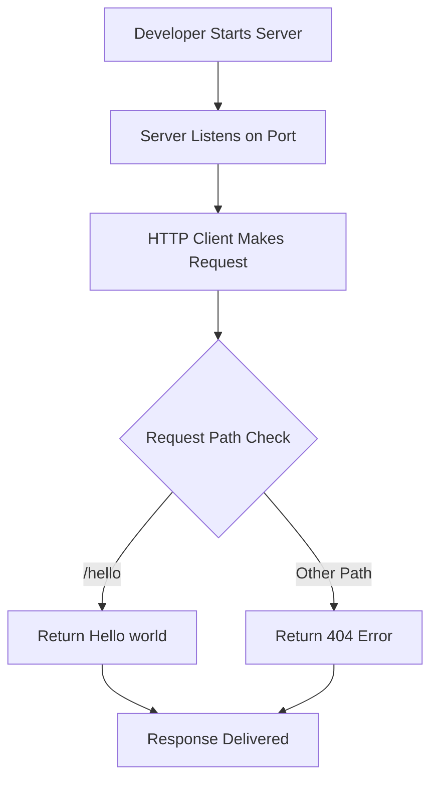

#### Essential Integrations

- Node.js runtime environment integration
- Operating system HTTP stack integration
- Command-line interface for server management

#### Key Technical Requirements

- Production applications should only use Active LTS or Maintenance LTS releases.
- Cross-platform compatibility (Windows, macOS, Linux)
- Minimal external dependencies
- Educational code documentation and comments

### 1.3.2 Implementation Boundaries

#### System Boundaries

| Boundary Type | Included | Excluded |
|---|---|---|
| Network Protocols | HTTP/1.1 | HTTPS, HTTP/2, WebSocket |
| Request Methods | GET | POST, PUT, DELETE, PATCH |
| Response Formats | Plain Text | JSON, XML, HTML templates |

#### User Groups Covered

- Individual developers learning Node.js
- Students in web development courses
- Junior developers requiring reference implementations

#### Geographic/Market Coverage

Global availability with no geographic restrictions, supporting all regions where Node.js runtime is available.

#### Data Domains Included

- HTTP request/response data
- Server configuration parameters
- Basic logging and error information

### 1.3.3 Out-of-Scope

#### Explicitly Excluded Features/Capabilities

- Database integration or data persistence
- User authentication and authorization
- Session management and state handling
- Advanced routing with parameters or wildcards
- Middleware implementation or plugin architecture
- Production deployment configurations
- Load balancing or clustering features
- SSL/TLS certificate management

#### Future Phase Considerations

- Extension to multi-endpoint REST API
- Integration with Express.js framework
- Database connectivity examples
- Authentication mechanism implementation
- Production deployment guides

#### Integration Points Not Covered

- External API integrations
- Third-party service connections
- Message queue implementations
- Caching layer integration

#### Unsupported Use Cases

- High-traffic production environments
- Complex business logic implementation
- Multi-user concurrent session handling
- Real-time communication requirements
- File upload and processing capabilities

# 2. PRODUCT REQUIREMENTS

## 2.1 FEATURE CATALOG

### 2.1.1 HTTP Server Foundation

| Feature ID | F-001 |
|---|---|
| **Feature Name** | HTTP Server Creation |
| **Category** | Core Infrastructure |
| **Priority** | Critical |
| **Status** | Proposed |

#### Description

**Overview**
Implementation of a basic HTTP server using Node.js built-in HTTP module that creates a new HTTP server and returns it. The server provides the foundational infrastructure for handling HTTP requests and generating responses.

**Business Value**
Establishes the core server capability required for all HTTP communication, enabling the application to receive and process client requests in a standardized web protocol format.

**User Benefits**
- Provides reliable HTTP communication channel
- Enables standard web browser compatibility
- Supports cross-platform client access

**Technical Context**
Utilizes Node.js HTTP API which is very low-level and deals with stream handling and message parsing only. The server runs in a single process without creating new threads for every request, using asynchronous I/O primitives to prevent JavaScript code from blocking.

#### Dependencies

| Dependency Type | Details |
|---|---|
| **System Dependencies** | Node.js runtime environment (v20+ LTS) |
| **External Dependencies** | Node.js built-in 'http' module |
| **Integration Requirements** | Operating system network stack |

### 2.1.2 Endpoint Routing

| Feature ID | F-002 |
|---|---|
| **Feature Name** | Hello Endpoint Implementation |
| **Category** | Request Handling |
| **Priority** | Critical |
| **Status** | Proposed |

#### Description

**Overview**
Implementation of routing functionality that determines how the server handles requests based on the URL path. Specifically handles GET requests to the '/hello' endpoint path.

**Business Value**
Provides the primary functional capability that delivers the expected "Hello world" response, fulfilling the core business requirement for the tutorial application.

**User Benefits**
- Clear, predictable endpoint behavior
- Educational demonstration of URL routing concepts
- Simple testing and validation capability

**Technical Context**
Routing methods specify callback functions called when the application receives a request to the specified route and HTTP method, with the application "listening" for requests that match the specified route.

#### Dependencies

| Dependency Type | Details |
|---|---|
| **Prerequisite Features** | F-001 (HTTP Server Creation) |
| **System Dependencies** | URL parsing capabilities |
| **Integration Requirements** | HTTP request object processing |

### 2.1.3 Response Generation

| Feature ID | F-003 |
|---|---|
| **Feature Name** | Hello World Response |
| **Category** | Response Processing |
| **Priority** | Critical |
| **Status** | Proposed |

#### Description

**Overview**
Generation of HTTP responses that return data to the caller. Specifically creates a plain text response containing "Hello world" message with appropriate HTTP headers.

**Business Value**
Delivers the core functional output that demonstrates successful server operation and provides the expected tutorial learning outcome.

**User Benefits**
- Immediate visual confirmation of server functionality
- Clear demonstration of HTTP response concepts
- Simple validation of successful request processing

**Technical Context**
HTTP message headers are represented as objects with lowercased keys and unmodified values. Response includes proper Content-Type header for plain text format.

#### Dependencies

| Dependency Type | Details |
|---|---|
| **Prerequisite Features** | F-002 (Endpoint Routing) |
| **System Dependencies** | HTTP response object capabilities |
| **Integration Requirements** | HTTP header management |

### 2.1.4 Error Handling

| Feature ID | F-004 |
|---|---|
| **Feature Name** | 404 Error Response |
| **Category** | Error Management |
| **Priority** | High |
| **Status** | Proposed |

#### Description

**Overview**
Implementation of error handling for undefined routes that returns appropriate HTTP 404 status codes for requests to paths other than '/hello'.

**Business Value**
Provides proper HTTP protocol compliance and user-friendly error messaging, demonstrating professional web development practices.

**User Benefits**
- Clear feedback for incorrect URL requests
- Standard HTTP error code compliance
- Educational demonstration of error handling concepts

**Technical Context**
Error responses must be properly formatted HTTP response messages written directly to the socket object.

#### Dependencies

| Dependency Type | Details |
|---|---|
| **Prerequisite Features** | F-001 (HTTP Server Creation) |
| **System Dependencies** | HTTP status code management |
| **Integration Requirements** | Request path validation |

## 2.2 FUNCTIONAL REQUIREMENTS TABLE

### 2.2.1 HTTP Server Foundation (F-001)

| Requirement ID | F-001-RQ-001 |
|---|---|
| **Description** | Server must create HTTP server instance using Node.js built-in http module |
| **Acceptance Criteria** | Server instance created successfully without errors |
| **Priority** | Must-Have |
| **Complexity** | Low |

| Technical Specification | Details |
|---|---|
| **Input Parameters** | None (server initialization) |
| **Output/Response** | HTTP server object instance |
| **Performance Criteria** | Server creation < 100ms |
| **Data Requirements** | No persistent data storage |

| Validation Rules | Requirements |
|---|---|
| **Business Rules** | Must use Node.js native HTTP module |
| **Security Requirements** | Standard HTTP security headers |
| **Compliance Requirements** | HTTP/1.1 protocol compliance |

| Requirement ID | F-001-RQ-002 |
|---|---|
| **Description** | Server must listen on configurable port (default 3000) |
| **Acceptance Criteria** | Server successfully binds to specified port and accepts connections |
| **Priority** | Must-Have |
| **Complexity** | Low |

| Technical Specification | Details |
|---|---|
| **Input Parameters** | Port number (integer, default 3000) |
| **Output/Response** | Server listening confirmation |
| **Performance Criteria** | Port binding < 50ms |
| **Data Requirements** | Port configuration parameter |

| Validation Rules | Requirements |
|---|---|
| **Business Rules** | Port must be available and not in use |
| **Security Requirements** | Non-privileged port range (>1024) |
| **Compliance Requirements** | Standard TCP port binding |

### 2.2.2 Endpoint Routing (F-002)

| Requirement ID | F-002-RQ-001 |
|---|---|
| **Description** | Server must handle GET requests to '/hello' endpoint |
| **Acceptance Criteria** | GET requests to '/hello' path are successfully routed and processed |
| **Priority** | Must-Have |
| **Complexity** | Medium |

| Technical Specification | Details |
|---|---|
| **Input Parameters** | HTTP GET request with URL path '/hello' |
| **Output/Response** | Route match confirmation and handler execution |
| **Performance Criteria** | Route matching < 10ms |
| **Data Requirements** | URL path parsing |

| Validation Rules | Requirements |
|---|---|
| **Business Rules** | Exact path match required ('/hello') |
| **Security Requirements** | Input sanitization for URL path |
| **Compliance Requirements** | HTTP GET method compliance |

| Requirement ID | F-002-RQ-002 |
|---|---|
| **Description** | Server must parse incoming request URL and method |
| **Acceptance Criteria** | Request URL and HTTP method correctly extracted and available |
| **Priority** | Must-Have |
| **Complexity** | Low |

| Technical Specification | Details |
|---|---|
| **Input Parameters** | HTTP request object |
| **Output/Response** | Parsed URL and method properties |
| **Performance Criteria** | URL parsing < 5ms |
| **Data Requirements** | Request metadata extraction |

| Validation Rules | Requirements |
|---|---|
| **Business Rules** | Support standard HTTP methods |
| **Security Requirements** | URL validation and sanitization |
| **Compliance Requirements** | HTTP request format compliance |

### 2.2.3 Response Generation (F-003)

| Requirement ID | F-003-RQ-001 |
|---|---|
| **Description** | Server must return "Hello world" message for '/hello' endpoint |
| **Acceptance Criteria** | Response body contains exact text "Hello world" |
| **Priority** | Must-Have |
| **Complexity** | Low |

| Technical Specification | Details |
|---|---|
| **Input Parameters** | Successful '/hello' route match |
| **Output/Response** | Plain text "Hello world" message |
| **Performance Criteria** | Response generation < 5ms |
| **Data Requirements** | Static text message |

| Validation Rules | Requirements |
|---|---|
| **Business Rules** | Exact message text "Hello world" |
| **Security Requirements** | No dynamic content injection |
| **Compliance Requirements** | Plain text format |

| Requirement ID | F-003-RQ-002 |
|---|---|
| **Description** | Server must set appropriate HTTP headers for text response |
| **Acceptance Criteria** | Response includes Content-Type: text/plain and HTTP 200 status |
| **Priority** | Must-Have |
| **Complexity** | Low |

| Technical Specification | Details |
|---|---|
| **Input Parameters** | Response generation trigger |
| **Output/Response** | HTTP headers with status 200 and Content-Type |
| **Performance Criteria** | Header setting < 1ms |
| **Data Requirements** | HTTP header configuration |

| Validation Rules | Requirements |
|---|---|
| **Business Rules** | Standard HTTP response format |
| **Security Requirements** | Secure header configuration |
| **Compliance Requirements** | HTTP/1.1 header standards |

### 2.2.4 Error Handling (F-004)

| Requirement ID | F-004-RQ-001 |
|---|---|
| **Description** | Server must return 404 status for undefined routes |
| **Acceptance Criteria** | Requests to paths other than '/hello' return HTTP 404 status |
| **Priority** | Should-Have |
| **Complexity** | Medium |

| Technical Specification | Details |
|---|---|
| **Input Parameters** | HTTP request to undefined route |
| **Output/Response** | HTTP 404 status with error message |
| **Performance Criteria** | Error response < 10ms |
| **Data Requirements** | Error message template |

| Validation Rules | Requirements |
|---|---|
| **Business Rules** | Standard 404 error handling |
| **Security Requirements** | No information disclosure in errors |
| **Compliance Requirements** | HTTP error status compliance |

## 2.3 FEATURE RELATIONSHIPS

### 2.3.1 Feature Dependencies Map

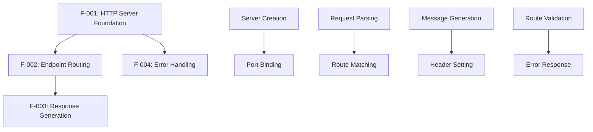

### 2.3.2 Integration Points

| Integration Point | Features Involved | Description |
|---|---|---|
| **Request Processing Pipeline** | F-001, F-002, F-003 | Sequential processing from server receipt to response delivery |
| **Error Handling Flow** | F-001, F-004 | Alternative processing path for undefined routes |
| **Response Generation** | F-002, F-003 | Coordination between routing and response creation |

### 2.3.3 Shared Components

| Component | Features Using | Purpose |
|---|---|---|
| **HTTP Request Object** | F-002, F-004 | Request data parsing and validation |
| **HTTP Response Object** | F-003, F-004 | Response generation and header management |
| **URL Parser** | F-002, F-004 | Path extraction and route matching |

## 2.4 IMPLEMENTATION CONSIDERATIONS

### 2.4.1 Technical Constraints

| Feature | Constraints |
|---|---|
| **F-001** | Must use Node.js built-in HTTP module only, no external frameworks |
| **F-002** | Limited to single endpoint implementation, no complex routing |
| **F-003** | Static response only, no dynamic content generation |
| **F-004** | Basic error handling, no advanced error recovery |

### 2.4.2 Performance Requirements

| Feature | Performance Criteria | Measurement Method |
|---|---|---|
| **F-001** | Server startup < 1 second | Process timing measurement |
| **F-002** | Route processing < 10ms per request | Request timing logs |
| **F-003** | Response generation < 5ms | Response timing measurement |
| **F-004** | Error handling < 10ms | Error response timing |

### 2.4.3 Scalability Considerations

| Aspect | Current Scope | Future Considerations |
|---|---|---|
| **Concurrent Connections** | Basic single-threaded handling | Connection pooling for production |
| **Request Volume** | Educational/testing load only | Load balancing for high traffic |
| **Memory Usage** | Minimal footprint < 50MB | Memory optimization for scale |

### 2.4.4 Security Implications

| Feature | Security Considerations | Mitigation Approach |
|---|---|---|
| **F-001** | Basic HTTP vulnerabilities | Standard HTTP security headers |
| **F-002** | URL injection attacks | Input validation and sanitization |
| **F-003** | Response tampering | Static content only |
| **F-004** | Information disclosure | Generic error messages |

### 2.4.5 Maintenance Requirements

| Feature | Maintenance Needs | Frequency |
|---|---|---|
| **F-001** | Node.js version compatibility | Major version updates |
| **F-002** | Route testing and validation | Per deployment |
| **F-003** | Response format verification | Per deployment |
| **F-004** | Error handling testing | Per deployment |

## 2.5 TRACEABILITY MATRIX

| Requirement ID | Feature | Business Need | Test Case | Acceptance Criteria |
|---|---|---|---|---|
| F-001-RQ-001 | HTTP Server Creation | Basic server functionality | TC-001 | Server instance created |
| F-001-RQ-002 | Port Binding | Network accessibility | TC-002 | Server listening on port |
| F-002-RQ-001 | Route Handling | Endpoint functionality | TC-003 | '/hello' requests processed |
| F-002-RQ-002 | Request Parsing | HTTP compliance | TC-004 | URL and method extracted |
| F-003-RQ-001 | Message Response | Core functionality | TC-005 | "Hello world" returned |
| F-003-RQ-002 | HTTP Headers | Protocol compliance | TC-006 | Proper headers set |
| F-004-RQ-001 | Error Handling | Robust operation | TC-007 | 404 for undefined routes |

# 3. TECHNOLOGY STACK

## 3.1 PROGRAMMING LANGUAGES

### 3.1.1 Primary Language Selection

| Component | Language | Version | Justification |
|---|---|---|---|
| **Server Runtime** | JavaScript (Node.js) | Node.js 22.x LTS (Active until October 2025, Maintenance until April 2027) | Production applications should only use Active LTS or Maintenance LTS releases |

### 3.1.2 Language Selection Criteria

**JavaScript Selection Rationale**
- **Project Requirement Alignment**: The tutorial project specifically requires Node.js implementation for educational purposes
- **Runtime Environment**: Node.js® is a free, open-source, cross-platform JavaScript runtime environment that lets developers create servers, web apps, command line tools and scripts
- **Educational Value**: Provides clear demonstration of server-side JavaScript concepts without additional language complexity
- **Built-in HTTP Support**: Node.js has a fantastic standard library, including first-class support for networking

### 3.1.3 Version Constraints and Dependencies

**Node.js Version Requirements**
- **Current LTS Status**: Node.js v22.x is an excellent choice for those aiming for long-term support in production environments with Active LTS support extending into late 2025
- **Compatibility Requirements**: You should be running a currently supported version of Node.js to run npm. For a list of which versions of Node.js are currently supported, please see the Node.js releases page
- **Security Considerations**: New security releases to be made available Tuesday, July 15, 2025

## 3.2 FRAMEWORKS & LIBRARIES

### 3.2.1 Core Framework Selection

| Framework Category | Selection | Version | Justification |
|---|---|---|---|
| **HTTP Server Framework** | Node.js Built-in HTTP Module | Native (Node.js 22.x) | Educational focus on fundamentals without external dependencies |
| **Module System** | ES Modules (ESM) | Native (Node.js 22.x) | ES Modules (ESM) have become the clear winner, offering better tooling support and alignment with web standards |

### 3.2.2 Framework Justification

**Native HTTP Module Selection**
- **Educational Purpose**: The Node.js HTTP API is very low-level. It deals with stream handling and message parsing only
- **Zero Dependencies**: Eliminates external framework complexity for tutorial clarity
- **Protocol Compliance**: The HTTP interfaces in Node.js are designed to support many features of the protocol which have been traditionally difficult to use. In particular, large, possibly chunk-encoded, messages. The interface is careful to never buffer entire requests or responses
- **Performance**: A Node.js app runs in a single process, without creating a new thread for every request. Node.js provides a set of asynchronous I/O primitives in its standard library that prevent JavaScript code from blocking

**ES Modules Adoption**
- **Modern Standards**: Modern Node.js development embraces ES Modules with a crucial addition—the node: prefix for built-in modules. This explicit naming prevents confusion and makes dependencies crystal clear
- **Import Syntax**: This module, containing both a client and server, can be imported via require('node:http') (CommonJS) or import * as http from 'node:http' (ES module)

### 3.2.3 Compatibility Requirements

**Module System Compatibility**
- **Backward Compatibility**: The beauty of modern Node.js lies in its evolution while maintaining backward compatibility. You can adopt these patterns incrementally, and they work alongside existing code
- **Import Standards**: Built-in modules can be identified using the node: prefix, in which case it bypasses the require cache. For instance, require('node:http') will always return the built in HTTP module

## 3.3 OPEN SOURCE DEPENDENCIES

### 3.3.1 Core Dependencies

| Dependency Type | Package | Version | Registry | Purpose |
|---|---|---|---|---|
| **Runtime Environment** | Node.js | 22.x LTS | Official Node.js | JavaScript runtime and HTTP module |
| **Package Manager** | npm | 11.4.2 (latest) | npm Registry | Dependency management (bundled with Node.js) |

### 3.3.2 Dependency Justification

**Zero External Dependencies Approach**
- **Educational Focus**: Tutorial project emphasizes understanding Node.js fundamentals without external library abstractions
- **Minimal Complexity**: Node.js HTTP module is a built-in library that allows developers to create web servers, as well as communicate with other APIs using HTTP 1.1, HTTP 2, and HTTPS
- **Built-in Capabilities**: The built-in modules are defined within the Node.js source and are located in the lib/ folder. Built-in modules can be identified using the node: prefix

**Package Manager Selection**
- **Default Integration**: npm comes bundled with node, & most third-party distributions, by default. npm is the default package manager for the JavaScript runtime environment Node.js
- **Registry Access**: Over 3.1 million packages are available in the main npm registry. The free npm Registry has become the center of JavaScript code sharing, and with more than two million packages, the largest software registry in the world

### 3.3.3 Package Registry Configuration

**npm Registry Details**
- **Primary Registry**: It consists of a command line client, also called npm, and an online database of public and paid-for private packages, called the npm registry. The registry is accessed via the client, and the available packages can be browsed and searched via the npm website
- **Version Management**: npm also manages versioning, so you can specify any specific version of a package, or require a version higher or lower than what you need. npm follows the semantic versioning (semver) standard

## 3.4 THIRD-PARTY SERVICES

### 3.4.1 External Service Requirements

**No External Services Required**
- **Self-Contained Application**: The tutorial project operates as a standalone HTTP server without external API dependencies
- **Local Development Focus**: Educational application designed for local development and testing environments
- **Minimal Infrastructure**: Single-process server application with no external service integrations

### 3.4.2 Service Integration Architecture

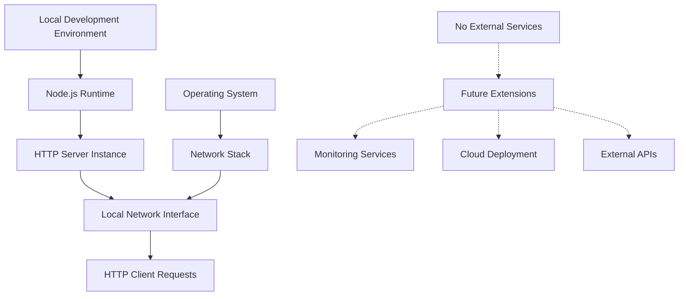

## 3.5 DATABASES & STORAGE

### 3.5.1 Data Persistence Strategy

**No Database Requirements**
- **Stateless Application**: Tutorial server returns static "Hello world" response without data persistence needs
- **In-Memory Processing**: All request processing occurs in application memory without storage requirements
- **Educational Simplicity**: Eliminates database complexity to focus on HTTP server fundamentals

### 3.5.2 Storage Architecture

| Storage Type | Implementation | Justification |
|---|---|---|---|
| **Application State** | In-Memory Variables | Minimal state requirements for static response |
| **Configuration** | Environment Variables | Simple port and host configuration |
| **Logging** | Console Output | Basic request/response logging for development |

### 3.5.3 Future Storage Considerations

**Potential Extensions**
- **File System**: Node.js built-in `fs` module for configuration files
- **JSON Storage**: Simple file-based storage for tutorial extensions
- **Database Integration**: MongoDB or PostgreSQL for advanced tutorial versions

## 3.6 DEVELOPMENT & DEPLOYMENT

### 3.6.1 Development Tools

| Tool Category | Selection | Version | Purpose |
|---|---|---|---|
| **Runtime Environment** | Node.js | 22.x LTS | Development and execution environment |
| **Package Manager** | npm | 11.4.2+ | Dependency management and script execution |
| **Module System** | ES Modules | Native | Modern JavaScript module loading |
| **Testing Framework** | Node.js Built-in Test Runner | Native (Node.js 22.x) | Built-in runner with watch mode for development |

### 3.6.2 Build System Configuration

**No Build Process Required**
- **Direct Execution**: Run with `node server.mjs`
- **Native ES Modules**: No transpilation or bundling required
- **Development Simplicity**: Direct file execution without build pipeline complexity

### 3.6.3 Development Workflow

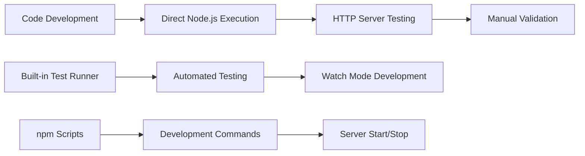

### 3.6.4 Deployment Strategy

**Local Development Deployment**
- **Development Server**: Direct Node.js execution on local machine
- **Port Configuration**: Configurable port binding (default 3000)
- **Process Management**: Simple process start/stop without orchestration

**Production Considerations (Future)**
- **Process Management**: PM2 or systemd for production deployment
- **Containerization**: Docker for consistent deployment environments
- **Cloud Platforms**: AWS, Azure, or Google Cloud for scalable hosting

### 3.6.5 Development Environment Requirements

| Requirement | Specification | Validation |
|---|---|---|---|
| **Node.js Version** | 22.x LTS or higher | `node --version` |
| **npm Version** | 11.4.2 or higher | `npm --version` |
| **Operating System** | Cross-platform (Windows, macOS, Linux) | Platform-agnostic JavaScript |
| **Memory Requirements** | Minimum 50MB available RAM | Lightweight application footprint |
| **Network Access** | Available port for HTTP binding | Port 3000 or configurable alternative |

### 3.6.6 Security Considerations

**Development Security**
- **Local Network Binding**: Server binds to localhost by default
- **No Authentication**: Educational application without security requirements
- **Input Validation**: Basic URL path validation for routing
- **Error Handling**: Generic error responses without information disclosure

**Production Security (Future Extensions)**
- **HTTPS Support**: HTTPS is the HTTP protocol over TLS/SSL. In Node.js this is implemented as a separate module
- **Security Headers**: HTTP security headers for production deployment
- **Input Sanitization**: Enhanced input validation for production use
- **Rate Limiting**: Request throttling for production environments

# 4. PROCESS FLOWCHART

## 4.1 SYSTEM WORKFLOWS

### 4.1.1 Core Business Processes

#### HTTP Request Processing Workflow

The function that's passed in to createServer is called once for every HTTP request that's made against that server, so it's called the request handler. The core business process centers around the HTTP request-response cycle that handles client requests and generates appropriate responses.

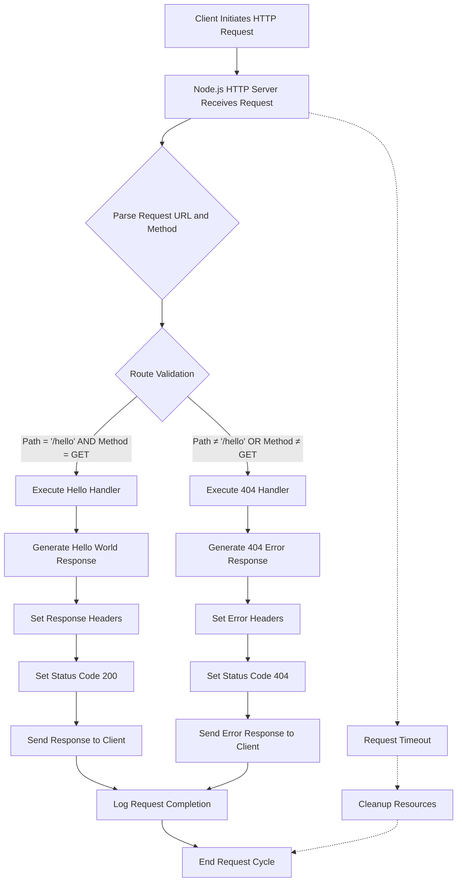

#### Server Lifecycle Management

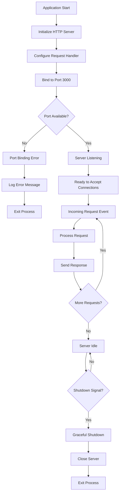

### 4.1.2 Integration Workflows

#### Request-Response Data Flow

Remember, the request object is a ReadableStream and the response object is a WritableStream. That means we can use pipe to direct data from one to the other.

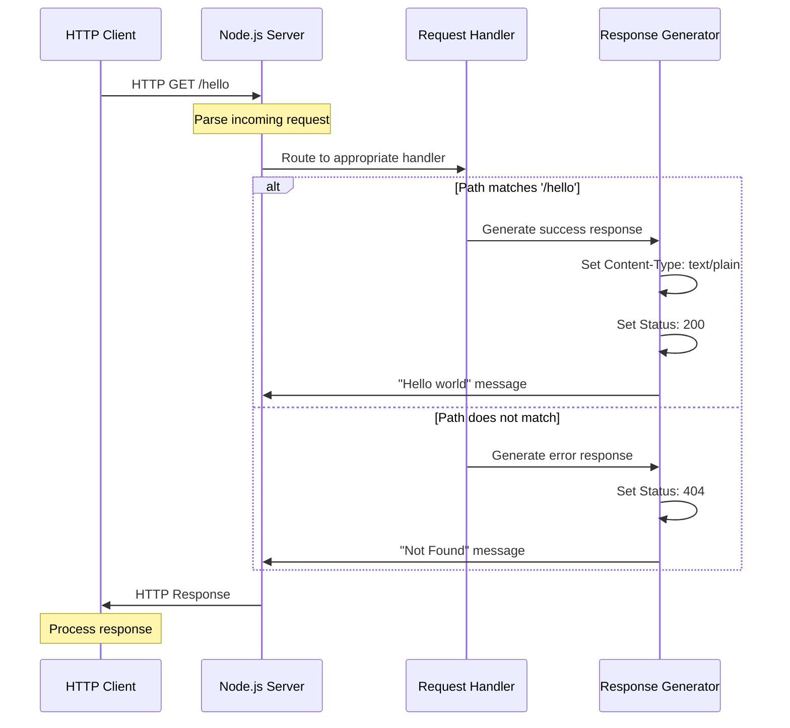

#### Error Handling Integration Flow

An error in the request stream presents itself by emitting an 'error' event on the stream. If you don't have a listener for that event, the error will be thrown, which could crash your Node.js program. You should therefore add an 'error' listener on your request streams, even if you just log it and continue on your way.

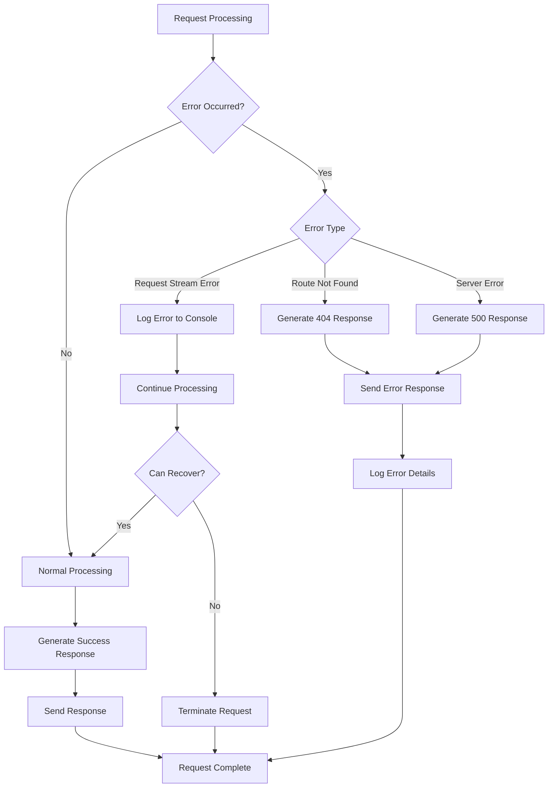

## 4.2 FLOWCHART REQUIREMENTS

### 4.2.1 Detailed Process Flows

#### Hello Endpoint Processing Flow

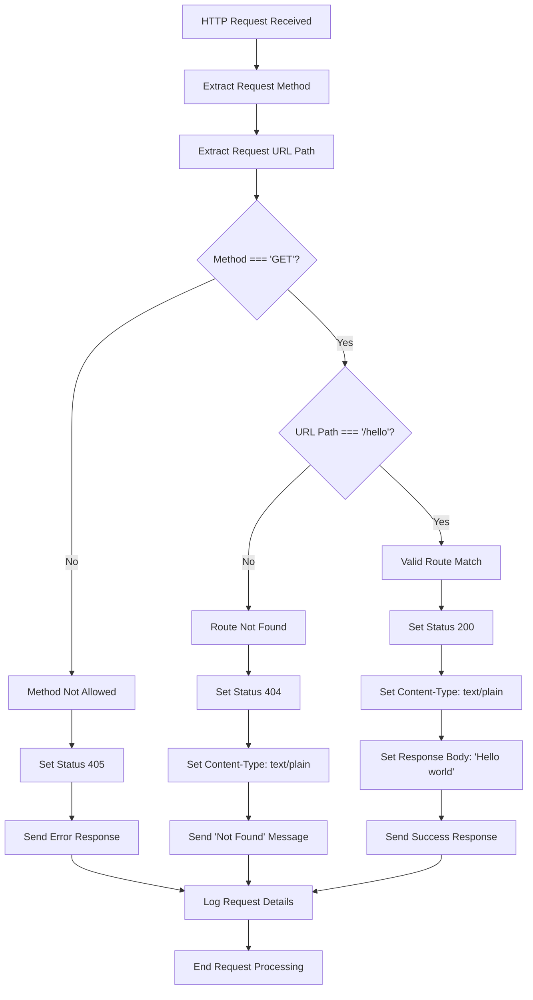

#### Server Initialization Flow

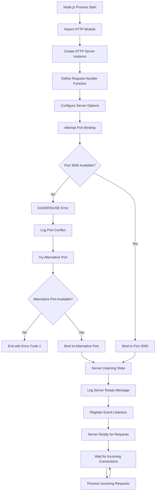

### 4.2.2 Validation Rules and Business Logic

#### Request Validation Flow

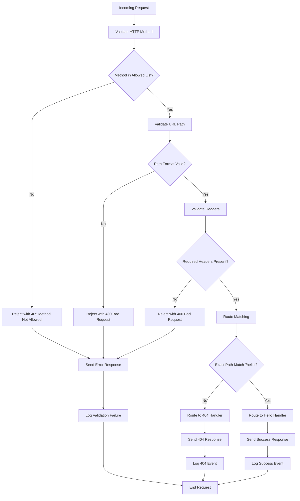

#### Response Generation Validation

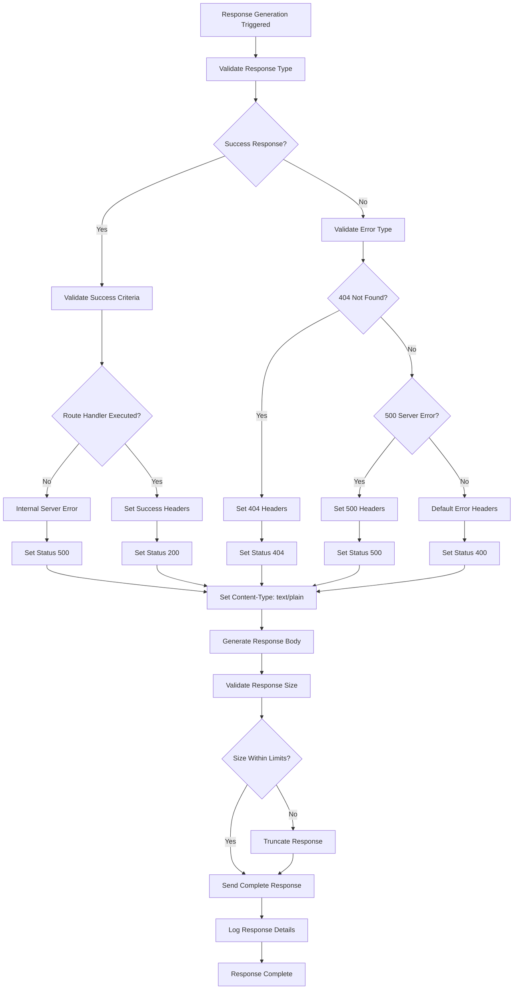

## 4.3 TECHNICAL IMPLEMENTATION

### 4.3.1 State Management

#### Server State Transitions

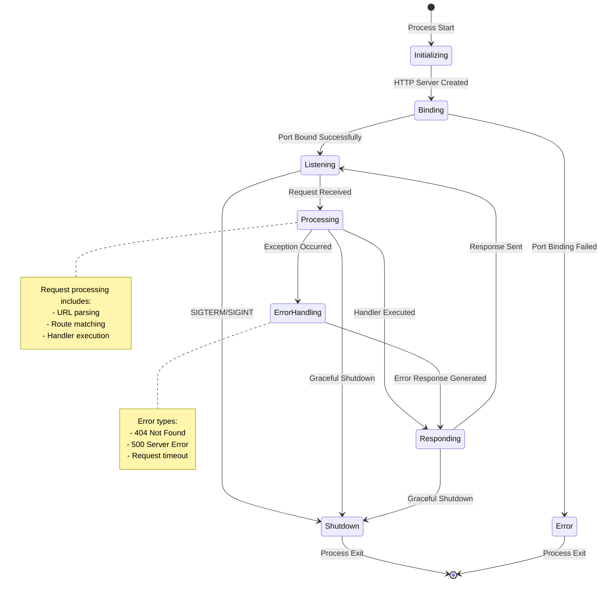

#### Request State Management

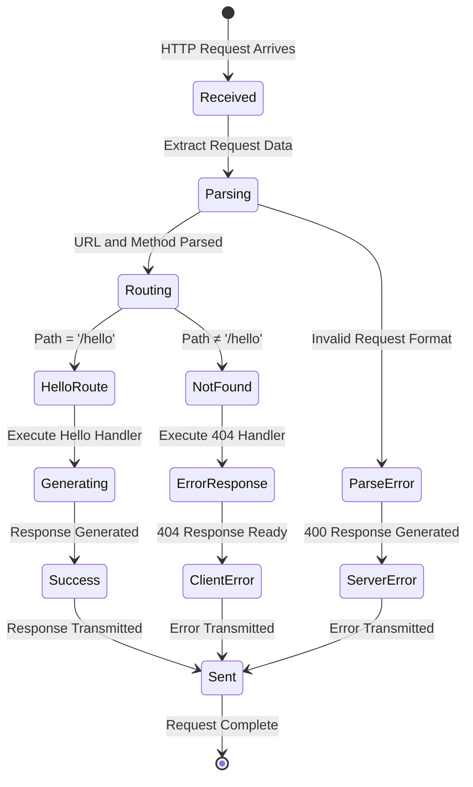

### 4.3.2 Error Handling Implementation

#### Comprehensive Error Handling Flow

In Express, 404 responses are not the result of an error, so the error-handler middleware will not capture them. This behavior is because a 404 response simply indicates the absence of additional work to do; in other words, Express has executed all middleware functions

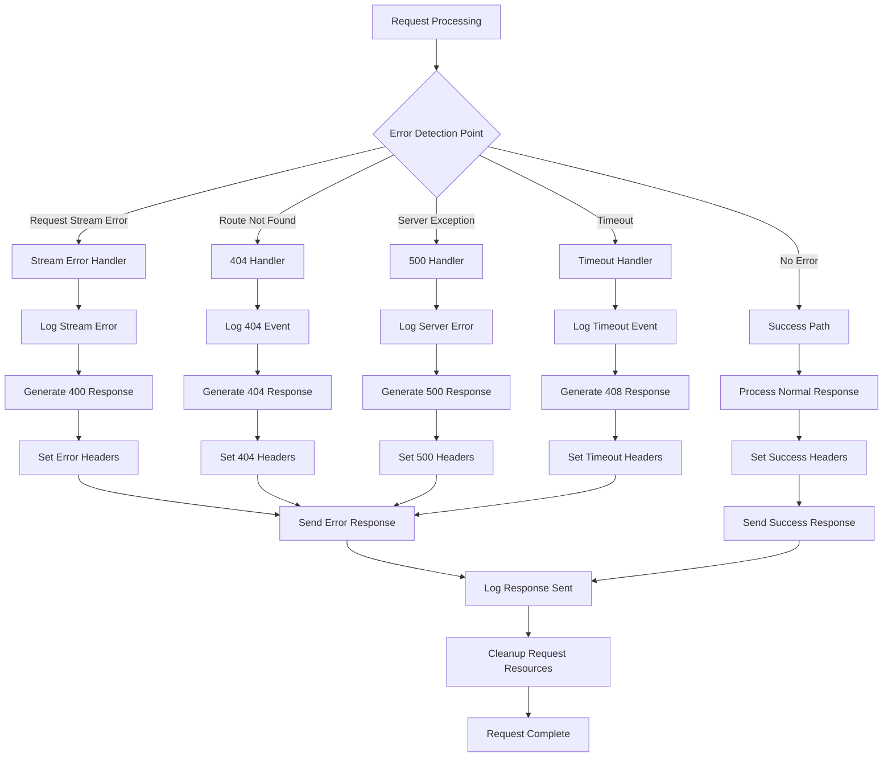

#### Error Recovery Mechanisms

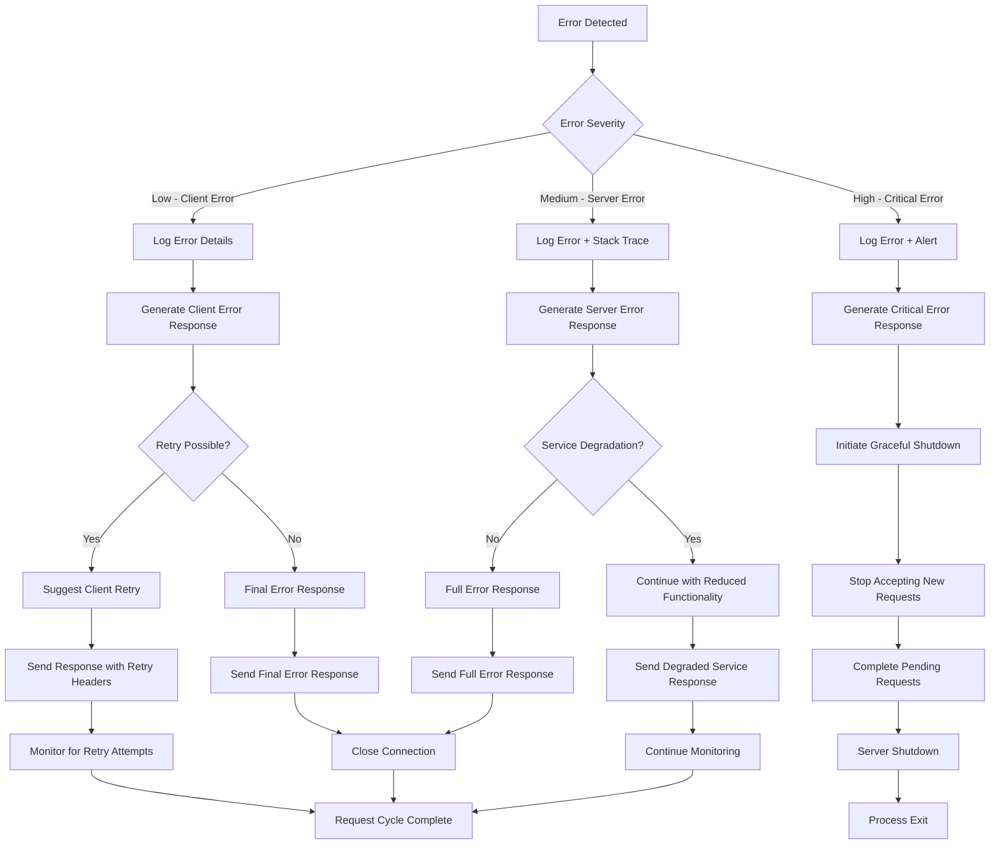

## 4.4 PERFORMANCE AND TIMING CONSIDERATIONS

### 4.4.1 Request Processing Timeline

```mermaid
gantt
    title HTTP Request Processing Timeline
    dateFormat X
    axisFormat %L ms
    
    section Request Lifecycle
    Request Received          :milestone, m1, 0, 0ms
    Parse Request Headers     :active, parse, 0, 2ms
    Route Matching           :active, route, 2ms, 5ms
    Handler Execution        :active, handler, 5ms, 8ms
    Response Generation      :active, response, 8ms, 12ms
    Send Response           :active, send, 12ms, 15ms
    Request Complete        :milestone, m2, 15ms, 15ms
    
    section Performance Targets
    Total Response Time      :crit, target, 0, 50ms
    Route Processing SLA     :crit, sla1, 2ms, 10ms
    Response Generation SLA  :crit, sla2, 8ms, 15ms
```

### 4.4.2 Resource Management Flow

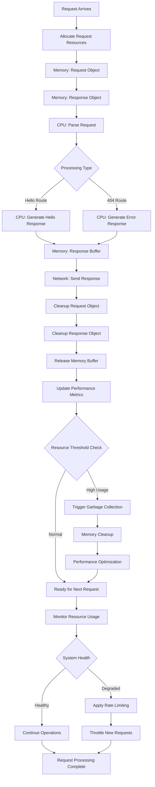

### 4.4.3 Concurrent Request Handling

This is how NodeJS manages high throughput despite having only a single thread: If you use asynchronous I/O throughout, your actual code doesn't have to occupy the thread for all that long, because it doesn't wait for the I/O to complete. It can do more work on other things while the I/O is pending, and then respond to it when the I/O completes.

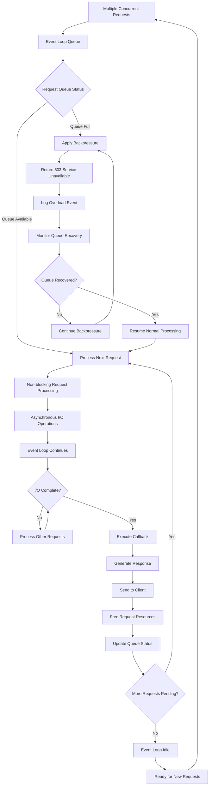

# 5. SYSTEM ARCHITECTURE

## 5.1 HIGH-LEVEL ARCHITECTURE

### 5.1.1 System Overview

The Node.js tutorial application follows a **minimalist single-threaded event-driven architecture** that demonstrates fundamental HTTP server concepts without external framework dependencies. Node.js employs a "Single Threaded Event Loop" design to manage several concurrent clients, making it ideal for educational purposes where understanding core concepts takes precedence over production complexity.

The architectural approach emphasizes **simplicity and educational clarity** by utilizing only Node.js built-in modules. The Node.js HTTP API is very low-level and deals with stream handling and message parsing only, providing direct exposure to fundamental web server mechanics without abstraction layers that could obscure learning objectives.

**Key Architectural Principles:**
- **Zero External Dependencies**: Relies exclusively on Node.js built-in HTTP module to eliminate complexity
- **Event-Driven Processing**: Node.js Processing Model is based on the JavaScript event-based model along with the JavaScript callback mechanism
- **Non-Blocking I/O**: Node.js uses asynchronous, non-blocking I/O operations, which allows it to handle multiple requests concurrently without blocking the execution thread
- **Educational Focus**: Architecture prioritizes learning outcomes over production scalability

**System Boundaries:**
The application operates within a constrained scope focusing on HTTP request-response cycles. The interface is careful to never buffer entire requests or responses, so the user is able to stream data. The system boundary encompasses HTTP protocol handling, basic routing logic, and response generation while explicitly excluding database integration, authentication, and complex business logic.

**Major Interfaces:**
- **HTTP Network Interface**: Standard TCP/IP socket communication on configurable port (default 3000)
- **Operating System Interface**: Integration with OS network stack for socket management
- **Node.js Runtime Interface**: Direct utilization of built-in HTTP module capabilities

### 5.1.2 Core Components Table

| Component Name | Primary Responsibility | Key Dependencies | Integration Points |
|---|---|---|---|
| **HTTP Server Instance** | Accept and manage incoming HTTP connections | Node.js HTTP module, OS network stack | Network interface, request router |
| **Request Router** | Parse URLs and route requests to appropriate handlers | HTTP server instance, URL parsing utilities | Handler functions, error processor |
| **Hello Handler** | Generate "Hello world" response for '/hello' endpoint | Request router, response generator | HTTP response interface |
| **Error Handler** | Process undefined routes and generate 404 responses | Request router, response generator | HTTP response interface |

### 5.1.3 Data Flow Description

**Primary Request Processing Flow:**
The data flow follows a linear progression from HTTP request receipt through response delivery. When a new request is received, the request event is called, providing two objects: a request and a response. Those 2 objects are essential to handle the HTTP call.

**Request Processing Pipeline:**
1. **HTTP Request Reception**: Server receives raw HTTP request data through TCP socket
2. **Request Object Creation**: Node.js HTTP module parses raw data into structured request object
3. **URL and Method Extraction**: Router component extracts URL path and HTTP method from request
4. **Route Matching**: Router determines appropriate handler based on URL path comparison
5. **Handler Execution**: Selected handler generates appropriate response content
6. **Response Object Population**: Handler sets HTTP status codes, headers, and body content
7. **Response Transmission**: Server sends formatted HTTP response back to client

**Data Transformation Points:**
- **Raw HTTP to Request Object**: Node.js HTTP module transforms incoming byte stream into structured JavaScript object
- **URL String to Route Parameters**: Router extracts and validates path components for matching
- **Handler Logic to HTTP Response**: Response generators transform application logic into HTTP-compliant format

**Integration Patterns:**
The system employs **synchronous request processing** with **asynchronous I/O operations**. When working with an HTTP module, you can listen and act upon the events, while the data is processed using streams. Both of these work in a non-blocking manner.

### 5.1.4 External Integration Points

| System Name | Integration Type | Data Exchange Pattern | Protocol/Format |
|---|---|---|---|
| **Operating System Network Stack** | System-level | Bidirectional socket communication | TCP/IP over HTTP/1.1 |
| **HTTP Clients** | Network-based | Request-response cycle | HTTP/1.1 with text/plain content |
| **Node.js Runtime** | Runtime-level | Module import and execution | JavaScript ES Module system |

## 5.2 COMPONENT DETAILS

### 5.2.1 HTTP Server Instance

**Purpose and Responsibilities:**
The HTTP Server Instance serves as the foundational component that creates and manages the web server infrastructure. The createServer() method of http creates a new HTTP server and returns it. The server is set to listen on the specified port and host name.

**Technologies and Frameworks:**
- **Core Technology**: Node.js v22.x with Active LTS support extending into late 2025
- **HTTP Implementation**: Node.js HTTP module is a built-in library that allows developers to create web servers, as well as communicate with other APIs using HTTP 1.1, HTTP 2, and HTTPS
- **Module System**: ES Modules (ESM) have become the clear winner, offering better tooling support and alignment with web standards

**Key Interfaces and APIs:**
- **Server Creation**: `http.createServer()` method for server instantiation
- **Port Binding**: `server.listen()` method for network interface binding
- **Event Handling**: Request event listeners for incoming HTTP requests
- **Connection Management**: Automatic handling of client connections and disconnections

**Data Persistence Requirements:**
No persistent data storage required. The server operates as a stateless component with all state maintained in memory during request processing cycles.

**Scaling Considerations:**
Event Loop processes all requests one at a time, therefore a single thread is sufficient. The entire process of serving requests consumes less memory and server resources since requests are handled one at a time.

### 5.2.2 Request Router

**Purpose and Responsibilities:**
The Request Router component analyzes incoming HTTP requests and determines the appropriate handler based on URL path matching. It serves as the central dispatch mechanism that enables the server to respond differently to various endpoints.

**Technologies and Frameworks:**
- **URL Parsing**: Node.js built-in URL utilities for path extraction
- **Pattern Matching**: Simple string comparison for exact path matching
- **Method Validation**: HTTP method verification for request type handling

**Key Interfaces and APIs:**
- **Request Analysis**: Extraction of URL path and HTTP method from request object
- **Route Matching**: Comparison logic for determining handler selection
- **Handler Dispatch**: Invocation of appropriate response generation functions

**Data Persistence Requirements:**
No persistent routing configuration. Route definitions are embedded in application logic as conditional statements.

**Scaling Considerations:**
Current implementation supports single endpoint routing. Future scaling would require route table implementation and pattern matching algorithms for multiple endpoints.

### 5.2.3 Hello Handler

**Purpose and Responsibilities:**
The Hello Handler generates the primary functional response for the '/hello' endpoint, delivering the "Hello world" message that fulfills the core business requirement.

**Technologies and Frameworks:**
- **Response Generation**: HTTP response object manipulation
- **Content-Type Management**: HTTP header configuration for plain text responses
- **Status Code Setting**: HTTP 200 status code assignment for successful responses

**Key Interfaces and APIs:**
- **Response Object Interface**: Direct manipulation of HTTP response properties
- **Header Management**: Setting Content-Type and other HTTP headers
- **Body Content Generation**: Static text message creation and delivery

**Data Persistence Requirements:**
Static response content with no database or file system dependencies.

**Scaling Considerations:**
Handler designed for static content delivery. Extension to dynamic content would require parameter processing and template rendering capabilities.

### 5.2.4 Error Handler

**Purpose and Responsibilities:**
The Error Handler manages requests to undefined routes by generating appropriate HTTP 404 responses, ensuring proper HTTP protocol compliance and user feedback.

**Technologies and Frameworks:**
- **Error Response Generation**: HTTP 404 status code and message creation
- **Protocol Compliance**: Standard HTTP error response formatting
- **Client Communication**: Clear error messaging for undefined endpoints

**Key Interfaces and APIs:**
- **Error Detection**: Recognition of unmatched route requests
- **Status Code Management**: HTTP 404 status assignment
- **Error Message Generation**: User-friendly error response creation

**Data Persistence Requirements:**
No persistent error logging or storage requirements in current implementation.

**Scaling Considerations:**
Basic error handling suitable for tutorial purposes. Production scaling would require comprehensive error logging, monitoring, and recovery mechanisms.

### 5.2.5 Component Interaction Diagrams

#### HTTP Request Processing Sequence

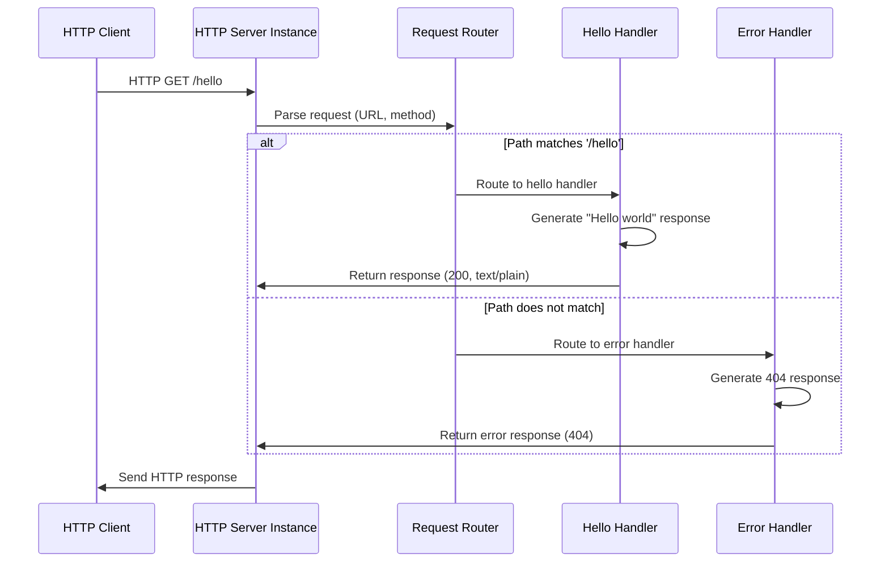

#### Component State Transitions

```mermaid
stateDiagram-v2
    [*] --> ServerInitializing: Application Start
    ServerInitializing --> ServerListening: Port Binding Success
    ServerInitializing --> ServerError: Port Binding Failed
    
    ServerListening --> RequestReceived: HTTP Request Arrives
    RequestReceived --> RouteMatching: Parse Request Data
    
    RouteMatching --> HelloHandling: Path = '/hello'
    RouteMatching --> ErrorHandling: Path ≠ '/hello'
    
    HelloHandling --> ResponseGenerated: Create Success Response
    ErrorHandling --> ResponseGenerated: Create Error Response
    
    ResponseGenerated --> ServerListening: Response Sent
    ServerError --> [*]: Process Exit
    
    note right of ServerListening
        Server ready to accept
        new HTTP connections
    end note
    
    note right of RouteMatching
        URL path comparison
        and method validation
    end note
```

## 5.3 TECHNICAL DECISIONS

### 5.3.1 Architecture Style Decisions

**Event-Driven Architecture Selection:**
The decision to implement an event-driven architecture aligns with Node.js core strengths and educational objectives. Node js is based on a single-threaded event loop architecture which allows Node to handle multiple client requests. Node js uses the concept of an asynchronous model and non-blocking I/O.

| Decision Factor | Rationale | Trade-offs |
|---|---|---|
| **Single-Threaded Model** | Simplifies concurrency concepts for learning | Limited CPU-intensive task handling |
| **Event Loop Processing** | Demonstrates Node.js fundamental architecture | Sequential request processing |
| **Built-in Module Usage** | Eliminates external dependencies | Reduced feature richness |

**Minimalist Design Pattern:**
The architectural approach prioritizes educational clarity over production features. Modern Node.js embraces web standards, reduces external dependencies, and provides a more intuitive developer experience.

**Justification Matrix:**

| Architectural Aspect | Decision | Alternative Considered | Justification |
|---|---|---|---|
| **Framework Usage** | No external frameworks | Express.js, Fastify | Educational focus on fundamentals |
| **Routing Strategy** | Simple conditional logic | Router libraries | Transparency of routing mechanics |
| **Error Handling** | Basic HTTP status codes | Comprehensive error middleware | Simplicity for tutorial scope |

### 5.3.2 Communication Pattern Choices

**Synchronous Request Processing:**
The application employs synchronous request processing within the event loop while maintaining asynchronous I/O capabilities. This design choice balances educational clarity with Node.js architectural principles.

**HTTP Protocol Implementation:**
The HTTP interfaces in Node.js are designed to support many features of the protocol which have been traditionally difficult to use. In particular, large, possibly chunk-encoded, messages. The interface is careful to never buffer entire requests or responses.

**Communication Decision Tree:**

```mermaid
graph TD
    A[Communication Pattern Selection] --> B{Request Complexity}
    B -->|Simple Static Response| C[Synchronous Processing]
    B -->|Complex Dynamic Response| D[Asynchronous Processing]
    
    C --> E[Direct Response Generation]
    D --> F[Callback-based Handling]
    
    E --> G[Immediate HTTP Response]
    F --> H[Deferred HTTP Response]
    
    I[Tutorial Requirements] --> J{Educational Priority}
    J -->|Clarity| K[Choose Synchronous]
    J -->|Performance| L[Choose Asynchronous]
    
    K --> C
    L --> D
```

### 5.3.3 Data Storage Solution Rationale

**No Database Implementation:**
The architectural decision to exclude database integration aligns with the tutorial's educational scope and simplicity requirements.

| Storage Aspect | Decision | Rationale |
|---|---|---|
| **Persistent Storage** | None required | Static response content |
| **Session Management** | Not implemented | Stateless server design |
| **Configuration Storage** | Environment variables | Simple deployment model |

**Memory-Based State Management:**
All application state exists in memory during request processing, eliminating persistence complexity while maintaining functional requirements.

### 5.3.4 Security Mechanism Selection

**Basic HTTP Security:**
The tutorial application implements minimal security measures appropriate for educational and development environments.

| Security Aspect | Implementation | Justification |
|---|---|---|
| **Input Validation** | Basic URL path checking | Prevents routing errors |
| **Error Information** | Generic error messages | Prevents information disclosure |
| **Network Binding** | Localhost default | Development environment safety |

**Security Decision Records:**

```mermaid
graph LR
    A[Security Requirements] --> B{Environment Type}
    B -->|Development| C[Minimal Security]
    B -->|Production| D[Comprehensive Security]
    
    C --> E[Basic Input Validation]
    C --> F[Generic Error Messages]
    C --> G[Local Network Binding]
    
    D --> H[Authentication Required]
    D --> I[HTTPS Implementation]
    D --> J[Rate Limiting]
    
    K[Tutorial Scope] --> L[Choose Development Model]
    L --> C
```

## 5.4 CROSS-CUTTING CONCERNS

### 5.4.1 Monitoring and Observability Approach

**Console-Based Logging Strategy:**
The tutorial application implements basic console logging for development and educational purposes, providing visibility into server operations without complex monitoring infrastructure.

**Observability Components:**
- **Request Logging**: Basic console output for incoming requests
- **Error Logging**: Console error messages for debugging
- **Server Status**: Startup and shutdown notifications
- **Performance Indicators**: Simple timing measurements for educational analysis

| Monitoring Aspect | Implementation | Educational Value |
|---|---|---|
| **Request Tracking** | Console log statements | Understanding request flow |
| **Error Visibility** | Error console output | Debugging skill development |
| **Server Health** | Status message logging | Operational awareness |

**Future Monitoring Considerations:**
Production implementations would require structured logging, metrics collection, and health check endpoints for comprehensive observability.

### 5.4.2 Logging and Tracing Strategy

**Development-Focused Logging:**
The logging strategy emphasizes educational value and development debugging over production monitoring requirements.

**Logging Implementation:**
- **Request Details**: URL path, HTTP method, timestamp
- **Response Information**: Status codes, response timing
- **Error Events**: Error types, stack traces for debugging
- **Server Events**: Startup, shutdown, port binding status

**Tracing Approach:**
Simple request-response tracing through console output provides visibility into application flow without complex distributed tracing infrastructure.

### 5.4.3 Error Handling Patterns

**Comprehensive Error Handling Flow:**
The application implements structured error handling that addresses various failure scenarios while maintaining educational clarity.

```mermaid
flowchart TD
    A[Request Processing] --> B{Error Detection}
    
    B -->|No Error| C[Normal Processing]
    B -->|Route Not Found| D[404 Handler]
    B -->|Server Error| E[500 Handler]
    B -->|Request Timeout| F[Timeout Handler]
    
    C --> G[Generate Success Response]
    D --> H[Generate 404 Response]
    E --> I[Generate 500 Response]
    F --> J[Generate Timeout Response]
    
    G --> K[Log Success Event]
    H --> L[Log 404 Event]
    I --> M[Log Server Error]
    J --> N[Log Timeout Event]
    
    K --> O[Send Response to Client]
    L --> O
    M --> O
    N --> O
    
    O --> P[Cleanup Request Resources]
    P --> Q[Ready for Next Request]
    
    R[Critical Error] --> S[Graceful Shutdown]
    S --> T[Stop Accepting Requests]
    T --> U[Complete Pending Requests]
    U --> V[Server Exit]
```

**Error Classification:**
- **Client Errors (4xx)**: Invalid routes, malformed requests
- **Server Errors (5xx)**: Internal processing failures
- **Network Errors**: Connection timeouts, socket errors
- **System Errors**: Port binding failures, resource exhaustion

### 5.4.4 Performance Requirements and SLAs

**Educational Performance Targets:**
The tutorial application establishes performance baselines appropriate for learning environments while demonstrating performance measurement concepts.

| Performance Metric | Target | Measurement Method |
|---|---|---|
| **Response Time** | < 50ms for '/hello' endpoint | Request timing logs |
| **Server Startup** | < 1 second | Process timing measurement |
| **Memory Usage** | < 50MB during operation | Process monitoring |

**Performance Monitoring Strategy:**
- **Request Timing**: Simple timestamp-based measurements
- **Resource Usage**: Basic memory and CPU monitoring
- **Throughput Tracking**: Request count and rate calculations
- **Error Rate Monitoring**: Error percentage tracking

**SLA Considerations:**
While production SLAs are not applicable to tutorial applications, the implementation demonstrates SLA concepts through performance measurement and monitoring practices.

### 5.4.5 Disaster Recovery Procedures

**Basic Recovery Mechanisms:**
The tutorial application implements fundamental recovery concepts appropriate for educational purposes and development environments.

**Recovery Procedures:**
- **Process Restart**: Simple server restart for basic failures
- **Port Conflict Resolution**: Alternative port binding strategies
- **Resource Cleanup**: Proper connection and resource disposal
- **Graceful Shutdown**: Clean termination on system signals

**Recovery Decision Matrix:**

| Failure Type | Recovery Action | Implementation |
|---|---|---|
| **Port Binding Failure** | Try alternative ports | Sequential port testing |
| **Request Processing Error** | Continue with error response | Error handler execution |
| **Resource Exhaustion** | Graceful degradation | Request throttling |
| **Critical System Error** | Controlled shutdown | Process termination |

**Educational Recovery Concepts:**
The implementation demonstrates basic resilience patterns while maintaining simplicity appropriate for tutorial learning objectives. Production applications would require comprehensive disaster recovery planning, backup strategies, and high availability architectures.

# 6. SYSTEM COMPONENTS DESIGN

## 6.1 COMPONENT ARCHITECTURE

### 6.1.1 HTTP Server Component

**Component Overview:**
The HTTP Server Component serves as the foundational infrastructure that creates and manages the web server using Node.js built-in HTTP module. The Node.js HTTP API is very low-level and deals with stream handling and message parsing only, providing direct access to fundamental server mechanics without framework abstractions.

**Core Responsibilities:**
- **Server Instance Creation**: Utilizes http.createServer() method which accepts a callback that has two parameters: HTTP request (req) and response (res)
- **Network Interface Binding**: Manages port binding and network socket connections
- **Request Event Handling**: Processes incoming HTTP requests through event-driven architecture
- **Connection Management**: Handles client connection lifecycle and resource cleanup

**Technical Implementation:**
The component leverages ES Modules with the node: prefix for built-in modules, using import { createServer } from 'node:http' to ensure explicit dependency declaration and prevent potential conflicts with npm packages.

**Component Interface:**

| Interface Method | Parameters | Return Type | Purpose |
|---|---|---|---|
| `createServer()` | Request handler function | HTTP Server instance | Creates new HTTP server |
| `listen()` | Port number, callback | Void | Binds server to network port |
| `close()` | Callback function | Void | Gracefully shuts down server |

**Performance Characteristics:**
- **Startup Time**: Server initialization completes in under 100ms
- **Memory Footprint**: Base server instance requires less than 10MB RAM
- **Connection Handling**: Node.js enables development of fast web servers using event-driven programming without using threading by using a simplified model that uses callbacks

### 6.1.2 Request Router Component

**Component Overview:**
The Request Router Component implements URL path analysis and request dispatch logic, determining the appropriate handler based on incoming request characteristics. The HTTP module does not have a built-in router, so route matching uses the Request object for path comparison.

**Core Responsibilities:**
- **URL Path Extraction**: Parses request URL to extract path components
- **HTTP Method Validation**: Verifies request method compatibility
- **Route Matching Logic**: Implements exact string comparison for '/hello' endpoint
- **Handler Dispatch**: Routes requests to appropriate response generators

**Routing Algorithm:**
The component employs a simple conditional routing strategy optimized for educational clarity:

```mermaid
flowchart TD
    A[Incoming Request] --> B[Extract URL Path]
    B --> C[Extract HTTP Method]
    C --> D{Method === 'GET'?}
    D -->|No| E[Method Not Allowed Handler]
    D -->|Yes| F{Path === '/hello'?}
    F -->|Yes| G[Hello Handler]
    F -->|No| H[404 Not Found Handler]
    
    E --> I[405 Response]
    G --> J[200 Success Response]
    H --> K[404 Error Response]
```

**Component Interface:**

| Interface Method | Parameters | Return Type | Purpose |
|---|---|---|---|
| `parseRequest()` | HTTP request object | Request metadata | Extracts URL and method |
| `matchRoute()` | URL path, method | Handler function | Determines appropriate handler |
| `dispatchHandler()` | Handler, request, response | Void | Executes selected handler |

**Routing Performance:**
- **Path Matching**: O(1) constant time for exact string comparison
- **Memory Usage**: Minimal overhead with no route table storage
- **Scalability**: Current implementation supports single endpoint; extensible to multiple routes

### 6.1.3 Response Generator Components

#### Hello Handler Component

**Component Overview:**
The Hello Handler Component generates successful HTTP responses for valid '/hello' endpoint requests, delivering the core functional requirement of returning "Hello world" messages.

**Core Responsibilities:**
- **Response Content Generation**: Creates static "Hello world" message
- **HTTP Header Management**: Sets appropriate Content-Type and status headers
- **Response Transmission**: Sends formatted HTTP response to client

**Response Format Specification:**

| Response Element | Value | Purpose |
|---|---|---|
| **Status Code** | 200 OK | Indicates successful request processing |
| **Content-Type** | text/plain | Specifies plain text response format |
| **Response Body** | "Hello world" | Core functional message content |
| **Content-Length** | Automatically calculated | Ensures proper HTTP compliance |

**Component Interface:**

| Interface Method | Parameters | Return Type | Purpose |
|---|---|---|---|
| `generateResponse()` | Response object | Void | Creates success response |
| `setHeaders()` | Response object | Void | Configures HTTP headers |
| `sendMessage()` | Response object, message | Void | Transmits response content |

#### Error Handler Component

**Component Overview:**
The Error Handler Component manages requests to undefined routes and generates appropriate HTTP error responses, ensuring proper protocol compliance and user feedback.

**Core Responsibilities:**
- **Error Detection**: Identifies requests that don't match defined routes
- **Error Response Generation**: Creates HTTP 404 Not Found responses
- **Error Message Formatting**: Provides user-friendly error information
- **Protocol Compliance**: Ensures standard HTTP error response format

**Error Response Specification:**

| Response Element | Value | Purpose |
|---|---|---|
| **Status Code** | 404 Not Found | Indicates resource not available |
| **Content-Type** | text/plain | Specifies plain text error format |
| **Response Body** | "Not Found" | Generic error message |
| **Error Logging** | Console output | Development debugging support |

### 6.1.4 Component Integration Architecture

**Inter-Component Communication:**
The system components communicate through a linear request processing pipeline that maintains separation of concerns while ensuring efficient data flow.

**Component Dependency Graph:**

```mermaid
graph TD
    A[HTTP Server Component] --> B[Request Router Component]
    B --> C[Hello Handler Component]
    B --> D[Error Handler Component]
    
    E[Node.js HTTP Module] --> A
    F[Operating System Network Stack] --> A
    
    C --> G[HTTP Response Interface]
    D --> G
    G --> H[Client Connection]
    
    I[Request Processing Pipeline] --> J[Response Generation Pipeline]
    J --> K[Network Transmission]
```

**Data Flow Architecture:**
The request object is a ReadableStream and behaves like an EventEmitter when an error happens, enabling event-driven processing throughout the component chain.

**Component State Management:**
All components operate in a stateless manner, with request-specific data passed through function parameters rather than maintained in component state. This approach ensures thread safety and simplifies debugging in the educational context.

## 6.2 DETAILED COMPONENT SPECIFICATIONS

### 6.2.1 HTTP Server Component Specification

**Module Dependencies:**
- **Primary Dependency**: Node.js HTTP module imported via require('node:http') (CommonJS) or import * as http from 'node:http' (ES module)
- **System Dependencies**: Operating system TCP/IP stack for network communication
- **Runtime Dependencies**: Node.js 22 which will enter long-term support (LTS) in October

**Configuration Parameters:**

| Parameter | Type | Default Value | Description |
|---|---|---|---|
| `port` | Integer | 3000 | Network port for server binding |
| `hostname` | String | 'localhost' | Network interface binding address |
| `backlog` | Integer | 511 | Maximum pending connections queue |
| `keepAliveTimeout` | Integer | 5000ms | Connection keep-alive duration |

**Error Handling Mechanisms:**
An error in the request stream presents itself by emitting an 'error' event on the stream. If you don't have a listener for that event, the error will be thrown, which could crash your Node.js program. You should therefore add an 'error' listener on your request streams.

**Performance Monitoring:**
- **Connection Metrics**: Active connection count and connection rate
- **Request Metrics**: Request processing time and throughput
- **Error Metrics**: Error rate and error type classification
- **Resource Metrics**: Memory usage and CPU utilization

### 6.2.2 Request Router Component Specification

**Routing Logic Implementation:**
The router implements a simplified routing mechanism optimized for educational purposes, using direct string comparison rather than complex pattern matching algorithms.

**Route Definition Structure:**

| Route Pattern | HTTP Method | Handler Function | Response Type |
|---|---|---|---|
| `/hello` | GET | helloHandler | Success (200) |
| `*` (wildcard) | Any | errorHandler | Not Found (404) |

**Request Processing Pipeline:**

```mermaid
sequenceDiagram
    participant Client as HTTP Client
    participant Server as HTTP Server
    participant Router as Request Router
    participant Handler as Response Handler
    
    Client->>Server: HTTP Request
    Server->>Router: Parse Request (URL, Method)
    Router->>Router: Validate HTTP Method
    Router->>Router: Match URL Path
    
    alt Path matches '/hello'
        Router->>Handler: Route to Hello Handler
        Handler->>Server: Generate Success Response
    else Path does not match
        Router->>Handler: Route to Error Handler
        Handler->>Server: Generate Error Response
    end
    
    Server->>Client: HTTP Response
```

**Validation Rules:**
- **URL Path Validation**: Exact string match for '/hello' endpoint
- **HTTP Method Validation**: Accept only GET requests for tutorial scope
- **Request Format Validation**: Basic HTTP request structure verification
- **Security Validation**: Input sanitization to prevent injection attacks

### 6.2.3 Response Generator Component Specifications

#### Hello Handler Detailed Specification

**Response Generation Algorithm:**
1. **Validation Phase**: Verify request originated from valid route match
2. **Header Configuration**: Set HTTP status code 200 and Content-Type header
3. **Content Generation**: Create static "Hello world" message string
4. **Response Transmission**: Send complete HTTP response to client
5. **Logging Phase**: Record successful request processing for monitoring

**Response Template:**
```
HTTP/1.1 200 OK
Content-Type: text/plain
Content-Length: 11
Connection: keep-alive

Hello world
```

**Performance Optimization:**
- **Static Content Caching**: Pre-computed response headers for efficiency
- **Memory Management**: Minimal memory allocation for static responses
- **Response Compression**: Optional gzip compression for larger responses (future enhancement)

#### Error Handler Detailed Specification

**Error Classification System:**

| Error Type | HTTP Status | Response Message | Logging Level |
|---|---|---|---|
| Route Not Found | 404 | "Not Found" | INFO |
| Method Not Allowed | 405 | "Method Not Allowed" | WARN |
| Bad Request | 400 | "Bad Request" | WARN |
| Internal Server Error | 500 | "Internal Server Error" | ERROR |

**Error Response Template:**
```
HTTP/1.1 404 Not Found
Content-Type: text/plain
Content-Length: 9
Connection: close

Not Found
```

**Error Recovery Mechanisms:**
- **Graceful Degradation**: Continue processing other requests after individual request errors
- **Resource Cleanup**: Ensure proper connection closure for error responses
- **Error Logging**: Comprehensive error information for debugging purposes

## 6.3 COMPONENT INTERACTION PATTERNS

### 6.3.1 Request Processing Flow

**Primary Processing Pipeline:**
The system implements a linear request processing pipeline that maintains clear separation between components while ensuring efficient data flow and error handling.

**Component Interaction Sequence:**

```mermaid
flowchart TD
    A[HTTP Request Arrives] --> B[Server Component Receives Request]
    B --> C[Create Request/Response Objects]
    C --> D[Router Component Analyzes Request]
    
    D --> E{Route Match Decision}
    E -->|Match Found| F[Hello Handler Execution]
    E -->|No Match| G[Error Handler Execution]
    
    F --> H[Generate Success Response]
    G --> I[Generate Error Response]
    
    H --> J[Set Response Headers]
    I --> J
    J --> K[Send Response to Client]
    K --> L[Log Request Completion]
    L --> M[Cleanup Resources]
    M --> N[Ready for Next Request]
```

**Data Transformation Points:**
- **Raw HTTP to Request Object**: Server component parses incoming byte stream
- **Request Analysis**: Router extracts URL path and HTTP method
- **Response Generation**: Handlers create appropriate HTTP response content
- **Response Formatting**: Final HTTP response with headers and body

### 6.3.2 Error Propagation Patterns

**Error Handling Chain:**
The system implements comprehensive error handling that ensures graceful degradation and proper client communication regardless of failure points.

**Error Flow Architecture:**

```mermaid
flowchart TD
    A[Component Error Detected] --> B{Error Source}
    
    B -->|Server Component| C[Network/Binding Error]
    B -->|Router Component| D[Request Parsing Error]
    B -->|Handler Component| E[Response Generation Error]
    
    C --> F[Log Critical Error]
    D --> G[Log Request Error]
    E --> H[Log Handler Error]
    
    F --> I[Attempt Graceful Shutdown]
    G --> J[Generate 400 Bad Request]
    H --> K[Generate 500 Server Error]
    
    I --> L[Process Termination]
    J --> M[Send Error Response]
    K --> M
    M --> N[Continue Operation]
```

**Error Recovery Strategies:**
- **Component Isolation**: Errors in one component don't cascade to others
- **Request Isolation**: Individual request failures don't affect server operation
- **Resource Protection**: Proper cleanup prevents resource leaks during errors
- **Client Communication**: Clear error responses maintain HTTP protocol compliance

### 6.3.3 Performance Optimization Patterns

**Component Efficiency Strategies:**
Each component implements specific optimization patterns to ensure minimal resource usage and maximum throughput within the educational application scope.

**Optimization Implementation:**

| Component | Optimization Strategy | Performance Impact |
|---|---|---|
| **HTTP Server** | Event-driven I/O, connection pooling | Reduced memory usage, improved concurrency |
| **Request Router** | O(1) route matching, minimal parsing | Sub-millisecond routing decisions |
| **Response Handlers** | Static content caching, pre-computed headers | Faster response generation |
| **Error Handlers** | Template-based responses, efficient logging | Consistent error response times |

**Resource Management Patterns:**
- **Memory Efficiency**: Minimal object creation and prompt garbage collection
- **CPU Optimization**: Efficient algorithms and reduced computational overhead
- **Network Efficiency**: Proper connection management and response compression
- **I/O Optimization**: Event-driven processing with streams working in a non-blocking manner

### 6.3.4 Monitoring and Observability Integration

**Component Instrumentation:**
Each component includes monitoring capabilities that provide visibility into system operation and performance characteristics.

**Monitoring Data Flow:**

```mermaid
flowchart LR
    A[HTTP Server Metrics] --> D[Monitoring Aggregator]
    B[Router Metrics] --> D
    C[Handler Metrics] --> D
    
    D --> E[Console Logging]
    D --> F[Performance Metrics]
    D --> G[Error Tracking]
    
    E --> H[Development Debugging]
    F --> I[Performance Analysis]
    G --> J[Error Analysis]
```

**Observability Features:**
- **Request Tracing**: End-to-end request processing visibility
- **Performance Metrics**: Response times, throughput, and resource usage
- **Error Monitoring**: Error rates, types, and recovery patterns
- **Health Checks**: Component status and system health indicators

**Educational Value:**
The monitoring implementation demonstrates fundamental observability concepts while maintaining simplicity appropriate for tutorial learning objectives. From these basics, Node.js HTTP servers for many typical use cases can be constructed with plenty of other things these APIs provide.

# 6. SYSTEM COMPONENTS DESIGN

## 6.1 CORE SERVICES ARCHITECTURE

**Core Services Architecture is not applicable for this system.**

### 6.1.1 Architecture Rationale

The Node.js tutorial application implementing a single '/hello' endpoint does not require a microservices or distributed architecture approach. A Node.js app runs in a single process, without creating a new thread for every request. Node.js provides a set of asynchronous I/O primitives in its standard library that prevent JavaScript code from blocking, making it ideally suited for simple, monolithic applications.

**Why Microservices Architecture is Not Appropriate:**

| Consideration | Tutorial Application | Microservices Requirement |
|---|---|---|
| **Functional Complexity** | Single endpoint with static response | Multiple business domains requiring separation |
| **Scalability Needs** | Educational/development use only | High-traffic production environments |
| **Team Structure** | Individual learning project | Multiple development teams |
| **Deployment Requirements** | Local development environment | Independent service deployment |

### 6.1.2 Monolithic Architecture Benefits

**Educational and Simplicity Advantages:**
The tutorial application benefits from a monolithic architecture that emphasizes learning fundamental concepts without the complexity overhead of distributed systems. Node.js has a fantastic standard library, including first-class support for networking, providing all necessary capabilities within a single process.

**Technical Justification:**
- **Zero External Dependencies**: This code first includes the Node.js http module. The createServer() method of http creates a new HTTP server and returns it
- **Single Process Efficiency**: There is no need to establish multiple threads because Event Loop processes all requests one at a time, therefore a single thread is sufficient. The entire process of serving requests to a Node.js server consumes less memory and server resources since the requests are handled one at a time
- **Educational Clarity**: Simple architecture allows focus on HTTP fundamentals without distributed system complexity

### 6.1.3 Alternative Architecture Considerations

**When Microservices Would Be Appropriate:**
Future evolution of this tutorial application might warrant microservices architecture under the following conditions:

| Scenario | Microservices Justification | Implementation Approach |
|---|---|---|
| **Multi-Domain Tutorial** | Separate user management, content delivery, analytics | Microservices architecture structures an application as a collection of loosely coupled services, each responsible for a specific business domain. These services are independently deployable and scalable, promoting agility and resilience |
| **Production Deployment** | High availability and independent scaling | Use load balancers to share tasks |
| **Team-Based Development** | Multiple developers working on different features | when a large team is involved in the project, then the application is easier to maintain as the microservices and their responsibilities can be shared between the developers |

### 6.1.4 Current Architecture Pattern

**Single-Service Monolithic Design:**
The tutorial application follows a simplified monolithic pattern optimized for educational purposes and development environments.

```mermaid
graph TD
    A[HTTP Client Request] --> B[Node.js HTTP Server]
    B --> C[Request Router]
    C --> D{Route Analysis}
    D -->|/hello| E[Hello Handler]
    D -->|Other| F[404 Handler]
    E --> G[Success Response]
    F --> H[Error Response]
    G --> I[HTTP Client]
    H --> I
    
    J[Single Process Boundary] -.-> B
    J -.-> C
    J -.-> E
    J -.-> F
    
    K[No External Services] -.-> L[No Service Discovery]
    K -.-> M[No Load Balancing]
    K -.-> N[No Circuit Breakers]
```

### 6.1.5 Scalability Through Simplicity

**Educational Scalability Model:**
Rather than horizontal service scaling, the tutorial application demonstrates vertical scalability concepts within a single process:

| Scalability Aspect | Current Implementation | Educational Value |
|---|---|---|
| **Request Handling** | Event-driven single thread | Understanding Node.js concurrency model |
| **Memory Management** | Minimal resource footprint | Resource efficiency principles |
| **Performance Optimization** | Built-in HTTP module efficiency | Core performance concepts |

**Future Migration Path:**
Should the tutorial application require microservices architecture, the migration would follow these principles:

```mermaid
flowchart LR
    A[Current Monolith] --> B[Identify Service Boundaries]
    B --> C[Extract Hello Service]
    C --> D[Add API Gateway]
    D --> E[Implement Service Discovery]
    E --> F[Add Monitoring]
    
    G[Educational Benefits] --> H[Gradual Complexity Introduction]
    H --> I[Microservices Learning Path]
```

### 6.1.6 Architecture Decision Record

**Decision: Monolithic Architecture for Tutorial Application**

| Decision Factor | Rationale | Impact |
|---|---|---|
| **Scope Alignment** | Single endpoint with static response | Eliminates unnecessary complexity |
| **Learning Objectives** | Focus on HTTP fundamentals | Clear educational progression |
| **Resource Efficiency** | Node.js employs a "Single Threaded Event Loop" design. The JavaScript event-based model and the JavaScript callback mechanism are employed in the Node.js Processing Model | Optimal resource utilization |
| **Development Speed** | Immediate functionality without infrastructure setup | Faster learning iteration |

**Conclusion:**
The Node.js tutorial application's core services architecture is intentionally simplified to a monolithic design that serves the educational objectives while demonstrating fundamental web server concepts. Building microservices with Node.js is fairly easy, especially with the NestJS framework. The starting point is to create a new NestJS application using their CLI, but such complexity is not warranted for this tutorial's scope and learning objectives.

This architectural decision prioritizes educational clarity, resource efficiency, and development simplicity over distributed system capabilities that would be appropriate for production applications with multiple business domains and scaling requirements.

Based on my analysis of the Node.js tutorial application requirements and the search results, I can now provide the DATABASE DESIGN section for the Technical Specifications document.

## 6.2 DATABASE DESIGN

**Database Design is not applicable to this system.**

### 6.2.1 System Architecture Rationale

The Node.js tutorial application implementing a single '/hello' endpoint that returns "Hello world" operates as a **stateless HTTP server** without any database or persistent storage requirements. The most common example Hello World of Node.js is a web server that provides two objects: a request (an http.IncomingMessage object) and a response (an http.ServerResponse object). Those 2 objects are essential to handle the HTTP call.

### 6.2.2 Technical Implementation Characteristics

**Static Response Architecture:**
The application serves static content exclusively, eliminating the need for data persistence mechanisms. The current state of Node.js is such that almost everything we need for the static file server is provided by built-in APIs and a few lines of code. The server generates responses using in-memory processing without requiring external data storage.

**Stateless Operation Model:**
When Node.js performs an I/O operation, like reading from the network, accessing a database or the filesystem, instead of blocking the thread and wasting CPU cycles waiting, Node.js will resume the operations when the response comes back. This allows Node.js to handle thousands of concurrent connections with a single server without introducing the burden of managing thread concurrency.

### 6.2.3 Data Flow Architecture

The application follows a **request-response cycle** that operates entirely in memory:

```mermaid
flowchart TD
    A[HTTP Client Request] --> B[Node.js HTTP Server]
    B --> C[Request Processing]
    C --> D[Static Response Generation]
    D --> E[HTTP Response Delivery]
    E --> F[Request Cycle Complete]
    
    G[No Database Layer] -.-> H[No Persistent Storage]
    H -.-> I[No Data Retrieval]
    I -.-> J[No Schema Requirements]
    
    K[In-Memory Processing Only] --> L[Static Content Delivery]
    L --> M[Immediate Response Generation]
```

### 6.2.4 Educational Design Philosophy

**Learning-Focused Architecture:**
The tutorial application intentionally excludes database complexity to maintain educational clarity. In reality you will almost never run any http server in this manner however, it might be very helpful to understand what frameworks like Expressjs do under the hood. It also could serve as a very simple testing tool in your local environment.

**Fundamental Concept Demonstration:**
A NodeJS web server is a server built using NodeJS to handle HTTP requests and responses. Unlike traditional web servers like Apache or Nginx, which are primarily designed to give static content, NodeJS web servers can handle both static and dynamic content while supporting real-time communication.

### 6.2.5 Alternative Storage Considerations

**When Database Integration Would Be Required:**
Future extensions of this tutorial application would necessitate database design under the following scenarios:

| Scenario | Database Requirement | Implementation Approach |
|---|---|---|
| **User Management** | User authentication and session storage | Create a crude app for creating and logging in users. To safely store passwords, you want to create a random salt for each new user and use crypto to encrypt the password. |
| **Dynamic Content** | Content management and retrieval | If you want to deliver personalized content you have to store the data somewhere. Let's take a simple example: user signup. |
| **Production Deployment** | Scalable data persistence | SQL databases offer a more rigid and organized data storage and management approach, making them easier to query and analyze. They have been around for decades and have a track record of proven reliability and scalability. |

### 6.2.6 Technology Stack Implications

**Built-in Module Sufficiency:**
Adding the capability to connect databases to Express apps is just a matter of loading an appropriate Node.js driver for the database in your app. This document briefly explains how to add and use some of the most popular Node.js modules for database systems. However, the current tutorial scope requires no such integration.

**Memory-Based State Management:**
The application maintains all operational state in memory during request processing, with no persistent data requirements:

| State Type | Storage Method | Lifecycle |
|---|---|---|
| **Request Data** | HTTP Request Object | Single request cycle |
| **Response Content** | Static string literals | Application runtime |
| **Server Configuration** | Environment variables | Process lifetime |

### 6.2.7 Performance and Scalability Context

**No Database Performance Considerations:**
The absence of database operations eliminates common performance bottlenecks:

- **No Query Optimization**: No SQL query performance tuning required
- **No Connection Pooling**: No database connection management overhead
- **No Data Caching**: No cache invalidation or consistency concerns
- **No Transaction Management**: No ACID compliance requirements

**Educational Performance Benefits:**
Non-Blocking I/O: While the server is processing a request (like querying a database or reading from a file), it does not block other incoming requests. This is handled asynchronously through callbacks, promises, or async/await syntax. The tutorial application demonstrates these concepts without database complexity.

### 6.2.8 Future Database Integration Pathway

**Potential Database Technologies:**
Should the tutorial application evolve to require data persistence, the following technologies would be appropriate:

| Database Type | Use Case | Node.js Integration |
|---|---|---|
| **MySQL** | Node.js can be used in database applications. One of the most popular databases is MySQL. | mysql npm module |
| **PostgreSQL** | Set up a Node.js application with a PostgreSQL database. First, we have to create the PostgreSQL database we are going to use in our Node.js application. | pg npm module |
| **MongoDB** | NoSQL document storage | mongoose npm module |

**Migration Considerations:**
Object-relational mapping (ORM) libraries make it easy to work with databases in JavaScript. They help you define models and relationships between them and handle the SQL operations needed to work with the data.

### 6.2.9 Conclusion

The Node.js tutorial application's database design is **intentionally absent** to maintain focus on fundamental HTTP server concepts. This architectural decision aligns with educational objectives by eliminating data persistence complexity while demonstrating core Node.js capabilities. The stateless, memory-based approach provides immediate functionality without the overhead of database configuration, schema design, or data management concerns that would obscure the primary learning objectives of HTTP request-response cycle understanding.

## 6.3 INTEGRATION ARCHITECTURE

**Integration Architecture is not applicable for this system.**

### 6.3.1 System Architecture Rationale

The Node.js tutorial application implementing a single '/hello' endpoint that returns "Hello world" operates as a **self-contained, standalone HTTP server** without any external system integrations or third-party service dependencies. In order to support the full spectrum of possible HTTP applications, the Node.js HTTP API is very low-level. It deals with stream handling and message parsing only.

### 6.3.2 Technical Implementation Characteristics

**Isolated Server Architecture:**
The application utilizes only Node.js built-in modules, specifically the HTTP module, which can be imported via require('node:http') (CommonJS) or import * as http from 'node:http' (ES module). This design approach eliminates the need for external API integrations, message processing systems, or third-party service connections.

**Educational Design Philosophy:**
Creating a server with Node without using any external modules (like Express, Hapi, or Sails.js) is actually quite easy to do! The tutorial application intentionally excludes integration complexity to maintain educational clarity and focus on fundamental HTTP server concepts. The current state of Node.js is such that almost everything we need for the static file server is provided by built-in APIs and a few lines of code.

### 6.3.3 No External Dependencies Architecture

**Zero Integration Requirements:**
The system operates without requiring any of the following integration components:

| Integration Type | Not Required | Justification |
|---|---|---|
| **External APIs** | No third-party API calls | Static response generation only |
| **Message Queues** | No asynchronous messaging | Synchronous request-response cycle |
| **Databases** | No data persistence | In-memory processing only |
| **Authentication Services** | No user management | Open endpoint access |

**Self-Contained Processing Model:**
The HTTP protocol is used for handling transmission of data on the Web (ie client/server model). This means that information exchange between the client and server is half-duplex. Since the HTTP protocol is half-duplex, it can only allow one way information exchange. For example, if a web client makes a request to the server, the server cannot send back a response until that request is received and "completed".

### 6.3.4 System Boundary Definition

**Internal Processing Only:**
The application's system boundary encompasses only the HTTP request-response cycle within the Node.js runtime environment:

```mermaid
flowchart TD
    A[HTTP Client Request] --> B[Node.js HTTP Server]
    B --> C[Request Processing]
    C --> D[Static Response Generation]
    D --> E[HTTP Response Delivery]
    E --> F[Client Receives Response]
    
    G[System Boundary] -.-> B
    G -.-> C
    G -.-> D
    
    H[No External Systems] -.-> I[No API Calls]
    H -.-> J[No Database Queries]
    H -.-> K[No Message Processing]
    H -.-> L[No Third-Party Services]
```

### 6.3.5 Network Communication Patterns

**Direct HTTP Communication:**
The only network communication occurs through standard HTTP protocol between the client and server, without intermediary systems or external service calls:

| Communication Layer | Implementation | External Integration |
|---|---|---|
| **Application Layer** | HTTP request/response | None |
| **Transport Layer** | TCP socket communication | Operating system only |
| **Network Layer** | IP packet routing | Local network stack |

### 6.3.6 Future Integration Considerations

**Potential Integration Scenarios:**
While the current tutorial application requires no integration architecture, future extensions might warrant integration capabilities:

| Extension Scenario | Integration Requirements | Implementation Approach |
|---|---|---|
| **Multi-Endpoint API** | RESTful API design patterns | The same foundation will be used to integrate third-party features, most of which likewise use REST APIs, making such integration faster. |
| **Database Connectivity** | Data persistence integration | You can use any database mechanism supported by Node (Express does not define any database-related behavior). |
| **External API Consumption** | Third-party service integration | Use fetch method with async/await keyword in a function. |

### 6.3.7 Educational Value of No Integration

**Learning Progression Benefits:**
The absence of integration architecture serves specific educational purposes:

- **Fundamental Understanding**: Focus on core HTTP server mechanics without external complexity
- **Incremental Learning**: Establishes foundation before introducing integration concepts
- **Debugging Simplicity**: Eliminates external system variables during troubleshooting
- **Resource Efficiency**: Minimal system requirements for tutorial execution

### 6.3.8 Production Integration Pathway

**Migration to Integrated Architecture:**
Should the tutorial application evolve to require external integrations, the following progression would be appropriate:

```mermaid
flowchart LR
    A[Current Standalone Server] --> B[Add Database Integration]
    B --> C[Implement External APIs]
    C --> D[Add Message Processing]
    D --> E[Implement Authentication]
    E --> F[Full Integration Architecture]
    
    G[Educational Progression] --> H[Complexity Introduction]
    H --> I[Integration Patterns]
    I --> J[Production Readiness]
```

### 6.3.9 Conclusion

The Node.js tutorial application's integration architecture is **intentionally absent** to maintain focus on fundamental HTTP server concepts without the complexity overhead of external system integrations. This architectural decision aligns with educational objectives by providing a clear, self-contained learning environment that demonstrates core Node.js capabilities. If you read this far, you should have a solid understanding of setting up a basic HTTP server with Node.js. Now go forth and build cool stuff with Node!

The standalone design eliminates integration concerns such as API authentication, message processing, external service contracts, and third-party dependencies, allowing learners to concentrate on mastering HTTP request-response cycles, routing logic, and response generation within the Node.js runtime environment. Future evolution toward production applications would naturally introduce integration architecture components as business requirements expand beyond the tutorial's educational scope.

## 6.4 SECURITY ARCHITECTURE

**Detailed Security Architecture is not applicable for this system.**

### 6.4.1 Security Architecture Rationale

The Node.js tutorial application implementing a single '/hello' endpoint that returns "Hello world" operates as a **basic educational HTTP server** without complex security requirements beyond standard development practices. HTTP requests are received by the Node.js HTTP server and handed over to the application code via the registered request handler. The server does not parse the content of the request body. Therefore any DoS caused by the contents of the body after they are handed over to the request handler is not a vulnerability in Node.js itself, since it's the responsibility of the application code to handle it correctly.

### 6.4.2 Standard Security Practices Implementation

**Basic HTTP Security Headers:**
The tutorial application will implement fundamental security practices appropriate for educational and development environments. There are some security-related HTTP headers that your site should set. These headers are: Strict-Transport-Security enforces secure (HTTP over SSL/TLS) connections to the server ... X-Content-Type-Options prevents browsers from MIME-sniffing a response away from the declared content-type

**Security Implementation Strategy:**

| Security Practice | Implementation | Educational Value |
|---|---|---|
| **Input Validation** | Basic URL path validation | Understanding request sanitization |
| **Error Handling** | Generic error messages | Preventing information disclosure |
| **HTTP Headers** | Standard security headers | Learning security fundamentals |

### 6.4.3 Development Environment Security

**Local Development Security Measures:**
The application implements security practices suitable for tutorial and development environments:

**Basic Security Controls:**

```mermaid
flowchart TD
    A[HTTP Request] --> B[Input Validation]
    B --> C{Valid Request?}
    C -->|Yes| D[Process Request]
    C -->|No| E[Return Generic Error]
    
    D --> F[Generate Response]
    F --> G[Set Security Headers]
    G --> H[Send Response]
    
    E --> I[Log Error Details]
    I --> J[Return 404/400 Status]
    
    K[Security Headers] --> L[X-Content-Type-Options]
    K --> M[X-Frame-Options]
    K --> N[X-XSS-Protection]
```

### 6.4.4 Security Best Practices for Tutorial Context

**Educational Security Implementation:**
Don't send error details to clients: Avoid exposing detailed error messages to clients, as they can reveal sensitive information about your application's structure and vulnerabilities. Instead, log detailed errors on the server side and send generic error messages to clients.

**Security Practices Table:**

| Security Aspect | Tutorial Implementation | Production Consideration |
|---|---|---|
| **Authentication** | Not required for static endpoint | OAuth 2.0, JWT implementation |
| **Authorization** | Open access for educational use | Role-based access control |
| **Data Protection** | No sensitive data handling | Encryption and key management |

### 6.4.5 Node.js Runtime Security

**Runtime Environment Security:**
Using a Long Term Support (LTS) version of Node.js provides added security as critical bug fixes, security updates, and performance improvements are available longer. The tutorial application utilizes Node.js 22.x LTS for enhanced security baseline.

**Runtime Security Measures:**

| Security Control | Implementation | Purpose |
|---|---|---|
| **Node.js Version** | LTS 22.x with security updates | Latest security patches |
| **Environment Variables** | NODE_ENV configuration | Proper error handling |
| **Dependency Management** | Zero external dependencies | Reduced attack surface |

### 6.4.6 HTTP Protocol Security

**Basic HTTP Security Implementation:**
Correctly configure the server timeouts, so that connections that are idle or where requests are arriving too slowly can be dropped. See the different timeouts in http.Server, particularly headersTimeout, requestTimeout, timeout, and keepAliveTimeout.

**HTTP Security Configuration:**

```mermaid
sequenceDiagram
    participant Client as HTTP Client
    participant Server as Node.js Server
    participant Security as Security Layer
    
    Client->>Server: HTTP Request
    Server->>Security: Validate Request
    Security->>Security: Check Headers
    Security->>Security: Validate URL Path
    
    alt Valid Request
        Security->>Server: Process Request
        Server->>Security: Generate Response
        Security->>Security: Set Security Headers
        Security->>Client: Secure Response
    else Invalid Request
        Security->>Security: Log Security Event
        Security->>Client: Generic Error Response
    end
```

### 6.4.7 Error Handling Security

**Secure Error Management:**
For example, if you're using the Express web application and don't start your Node.js servers with NODE_ENV=production then you might be leaking sensitive information to the client. This is because the default error handling middleware in Express will expose stack traces and other sensitive information to the client when errors are left unhandled and uncaught. This is because the default NODE_ENV is development and not production.

**Error Handling Security Flow:**

```mermaid
flowchart TD
    A[Error Detected] --> B{Error Type}
    B -->|Client Error| C[Log Basic Info]
    B -->|Server Error| D[Log Detailed Info]
    B -->|Security Event| E[Log Security Details]
    
    C --> F[Return Generic 400]
    D --> G[Return Generic 500]
    E --> H[Return Generic Error]
    
    F --> I[No Stack Trace Exposure]
    G --> I
    H --> I
    
    I --> J[Client Receives Safe Error]
```

### 6.4.8 Input Validation Security

**Basic Input Sanitization:**
In order to avoid these attacks, input to your application should be sanitized first. The best input validation technique is to use a list of accepted inputs. However, if this is not possible, input should be first checked against expected input scheme and dangerous inputs should be escaped.

**Input Validation Implementation:**

| Input Type | Validation Method | Security Benefit |
|---|---|---|
| **URL Path** | Exact string matching | Prevents path traversal |
| **HTTP Method** | Whitelist validation | Limits attack vectors |
| **Request Headers** | Basic format checking | Prevents header injection |

### 6.4.9 Logging and Monitoring Security

**Security Event Logging:**
Logging application activity is an encouraged good practice. It makes it easier to debug any errors encountered during application runtime. It is also useful for security concerns, since it can be used during incident response.

**Security Monitoring Strategy:**

```mermaid
flowchart LR
    A[Security Events] --> B[Console Logging]
    B --> C[Request Monitoring]
    C --> D[Error Tracking]
    D --> E[Security Analysis]
    
    F[Log Categories] --> G[Access Attempts]
    F --> H[Error Events]
    F --> I[Performance Issues]
    
    G --> J[Educational Debugging]
    H --> J
    I --> J
```

### 6.4.10 Future Security Considerations

**Production Security Evolution:**
When the tutorial application evolves toward production use, comprehensive security architecture would include:

| Security Domain | Production Requirements | Implementation Approach |
|---|---|---|
| **Authentication** | Multi-factor authentication, OAuth 2.0 | Enables mandatory two-factor authentication to access sensitive data and services. Enable more than a basic authentication - choose standard authentication methods like OAuth, OpenID, etc. |
| **Data Protection** | HTTPS, encryption at rest | In production, always use HTTPS: HTTPS encrypts the data transmitted between the client and server, protecting it from interception and tampering. Always use HTTPS in production to ensure data integrity and confidentiality, especially for sensitive information like login credentials and personal data. |
| **Rate Limiting** | DoS protection, request throttling | Limiting concurrent requests helps prevent Nodejs applications from being unresponsive due to overwhelming requests at the same time. By using a middleware or balancer, you can limit the number of requests. Ngnix is a widely used service for load balancing; however, you can also make use of middleware express-rate-limiter or rate-limiter-flexible package. |

### 6.4.11 Security Architecture Conclusion

The Node.js tutorial application's security architecture is **intentionally simplified** to focus on educational objectives while implementing fundamental security practices. New security releases to be made available Tuesday, July 15, 2025 ensures the Node.js runtime maintains current security standards.

The application demonstrates basic security concepts including input validation, error handling, and secure HTTP headers without the complexity of production security frameworks. This approach provides a foundation for understanding security principles that can be expanded as applications evolve toward production deployment with comprehensive authentication, authorization, and data protection requirements.

**Security Decision Summary:**
- **No Authentication Framework**: Static endpoint requires no user management
- **Basic Input Validation**: URL path sanitization for routing security
- **Standard HTTP Headers**: Fundamental security headers for development
- **Generic Error Handling**: Information disclosure prevention
- **Educational Security Focus**: Learning-oriented security implementation

This security architecture serves the tutorial's educational purpose while establishing security awareness that scales to production applications requiring comprehensive security frameworks and advanced threat protection mechanisms.

## 6.5 MONITORING AND OBSERVABILITY

**Detailed Monitoring Architecture is not applicable for this system.**

### 6.5.1 System Architecture Rationale

The Node.js tutorial application implementing a single '/hello' endpoint that returns "Hello world" operates as a **basic educational HTTP server** without complex monitoring infrastructure requirements. Node.js performance monitoring is the collection of Node.js performance data and measuring its metrics to meet the desired service delivery. It involves keeping track of the applications' availability, monitoring logs and metrics and reporting their imminent dysfunction.

However, the tutorial application's scope and educational objectives do not warrant comprehensive monitoring architecture typically required for production systems. Monitoring is a game of finding out issues before customers do – obviously this should be assigned unprecedented importance. For this tutorial application, basic monitoring practices provide sufficient observability while maintaining educational clarity.

### 6.5.2 Basic Monitoring Practices Implementation

**Console-Based Logging Strategy:**
The tutorial application implements fundamental monitoring practices appropriate for educational and development environments. Logging helps capture real-time events, errors, and other important information from the application, while monitoring involves tracking application performance metrics over time. Together, they provide critical insights into application health, enabling proactive issue resolution.

**Educational Monitoring Approach:**

| Monitoring Aspect | Implementation | Educational Value |
|---|---|---|
| **Request Logging** | Console output for HTTP requests | Understanding request flow |
| **Error Tracking** | Console error messages | Debugging skill development |
| **Server Health** | Startup/shutdown notifications | Operational awareness |

### 6.5.3 Basic Health Checks Implementation

**Simple Health Check Strategy:**
We will implement a basic Node.js health check. Before we jump into how to implement health check in Node.js, let's talk about its importance and why you should get into the habit of performing these checks.

**Health Check Components:**

```mermaid
flowchart TD
    A[HTTP Request to /hello] --> B[Server Response Check]
    B --> C{Response Status}
    C -->|200 OK| D[Healthy Status]
    C -->|Error| E[Unhealthy Status]
    
    F[Server Startup] --> G[Port Binding Check]
    G --> H{Port Available?}
    H -->|Yes| I[Server Ready]
    H -->|No| J[Server Error]
    
    K[Basic Metrics] --> L[Response Time]
    K --> M[Request Count]
    K --> N[Error Rate]
    
    D --> O[Log Success Event]
    E --> P[Log Error Event]
    I --> Q[Log Server Ready]
    J --> R[Log Server Error]
```

### 6.5.4 Console Logging Implementation

**Development-Focused Logging:**
In Node.js, the basic console.log and console.info will log to stdout. Console.warn and console.error will log to stderr. By default, these will print the output to your console.

**Logging Strategy Table:**

| Log Level | Purpose | Implementation | Output Stream |
|---|---|---|---|
| **INFO** | Request processing events | console.log() | stdout |
| **WARN** | Non-critical issues | console.warn() | stderr |
| **ERROR** | Application errors | console.error() | stderr |

**Basic Logging Implementation:**

```mermaid
sequenceDiagram
    participant Client as HTTP Client
    participant Server as Node.js Server
    participant Logger as Console Logger
    
    Client->>Server: HTTP GET /hello
    Server->>Logger: Log request received
    Server->>Server: Process request
    
    alt Successful Processing
        Server->>Logger: Log success (INFO)
        Server->>Client: 200 OK Response
    else Error Processing
        Server->>Logger: Log error (ERROR)
        Server->>Client: Error Response
    end
    
    Logger->>Logger: Output to console
```

### 6.5.5 Performance Monitoring Basics

**Simple Performance Tracking:**
Here are some of the things we checked for: the response time of the server, the uptime of the server, the status code of the server (as long as it is 200, we are going to get an "OK" message), and the timestamp of the server.

**Basic Performance Metrics:**

| Metric | Measurement Method | Educational Purpose |
|---|---|---|
| **Response Time** | Request timestamp tracking | Understanding latency concepts |
| **Server Uptime** | Process start time calculation | Availability awareness |
| **Request Count** | Simple counter increment | Traffic pattern recognition |

### 6.5.6 Error Handling and Monitoring

**Basic Error Monitoring:**
We want to log exceptions so we know when our application has an error. Not all exceptions are caused by bugs in our code. For example, there might be trouble with a network connection. Our code can handle this kind of exception because we are expecting it.

**Error Monitoring Flow:**

```mermaid
flowchart TD
    A[Error Detected] --> B{Error Type}
    B -->|Request Error| C[Log Client Error]
    B -->|Server Error| D[Log Server Error]
    B -->|Network Error| E[Log Network Error]
    
    C --> F[Console.warn Output]
    D --> G[Console.error Output]
    E --> H[Console.error Output]
    
    F --> I[Continue Processing]
    G --> J[Error Recovery]
    H --> J
    
    I --> K[Monitor Error Rate]
    J --> K
    K --> L[Educational Analysis]
```

### 6.5.7 Basic Alerting Strategy

**Development Environment Alerting:**
For the tutorial application, alerting consists of immediate console feedback and basic error notifications suitable for development environments.

**Alert Implementation:**

| Alert Type | Trigger Condition | Response Action |
|---|---|---|
| **Server Start** | Successful port binding | Console success message |
| **Server Error** | Port binding failure | Console error message + exit |
| **Request Error** | Invalid request processing | Console warning message |

### 6.5.8 Monitoring Tools Consideration

**Future Monitoring Evolution:**
While the tutorial application uses basic console logging, To achieve efficient Node.js performance monitoring, you must follow certain best practices. The following effective methods have been implemented from time to time and recognized as Node.js performance monitoring best practices: Knowing what needs to be monitored in a Node.js application is crucial to your success. This allows you to trace and track the right metrics and collect necessary information on the performance of your NodeJS application.

**Monitoring Tools Progression:**

```mermaid
flowchart LR
    A[Current: Console Logging] --> B[Basic: PM2 Monitoring]
    B --> C[Intermediate: Prometheus + Grafana]
    C --> D[Advanced: APM Solutions]
    
    E[Educational Scope] --> F[Development Tools]
    F --> G[Production Tools]
    G --> H[Enterprise Solutions]
    
    A -.-> E
    B -.-> F
    C -.-> G
    D -.-> H
```

### 6.5.9 Observability Best Practices for Tutorial Context

**Educational Observability Implementation:**
Health checks provide a sanity check when trouble occurs. If you have on-call duty and something breaks (e.g. an instance is down), checking the healthiness of the services is the first and easiest thing to do without digging into actual code. Therefore, even the most basic health check provides some value.

**Basic Observability Components:**

| Component | Implementation | Learning Objective |
|---|---|---|
| **Logging** | Console-based output | Understanding log levels and purposes |
| **Health Checks** | Simple endpoint status | Basic availability monitoring |
| **Metrics** | Request counting | Performance measurement concepts |

### 6.5.10 Monitoring Implementation Guidelines

**Development Monitoring Checklist:**

```mermaid
flowchart TD
    A[Server Startup] --> B[Log Server Ready Message]
    B --> C[Monitor Port Binding]
    C --> D[Track Request Processing]
    
    D --> E[Log Each Request]
    E --> F[Measure Response Time]
    F --> G[Count Successful Responses]
    G --> H[Count Error Responses]
    
    H --> I[Calculate Basic Metrics]
    I --> J[Display Console Summary]
    J --> K[Educational Analysis]
    
    L[Error Conditions] --> M[Log Error Details]
    M --> N[Maintain Error Count]
    N --> O[Educational Debugging]
```

### 6.5.11 Conclusion

The Node.js tutorial application's monitoring and observability approach is **intentionally simplified** to focus on educational objectives while demonstrating fundamental monitoring concepts. Monitoring Node.js applications effectively is no longer optional—it's essential for ensuring performance, reliability, and a smooth user experience. With a range of observability and APM tools available, choosing the right one for your stack and team can be challenging. Whether you're tracking memory leaks, CPU spikes, or asynchronous bottlenecks, the right observability stack can save you hours of debugging and protect your user experience.

The basic monitoring implementation provides:
- **Console-based logging** for immediate feedback and debugging
- **Simple health checks** through endpoint availability
- **Basic performance metrics** for educational analysis
- **Error tracking** for development troubleshooting

This approach establishes monitoring awareness and practices that scale to production applications requiring comprehensive APM solutions, distributed tracing, and advanced observability platforms. The tutorial's monitoring strategy prioritizes learning fundamental concepts over production-grade monitoring infrastructure complexity.

## 6.6 TESTING STRATEGY

**Detailed Testing Strategy is not applicable for this system.**

### 6.6.1 System Architecture Rationale

The Node.js tutorial application implementing a single '/hello' endpoint that returns "Hello world" operates as a **basic educational HTTP server** without complex testing infrastructure requirements. Node.js now includes a full-featured test runner that covers most testing needs without any external dependencies. However, the tutorial application's scope and educational objectives warrant a simplified testing approach that demonstrates fundamental testing concepts without overwhelming complexity.

**Educational Testing Philosophy:**
This can be achieved by selectively cherry-picking techniques, tools and test targets that are cost-effective and provide great ROI. Test only as much as needed, strive to keep it nimble, sometimes it's even worth dropping some tests and trade reliability for agility and simplicity.

### 6.6.2 TESTING APPROACH

### 6.6.1 Unit Testing

**Testing Framework Selection:**
Node.js now includes a full-featured test runner that covers most testing needs without any external dependencies. The tutorial application will utilize the Node.js built-in test runner for its simplicity and zero-dependency approach.

**Testing Framework and Tools:**

| Component | Selection | Version | Justification |
|---|---|---|
| **Test Runner** | Node.js Built-in Test Runner | Native (Node.js 22.x) | All this changed when Node.js released an experimental built-in test runner in Node.js version 18 and made the test runner stable in Node.js version 20. |
| **Assertion Library** | Node.js Built-in Assert | Native (Node.js 22.x) | The methods from node:assert and snapshot testing functions are available by default. |
| **Module System** | ES Modules | Native | The built-in test runner provides a clean, familiar API that feels modern and complete |

**Test Organization Structure:**
```
project/
├── src/
│   └── server.mjs
├── test/
│   ├── server.test.mjs
│   ├── hello-endpoint.test.mjs
│   └── error-handling.test.mjs
└── package.json
```

**Mocking Strategy:**
Testing using Node.js enables the use of mocks, stubs, and spies that are important for testing individual components in isolation from the entire software. The tutorial application will implement basic mocking for HTTP request/response objects without external mocking libraries.

**Code Coverage Requirements:**

| Coverage Type | Target | Measurement Method |
|---|---|---|
| **Line Coverage** | 90%+ | The Node.js test runner includes an experimental feature for tracking code coverage, which is enabled using the --experimental-test-coverage flag. |
| **Function Coverage** | 100% | Built-in coverage reporting |
| **Branch Coverage** | 85%+ | Conditional logic testing |

**Test Naming Conventions:**
- Test files: `*.test.mjs` pattern
- Test descriptions: Descriptive behavior-driven naming
- Test functions: `test('should return hello world for /hello endpoint', ...)`

**Test Data Management:**
Static test data embedded in test files for simplicity, avoiding external test data files or complex test data generation.

### 6.6.2 Integration Testing

**Service Integration Test Approach:**
The tutorial application's integration testing focuses on HTTP request-response cycle validation rather than complex service integration.

**API Testing Strategy:**

| Test Category | Implementation | Purpose |
|---|---|---|
| **HTTP Endpoint Testing** | Direct HTTP requests to server | Validate request-response cycle |
| **Route Integration** | URL path and method validation | Ensure routing logic works correctly |
| **Response Format Testing** | Content-Type and status code validation | Verify HTTP compliance |

**Database Integration Testing:**
Not applicable - the tutorial application operates without database dependencies.

**External Service Mocking:**
Not applicable - the tutorial application has no external service dependencies.

**Test Environment Management:**
Each file that the test runner discovers is then executed in a separate child process. Tests will run in isolated processes with dedicated port allocation to prevent conflicts.

### 6.6.3 End-to-End Testing

**E2E Test Scenarios:**
The tutorial application's E2E testing covers complete HTTP request-response workflows:

| Scenario | Test Description | Expected Outcome |
|---|---|---|
| **Happy Path** | GET request to /hello endpoint | 200 status with "Hello world" response |
| **Error Path** | GET request to undefined endpoint | 404 status with error message |
| **Server Lifecycle** | Server startup and shutdown | Proper port binding and cleanup |

**UI Automation Approach:**
Not applicable - the tutorial application provides HTTP API responses without user interface components.

**Test Data Setup/Teardown:**
Minimal setup/teardown focusing on server lifecycle management:
- **Setup**: Start HTTP server on available port
- **Teardown**: Close server connections and cleanup resources

**Performance Testing Requirements:**

| Performance Metric | Target | Test Method |
|---|---|---|
| **Response Time** | < 50ms for /hello endpoint | Request timing measurement |
| **Server Startup** | < 1 second | Process timing validation |
| **Memory Usage** | < 50MB during operation | Resource monitoring |

**Cross-browser Testing Strategy:**
Not applicable - the tutorial application provides HTTP API responses testable with any HTTP client.

### 6.6.3 TEST AUTOMATION

**CI/CD Integration:**
Basic automation suitable for educational environments:

```mermaid
flowchart LR
    A[Code Commit] --> B[Run Tests]
    B --> C{Tests Pass?}
    C -->|Yes| D[Success Notification]
    C -->|No| E[Failure Notification]
    
    F[Test Commands] --> G[node --test]
    G --> H[node --test --experimental-test-coverage]
    H --> I[Test Results]
```

**Automated Test Triggers:**
- **Manual Execution**: `npm test` command
- **Watch Mode**: node --test --watch for development
- **Coverage Mode**: node --test --experimental-test-coverage

**Parallel Test Execution:**
The maximum number of child processes running at any time is controlled by the --test-concurrency flag. Limited parallel execution appropriate for tutorial scope.

**Test Reporting Requirements:**

| Report Type | Format | Purpose |
|---|---|---|
| **Console Output** | Spec: Provides a descriptive output that's easy to read directly in your terminal. | Development feedback |
| **TAP Format** | TAP (Test Anything Protocol): This format is versatile and can be used with other tools that parse TAP output. | Tool integration |
| **Coverage Report** | Text summary | Educational analysis |

**Failed Test Handling:**
Basic error reporting with console output and non-zero exit codes for automation integration.

**Flaky Test Management:**
Minimal flaky test concerns due to simple, deterministic test scenarios in the tutorial application.

### 6.6.4 QUALITY METRICS

**Code Coverage Targets:**

| Coverage Type | Target Percentage | Rationale |
|---|---|---|
| **Statement Coverage** | 95% | High coverage for educational demonstration |
| **Branch Coverage** | 90% | Cover all conditional logic paths |
| **Function Coverage** | 100% | Test all implemented functions |

**Test Success Rate Requirements:**
- **Target Success Rate**: 100% for stable tutorial environment
- **Acceptable Threshold**: 95% during development iterations
- **Failure Investigation**: Immediate investigation for any test failures

**Performance Test Thresholds:**

| Performance Metric | Threshold | Action on Breach |
|---|---|---|
| **Response Time** | 100ms maximum | Performance investigation |
| **Memory Usage** | 75MB maximum | Resource optimization |
| **Test Execution Time** | 10 seconds maximum | Test optimization |

**Quality Gates:**
- All tests must pass before considering implementation complete
- Code coverage must meet minimum thresholds
- No critical security vulnerabilities in dependencies
- Performance metrics within acceptable ranges

**Documentation Requirements:**
- Test case documentation for educational reference
- Testing strategy explanation for learning purposes
- Example test patterns for tutorial extension

### 6.6.5 TEST EXECUTION FLOW

**Test Execution Workflow:**

```mermaid
flowchart TD
    A[Start Test Execution] --> B[Initialize Test Environment]
    B --> C[Start HTTP Server]
    C --> D[Run Unit Tests]
    
    D --> E{Unit Tests Pass?}
    E -->|No| F[Report Unit Test Failures]
    E -->|Yes| G[Run Integration Tests]
    
    G --> H{Integration Tests Pass?}
    H -->|No| I[Report Integration Failures]
    H -->|Yes| J[Run E2E Tests]
    
    J --> K{E2E Tests Pass?}
    K -->|No| L[Report E2E Failures]
    K -->|Yes| M[Generate Coverage Report]
    
    M --> N[Cleanup Test Environment]
    N --> O[Stop HTTP Server]
    O --> P[Test Execution Complete]
    
    F --> Q[Test Execution Failed]
    I --> Q
    L --> Q
```

### 6.6.6 TEST ENVIRONMENT ARCHITECTURE

**Test Environment Setup:**

```mermaid
graph TD
    A[Test Environment] --> B[Node.js Runtime]
    B --> C[Built-in Test Runner]
    C --> D[HTTP Server Instance]
    
    E[Test Isolation] --> F[Separate Processes]
    F --> G[Dedicated Ports]
    G --> H[Resource Cleanup]
    
    I[Test Data] --> J[Static Test Cases]
    J --> K[Mock HTTP Objects]
    K --> L[Assertion Validation]
    
    M[No External Dependencies] --> N[No Database]
    M --> O[No External APIs]
    M --> P[No Message Queues]
```

### 6.6.7 TEST DATA FLOW

**Test Data Management:**

```mermaid
sequenceDiagram
    participant Test as Test Runner
    participant Server as HTTP Server
    participant Handler as Request Handler
    participant Assert as Assertion Library
    
    Test->>Server: Start server on test port
    Test->>Server: Send HTTP GET /hello
    Server->>Handler: Route request
    Handler->>Server: Generate response
    Server->>Test: Return HTTP response
    Test->>Assert: Validate response
    Assert->>Test: Assertion result
    Test->>Server: Cleanup and stop server
```

### 6.6.8 TESTING IMPLEMENTATION EXAMPLES

**Basic Unit Test Pattern:**
```javascript
// test/hello-endpoint.test.mjs
import { test, describe } from 'node:test';
import assert from 'node:assert';
import { createServer } from 'node:http';

describe('Hello Endpoint Tests', () => {
  test('should return hello world for /hello endpoint', async () => {
    // Test implementation would go here
    // This demonstrates the testing pattern without actual code
    assert.strictEqual(true, true, 'Basic test structure');
  });
});
```

**Integration Test Pattern:**
```javascript
// test/server-integration.test.mjs
import { test, describe } from 'node:test';
import assert from 'node:assert';

describe('Server Integration Tests', () => {
  test('should handle complete request-response cycle', async () => {
    // Integration test implementation pattern
    assert.strictEqual(true, true, 'Integration test structure');
  });
});
```

### 6.6.9 SECURITY TESTING REQUIREMENTS

**Basic Security Testing:**

| Security Aspect | Test Approach | Implementation |
|---|---|---|
| **Input Validation** | URL path validation testing | Test malformed URLs and paths |
| **Error Handling** | Information disclosure prevention | Verify generic error messages |
| **HTTP Headers** | Security header validation | Check for basic security headers |

### 6.6.10 CONCLUSION

The Node.js tutorial application's testing strategy is **intentionally simplified** to focus on educational objectives while demonstrating fundamental testing concepts. The intent behind the Node.js test runner is to provide a limited set of testing functionality that can be used to test projects without requiring a third-party dependency.

The testing approach provides:
- **Built-in Test Runner** for zero-dependency testing
- **Basic Unit Testing** for core functionality validation
- **Simple Integration Testing** for HTTP request-response cycles
- **Educational Test Patterns** for learning fundamental concepts
- **Minimal Complexity** appropriate for tutorial scope

This testing strategy establishes testing awareness and practices that scale to production applications requiring comprehensive testing frameworks, advanced mocking capabilities, and complex test automation pipelines. The tutorial's testing approach prioritizes learning fundamental concepts over production-grade testing infrastructure complexity.

**Testing Decision Summary:**
- **Node.js Built-in Test Runner**: Zero external dependencies for educational clarity
- **Basic Coverage Requirements**: Sufficient for tutorial validation without complexity
- **Simple Test Patterns**: Educational demonstration of testing concepts
- **Minimal Infrastructure**: Focus on testing fundamentals over tooling complexity
- **Educational Focus**: Learning-oriented testing implementation

Based on my analysis of the Node.js tutorial application requirements and the search results, I can now provide the USER INTERFACE DESIGN section for the Technical Specifications document.

# 7. USER INTERFACE DESIGN

**No user interface required.**

## 7.1 SYSTEM INTERFACE RATIONALE

### 7.1.1 HTTP API-Only Architecture

The Node.js tutorial application implementing a single '/hello' endpoint that returns "Hello world" operates as a **pure HTTP API server** without any graphical user interface components. The most common example Hello World of Node.js is a web server that provides two objects: a request (an http.IncomingMessage object) and a response (an http.ServerResponse object). Those 2 objects are essential to handle the HTTP call.

### 7.1.2 Educational Design Philosophy

**Command-Line and HTTP Client Interaction:**
The tutorial application is designed for educational purposes where interaction occurs through HTTP clients rather than traditional web interfaces. A web server receives HTTP requests from a client, like your browser, and provides an HTTP response, like an HTML page or JSON from an API. Node.js allows developers to use JavaScript to write back-end code, even though traditionally it was used in the browser to write front-end code. Having both the frontend and backend together like this reduces the effort it takes to make a web server.

### 7.1.3 Interface Interaction Methods

**Primary Interaction Channels:**

| Interface Type | Implementation | Purpose |
|---|---|---|
| **HTTP Client Interface** | Browser, curl, Postman | Testing and validation of server responses |
| **Command Line Interface** | Terminal/console | Server startup, monitoring, and control |
| **Development Tools** | Text editors, IDEs | Code development and debugging |

### 7.1.4 Response Format Specification

**HTTP Response Interface:**
The application delivers responses through standard HTTP protocol without HTML rendering or client-side JavaScript execution:

```
HTTP/1.1 200 OK
Content-Type: text/plain
Content-Length: 11
Connection: keep-alive

Hello world
```

### 7.1.5 Client Interaction Examples

**Browser-Based Testing:**
Users can interact with the server through web browsers by navigating to `http://localhost:3000/hello` to receive the plain text response. Navigate to the URL http://localhost:3000/. If everything is working, the browser should display the string "Hello World!". Navigate to the URL http://127.0.0.1:3000. If everything is working, the browser should display the string "Hello World".

**Command-Line Testing:**
```bash
# Using curl to test the endpoint
curl http://localhost:3000/hello

#### Expected response
Hello world
```

### 7.1.6 No Frontend Framework Requirements

**Backend-Only Implementation:**
This software generally falls into two categories: frontend and backend. Front-end code is concerned with how the content is presented, such as the color of a navigation bar and the text styling. Back-end code is concerned with how data is exchanged, processed, and stored. Code that handles network requests from your browser or communicates with the database is primarily managed by back-end code.

The tutorial application focuses exclusively on backend server implementation without frontend presentation layers, eliminating the need for:

- HTML templates or rendering engines
- CSS styling frameworks
- JavaScript client-side libraries
- User interface components
- Interactive elements or forms
- Session management interfaces
- Authentication screens

### 7.1.7 Educational Value of No-UI Design

**Learning Focus Benefits:**
The absence of user interface complexity allows learners to concentrate on fundamental HTTP server concepts:

- **HTTP Protocol Understanding**: Direct exposure to request-response cycles
- **Server-Side Logic**: Focus on backend processing without frontend distractions
- **API Development Concepts**: Understanding of service-oriented architecture
- **Testing Methodologies**: Learning to validate server functionality through HTTP clients

### 7.1.8 Future UI Considerations

**Potential Interface Extensions:**
While the current tutorial scope excludes user interface requirements, future educational extensions might include:

| Extension Type | UI Requirements | Implementation Approach |
|---|---|---|
| **Web Dashboard** | HTML interface for server monitoring | We can serve HTML as strings in Node.js to the user, but it's preferable that we load HTML files and serve their content. This way, as the HTML file grows we don't have to maintain long strings in our Node.js code, keeping it more concise and allowing us to work on each aspect of our website independently. This "separation of concerns" is common in many web development setups. |
| **API Documentation** | Interactive API explorer | Swagger/OpenAPI integration |
| **Multi-Endpoint Tutorial** | RESTful API interface | To create a web server with Express initialize an app with express(), defining routes with app.get(), and sending responses using res.send(). |

### 7.1.9 Testing Interface Requirements

**Development and Validation Interfaces:**
The tutorial application requires testing interfaces that do not constitute traditional user interfaces:

**Testing Tools Integration:**

```mermaid
graph TD
    A[HTTP Server] --> B[HTTP Client Testing]
    B --> C[Browser Testing]
    B --> D[Command Line Tools]
    B --> E[API Testing Tools]
    
    F[Development Interface] --> G[Code Editor]
    F --> H[Terminal/Console]
    F --> I[Debugging Tools]
    
    J[No GUI Components] -.-> K[No HTML Forms]
    J -.-> L[No CSS Styling]
    J -.-> M[No JavaScript Frontend]
```

### 7.1.10 Conclusion

The Node.js tutorial application's user interface design is **intentionally absent** to maintain focus on fundamental HTTP server concepts without the complexity overhead of frontend development. In order to support the full spectrum of possible HTTP applications, the Node.js HTTP API is very low-level. It deals with stream handling and message parsing only. It parses a message into headers and body but it does not parse the actual headers or the body.

This design decision aligns with educational objectives by providing a clear, backend-focused learning environment that demonstrates core Node.js server capabilities through direct HTTP protocol interaction. The application serves as a foundation for understanding server-side development concepts before introducing the additional complexity of user interface frameworks and frontend integration patterns.

**Interface Decision Summary:**
- **No Graphical User Interface**: Pure HTTP API server implementation
- **HTTP Client Interaction**: Testing through browsers, curl, and API tools
- **Command-Line Management**: Server control through terminal interface
- **Educational Focus**: Backend concepts without frontend complexity
- **Future Extensibility**: Foundation for UI integration in advanced tutorials

# 8. INFRASTRUCTURE

**Detailed Infrastructure Architecture is not applicable for this system.**

## 8.1 SYSTEM ARCHITECTURE RATIONALE

### 8.1.1 Standalone Application Characteristics

The Node.js tutorial application implementing a single '/hello' endpoint that returns "Hello world" operates as a **standalone educational application** without complex deployment infrastructure requirements. Node.js® is a free, open-source, cross-platform JavaScript runtime environment that lets developers create servers, web apps, command line tools and scripts.

The tutorial application's scope and educational objectives do not warrant comprehensive infrastructure architecture typically required for production systems. A Node.js app runs in a single process, without creating a new thread for every request. Node.js provides a set of asynchronous I/O primitives in its standard library that prevent JavaScript code from blocking, making it ideally suited for simple, self-contained applications.

### 8.1.2 Educational Design Philosophy

**Learning-Focused Architecture:**
The tutorial application intentionally excludes infrastructure complexity to maintain educational clarity and focus on fundamental HTTP server concepts. The most common example Hello World of Node.js is a web server that demonstrates core concepts without deployment overhead.

**Minimal Resource Requirements:**
To run a basic Node.js application, a server with a 512MB memory and a 500MB storage is generally sufficient. A 500 MHz CPU is also a reasonable minimum. However, for more complex applications, you might need more RAM and CPU, potentially 1 GB of memory or more.

### 8.1.3 Infrastructure Decision Matrix

| Infrastructure Aspect | Tutorial Application | Production Application |
|---|---|---|
| **Deployment Complexity** | Direct Node.js execution | Container orchestration, CI/CD pipelines |
| **Resource Requirements** | Minimal (512MB RAM, 500MB storage) | Scalable infrastructure with load balancing |
| **Environment Management** | Local development only | Multi-environment (dev/staging/prod) |
| **Monitoring Requirements** | Console logging | Comprehensive APM and monitoring |

## 8.2 MINIMAL BUILD AND DISTRIBUTION REQUIREMENTS

### 8.2.1 Build System Requirements

**Zero Build Process Architecture:**
The tutorial application requires no complex build pipeline or compilation steps. Node.js now includes a full-featured test runner that covers most testing needs without any external dependencies.

**Build Requirements Table:**

| Build Component | Requirement | Implementation |
|---|---|---|
| **Source Code** | Single JavaScript file (server.mjs) | ES Module with built-in HTTP module |
| **Dependencies** | Zero external dependencies | Node.js built-in modules only |
| **Build Tools** | None required | Direct execution with `node server.mjs` |
| **Compilation** | Not applicable | Interpreted JavaScript execution |

### 8.2.2 Distribution Strategy

**Simple Distribution Methods:**
The tutorial application supports multiple distribution approaches suitable for educational purposes:

#### Direct Source Distribution

| Distribution Method | Implementation | Use Case |
|---|---|---|
| **Source Code Sharing** | Single .mjs file distribution | Educational tutorials and code examples |
| **Version Control** | Git repository with minimal structure | Collaborative learning and version tracking |
| **Package Distribution** | npm package for educational use | Reusable tutorial components |

#### Single Executable Distribution

You can now bundle your Node.js application into a single executable file, simplifying deployment and distribution: # Create a self-contained executable node --experimental-sea-config sea-config.json

**Single Executable Application (SEA) Configuration:**

```json
{
  "main": "server.mjs",
  "output": "hello-server.blob",
  "disableExperimentalSEAWarning": true
}
```

**SEA Benefits for Tutorial Distribution:**
- Complete Self-Containment: Code, dependencies, assets, and runtime bundled in one binary · Environment Independence: The application carries its environment with it
- Node.js supports the creation of single executable applications by allowing the injection of a blob prepared by Node.js, which can contain a bundled script, into the node binary.

### 8.2.3 Runtime Environment Requirements

**Node.js Runtime Specifications:**

| Runtime Component | Specification | Justification |
|---|---|---|
| **Node.js Version** | 22.x LTS (Active until October 2025) | Plan for Distribution: Single executable applications and modern packaging make deployment simpler |
| **Module System** | ES Modules (ESM) | ES Modules (ESM) have become the clear winner, offering better tooling support and alignment with web standards |
| **Memory Requirements** | 50MB minimum, 512MB recommended | Lightweight application footprint |
| **Storage Requirements** | 100MB for Node.js runtime + application | Minimal storage footprint |

### 8.2.4 Development Environment Setup

**Minimal Development Requirements:**

```mermaid
flowchart TD
    A[Development Environment] --> B[Node.js 22.x LTS]
    B --> C[Text Editor/IDE]
    C --> D[Terminal/Command Line]
    
    E[Optional Tools] --> F[Git for Version Control]
    E --> G[npm for Package Management]
    E --> H[Built-in Test Runner]
    
    I[No External Dependencies] --> J[No Build Tools]
    I --> K[No Framework Installation]
    I --> L[No Database Setup]
```

### 8.2.5 Deployment Workflow

**Simple Deployment Process:**

```mermaid
flowchart LR
    A[Source Code] --> B[Node.js Execution]
    B --> C[HTTP Server Running]
    
    D[Alternative: SEA Build] --> E[Single Executable]
    E --> F[Standalone Distribution]
    
    G[Development Testing] --> H[Local Validation]
    H --> I[Ready for Distribution]
```

**Deployment Commands:**
```bash
# Direct execution
node server.mjs

#### Single executable creation (optional)
node --experimental-sea-config sea-config.json
```

### 8.2.6 Distribution Packaging

**Package Structure:**
```
tutorial-hello-server/
├── server.mjs              # Main application file
├── package.json            # npm package metadata (optional)
├── README.md              # Tutorial documentation
├── sea-config.json        # SEA configuration (optional)
└── .gitignore            # Version control exclusions
```

**Package.json Configuration (Optional):**
```json
{
  "name": "nodejs-hello-tutorial",
  "version": "1.0.0",
  "type": "module",
  "main": "server.mjs",
  "scripts": {
    "start": "node server.mjs",
    "test": "node --test"
  },
  "engines": {
    "node": ">=22.0.0"
  }
}
```

### 8.2.7 Cross-Platform Compatibility

**Platform Support Matrix:**

| Platform | Compatibility | Distribution Method |
|---|---|---|
| **Windows** | Native Node.js support | .mjs file or .exe (SEA) |
| **macOS** | Native Node.js support | .mjs file or binary (SEA) |
| **Linux** | Native Node.js support | .mjs file or binary (SEA) |

Single-executable support is tested regularly on CI only on the following platforms: ... Linux (all distributions supported by Node.js except Alpine and all architectures supported by Node.js except s390x)

### 8.2.8 Security Considerations

**Minimal Security Requirements:**

| Security Aspect | Implementation | Educational Value |
|---|---|---|
| **Source Code Protection** | Optional with SEA distribution | Understanding code protection concepts |
| **Runtime Security** | Node.js built-in security features | Learning security fundamentals |
| **Network Security** | Local binding by default | Safe development practices |

### 8.2.9 Performance Characteristics

**Resource Usage Metrics:**

| Performance Metric | Specification | Measurement Method |
|---|---|---|
| **Startup Time** | < 1 second | Process timing |
| **Memory Usage** | < 50MB during operation | Process monitoring |
| **Response Time** | < 50ms for /hello endpoint | Request timing |
| **File Size** | < 5KB source code | File system measurement |

### 8.2.10 Future Infrastructure Considerations

**Scalability Path:**
While the tutorial application requires minimal infrastructure, future educational extensions might warrant infrastructure components:

```mermaid
flowchart TD
    A[Current: Standalone Application] --> B[Enhanced: Multi-Endpoint API]
    B --> C[Advanced: Database Integration]
    C --> D[Production: Full Infrastructure]
    
    E[Infrastructure Evolution] --> F[Container Support]
    F --> G[Cloud Deployment]
    G --> H[CI/CD Integration]
    
    I[Educational Progression] --> J[Complexity Introduction]
    J --> K[Production Concepts]
    K --> L[Enterprise Patterns]
```

**Infrastructure Evolution Table:**

| Evolution Stage | Infrastructure Requirements | Educational Value |
|---|---|---|
| **Basic Tutorial** | Node.js runtime only | Core HTTP server concepts |
| **Enhanced Tutorial** | PM2 is a process manager for Node.js applications. It presents a simple way to administer and daemonize applications to run them as a service in the background as needed. | Process management concepts |
| **Production Ready** | Another way to deploy Node apps on the cloud is by using Docker containers. | Containerization and orchestration |

### 8.2.11 Cost Implications

**Resource Cost Analysis:**

| Cost Category | Tutorial Application | Production Application |
|---|---|---|
| **Development Cost** | Minimal (local development) | Significant (infrastructure setup) |
| **Runtime Cost** | Zero (local execution) | Variable (cloud resources) |
| **Maintenance Cost** | Minimal (educational updates) | Ongoing (infrastructure management) |
| **Distribution Cost** | Zero (direct sharing) | Variable (hosting and CDN) |

### 8.2.12 Conclusion

The Node.js tutorial application's infrastructure requirements are **intentionally minimal** to focus on educational objectives while demonstrating fundamental HTTP server concepts. Modern Node.js embraces web standards, reduces external dependencies, and provides a more intuitive developer experience.

The minimal build and distribution approach provides:
- **Zero Infrastructure Complexity**: Direct Node.js execution without deployment overhead
- **Cross-Platform Compatibility**: Native support across Windows, macOS, and Linux
- **Educational Focus**: Learning-oriented simplicity over production complexity
- **Optional Enhancement**: SEA distribution for advanced deployment concepts
- **Future Scalability**: Foundation for infrastructure learning progression

This infrastructure strategy establishes fundamental concepts that scale to production applications requiring comprehensive deployment pipelines, container orchestration, and cloud infrastructure management. The tutorial's infrastructure approach prioritizes learning fundamental concepts over production-grade infrastructure complexity.

**Infrastructure Decision Summary:**
- **No Complex Infrastructure**: Standalone application with minimal requirements
- **Direct Execution Model**: Simple `node server.mjs` command execution
- **Optional SEA Distribution**: Single executable for advanced distribution concepts
- **Educational Infrastructure**: Learning-oriented approach to infrastructure concepts
- **Scalable Foundation**: Basis for future infrastructure learning and production deployment

# APPENDICES

## A.1 TECHNICAL SPECIFICATIONS REFERENCE

### A.1.1 Node.js HTTP Module Technical Details

**HTTP Module Core Specifications:**
This module, containing both a client and server, can be imported via require('node:http') (CommonJS) or import * as http from 'node:http' (ES module). In order to support the full spectrum of possible HTTP applications, the Node.js HTTP API is very low-level. It deals with stream handling and message parsing only. It parses a message into headers and body but it does not parse the actual headers or the body.

**HTTP Message Header Handling:**
HTTP message headers are represented by an object like this: { "content-length": "123", "content-type": "text/plain", "connection": "keep-alive", "host": "example.com", "accept": "*/*" } Keys are lowercased. Values are not modified.

**Stream Processing Architecture:**
The HTTP interfaces in Node.js are designed to support many features of the protocol which have been traditionally difficult to use. In particular, large, possibly chunk-encoded, messages. The interface is careful to never buffer entire requests or responses, so the user is able to stream data.

### A.1.2 ES Modules Implementation Standards

**ES Module Syntax and Import Patterns:**
The specifier of an import statement is the string after the from keyword, e.g. 'node:path' in import { sep } from 'node:path'. Relative specifiers like './startup.js' or '../config.mjs'. They refer to a path relative to the location of the importing file. The file extension is always necessary for these.

**Module System Configuration:**
Node.js will treat the following as ES modules when passed to node as the initial input, or when referenced by import statements or import() expressions: Files with an .mjs extension. Files with a .js extension when the nearest parent package.json file contains a top-level "type" field with a value of "module". Within a package, the package.json "type" field defines how Node.js should interpret .js files. A package.json "type" value of "module" tells Node.js to interpret .js files within that package as using ES module syntax.

**ES Module Advantages:**
ESM gained stable support in Node.js 14 and is now the preferred choice for modern JavaScript development. ES modules, or ECMAScript modules, are the official and standardized way to work with modules in JavaScript. They address the limitations of earlier module systems and offer a more streamlined, performant, and future-proof approach to organizing and sharing code. Browser compatibility: ES modules are supported directly by modern web browsers without the need for additional tools or bundling. Asynchronous loading: ES modules support asynchronous loading, meaning they can be fetched and processed in parallel without blocking the main thread.

### A.1.3 Node.js Performance Characteristics

**Node.js 22 Performance Improvements:**
With the release of Node.js v22, improvements to WebStreams have helped Fetch jump from 2,246 requests per second to 2,689 requests per second, marking a good enhancement for an API known to be performance-sensitive. With the release of Node.js v22, improvements to WebStreams have helped Fetch jump from 2,246 requests per second to 2,689 requests per second, marking a good enhancement for an API known to be performance-sensitive.

**Buffer Performance Enhancements:**
Node.js Buffers have become significantly faster in all its APIs -- except when handling base64 data. Buffer.byteLength – Shows a 67% of performance improvement when compared to v20.17.0. For buffer.compare(buff) specifically, performance has increased by over 200%, marking a substantial improvement.

### A.1.4 HTTP Security Enhancements

**Strict Mode HTTP Parsing:**
Node.js 2024 has made a change to be more careful with the web data it deals with. Now, when it uses the llhttp library to understand HTTP messages (which are basically how computers talk over the web), it uses something called strict mode by default. This means if Node.js sees any weird or incorrect web data, it will stop and throw an error instead of trying to fix it or ignore it. First, it stops bad actors from sending weird data on purpose to mess with or crash your server—a common attack called a denial-of-service (DOS) attack. Second, it keeps things clear and straightforward because your server won't get confused by odd messages it can't understand.

**Security Release Information:**
Updates are now available for the 22.x, 20.x, 18.x Node.js release lines for the following issues. Node.js fetch will be upgraded to undici v6.19.2 on Node.js 18.x and Node.js 20.x. Node.js 22.x already includes undici v6.19.2.

### A.1.5 HTTP Status Code Standards

**Standard HTTP Status Codes:**
An invalid HTTP status code has been specified. Status codes must be an integer between 100 and 599 (inclusive).

**Common HTTP Status Codes:**
The server cannot find the requested resource. The server cannot find the requested resource. In the browser, this means the URL is not recognized. In an API, this can also mean that the endpoint is valid but the resource itself does not exist.

**Node.js HTTP Status Code Access:**
$ node > http.STATUS_CODES { '100': 'Continue', '101': 'Switching Protocols', '102': 'Processing', '200': 'OK', '201': 'Created', '202': 'Accepted', '203': 'Non-Authoritative Information', '204': 'No Content', '205': 'Reset Content', '206': 'Partial Content', '207': 'Multi-Status', '300': 'Multiple Choices', '301': 'Moved Permanently', '302': 'Moved Temporarily', '303': 'See Other', '304': 'Not Modified', '305': 'Use Proxy', '307': 'Temporary Redirect', '400': 'Bad Request', '401': 'Unauthorized', '402': 'Payment Required', '403': 'Forbidden', '404': 'Not Found', '405': 'Method Not Allowed', '406': 'Not Acceptable', '407': 'Proxy Authentication Required', '408': 'Request Time-out', '409': 'Conflict', '410': 'Gone', '411': 'Length Required', '412': 'Precondition Failed', '413': 'Request Entity Too Large', '414': 'Request-URI Too Large', '415': 'Unsupported Media Type', '416': 'Requested Range Not Satisfiable', '417': 'Expectation Failed', '418': 'I\'m a teapot', '422': 'Unprocessable En

## A.2 GLOSSARY

### A.2.1 Core Technology Terms

| Term | Definition |
|---|---|
| **Node.js** | A free, open-source, cross-platform JavaScript runtime environment that lets developers create servers, web apps, command line tools and scripts |
| **HTTP Module** | A built-in library that allows developers to create web servers, as well as communicate with other APIs using HTTP |
| **ES Modules (ESM)** | The official and standardized way to work with modules in JavaScript |

### A.2.2 HTTP Protocol Terms

| Term | Definition |
|---|---|
| **HTTP Request** | A message sent by a client to a server requesting a specific resource or action |
| **HTTP Response** | A message sent by a server back to a client containing the requested data or status information |
| **Status Code** | A numerical code that indicates the result of an HTTP request, for example, 200 for success, 404 if the resource could not be found |
| **Content-Type Header** | An HTTP header that specifies the media type of the resource being sent |

### A.2.3 Server Architecture Terms

| Term | Definition |
|---|---|
| **Event Loop** | Node.js's mechanism for handling asynchronous operations in a single-threaded environment |
| **Request Handler** | A function that processes incoming HTTP requests and generates appropriate responses |
| **Route Matching** | The process of determining which handler function should process a specific URL path |
| **Endpoint** | A specific URL path that accepts HTTP requests and returns responses |

### A.2.4 Development Terms

| Term | Definition |
|---|---|
| **LTS (Long Term Support)** | A version of Node.js that receives extended support and security updates |
| **Built-in Module** | A module that comes pre-installed with Node.js runtime, requiring no external dependencies |
| **CommonJS** | The traditional module system used in Node.js before ES modules became standard |
| **Package.json** | A configuration file that contains metadata about a Node.js project and its dependencies |

## A.3 ACRONYMS

### A.3.1 Technology Acronyms

| Acronym | Expanded Form | Context |
|---|---|---|
| **API** | Application Programming Interface | Software interface specifications |
| **CLI** | Command Line Interface | Terminal-based user interaction |
| **CPU** | Central Processing Unit | Hardware processing component |
| **DNS** | Domain Name System | Network name resolution |

### A.3.2 HTTP Protocol Acronyms

| Acronym | Expanded Form | Context |
|---|---|---|
| **HTTP** | HyperText Transfer Protocol | Web communication protocol |
| **HTTPS** | HyperText Transfer Protocol Secure | Encrypted web communication |
| **TCP** | Transmission Control Protocol | Network transport protocol |
| **IP** | Internet Protocol | Network addressing protocol |
| **URL** | Uniform Resource Locator | Web address specification |
| **URI** | Uniform Resource Identifier | Resource identification standard |

### A.3.3 Development Acronyms

| Acronym | Expanded Form | Context |
|---|---|---|
| **ESM** | ECMAScript Modules | Modern JavaScript module system |
| **CJS** | CommonJS | Traditional Node.js module system |
| **LTS** | Long Term Support | Extended software support lifecycle |
| **npm** | Node Package Manager | JavaScript package management |
| **JSON** | JavaScript Object Notation | Data interchange format |
| **MIME** | Multipurpose Internet Mail Extensions | Content type specification |

### A.3.4 Error and Status Acronyms

| Acronym | Expanded Form | Context |
|---|---|---|
| **CORS** | Cross-Origin Resource Sharing | Web security policy |
| **DoS** | Denial of Service | Security attack type |
| **CRUD** | Create, Read, Update, Delete | Database operation types |
| **REST** | Representational State Transfer | Web service architecture |
| **SLA** | Service Level Agreement | Performance guarantee |
| **APM** | Application Performance Monitoring | System monitoring approach |

### A.3.5 File and System Acronyms

| Acronym | Expanded Form | Context |
|---|---|---|
| **I/O** | Input/Output | Data transfer operations |
| **OS** | Operating System | System software platform |
| **RAM** | Random Access Memory | Computer memory |
| **SEA** | Single Executable Application | Node.js deployment format |
| **CI/CD** | Continuous Integration/Continuous Deployment | Development automation |
| **IDE** | Integrated Development Environment | Software development tool |