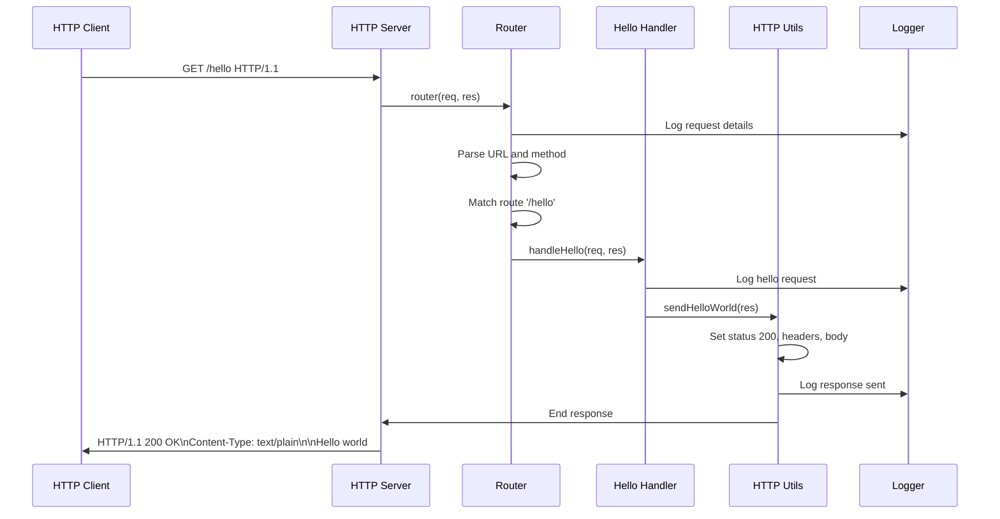
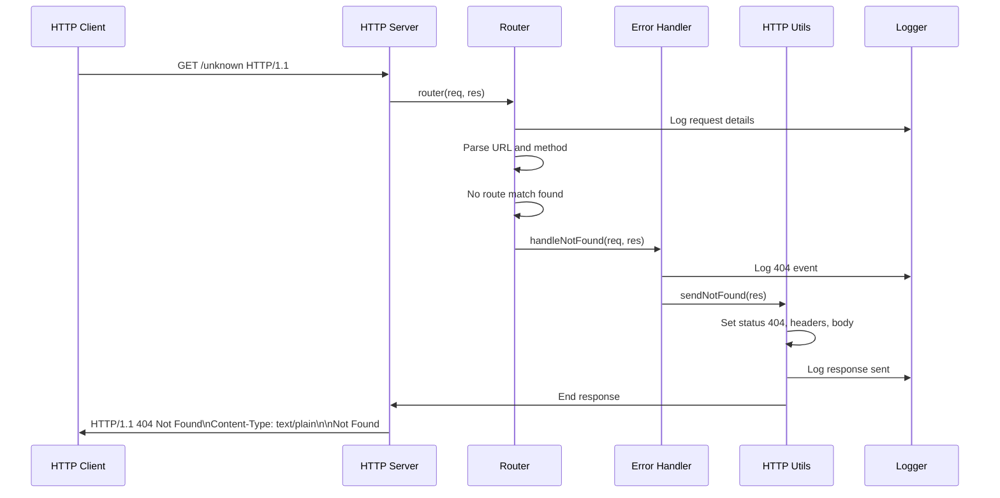
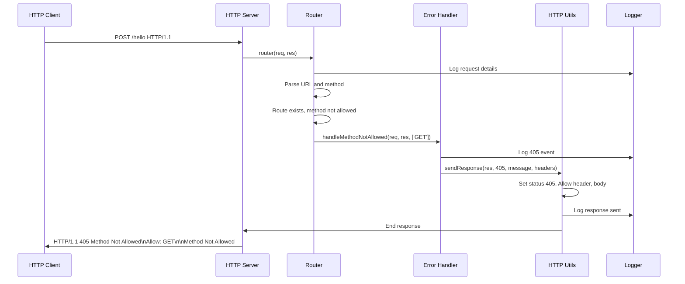

# Node.js Tutorial HTTP Server - Architecture Overview

## Table of Contents
1. [System Architecture Overview](#system-architecture-overview)
2. [Component Responsibilities](#component-responsibilities)
3. [Request/Response Data Flow](#requestresponse-data-flow)
4. [Error Handling and Observability](#error-handling-and-observability)
5. [Design Rationale and Educational Focus](#design-rationale-and-educational-focus)

---

## System Architecture Overview

The Node.js tutorial HTTP server implements a **minimalist single-threaded event-driven architecture** that demonstrates fundamental HTTP server concepts using only Node.js built-in modules. This educational implementation prioritizes clarity and understanding over production complexity while maintaining HTTP/1.1 protocol compliance.

### Architectural Principles

- **Zero External Dependencies**: Uses only Node.js built-in modules (`node:http`, `node:util`) to eliminate complexity and focus on core concepts
- **Event-Driven Processing**: Leverages Node.js event loop for non-blocking I/O operations and concurrent request handling
- **Educational Clarity**: Architecture designed for learning with comprehensive documentation and observable behavior
- **Protocol Compliance**: Maintains HTTP/1.1 standards while keeping implementation simple and understandable

### High-Level Architecture

```
┌─────────────────────────────────────────────────────────┐
│                    HTTP Client                          │
│                 (Web Browser/curl)                      │
└─────────────────────────┬───────────────────────────────┘
                          │ HTTP/1.1 Protocol
                          │ (GET /hello)
                          │
┌─────────────────────────▼───────────────────────────────┐
│                 Node.js HTTP Server                     │
│                 (server.mjs)                            │
│  ┌─────────────────────────────────────────────────────┐│
│  │              Router Module                          ││
│  │              (routes/router.mjs)                    ││
│  │                                                     ││
│  │  ┌─────────────┐  ┌─────────────┐  ┌─────────────┐  ││
│  │  │   Hello     │  │   Error     │  │   Method    │  ││
│  │  │  Handler    │  │  Handler    │  │ Not Allowed │  ││
│  │  │             │  │  (404)      │  │  Handler    │  ││
│  │  └─────────────┘  └─────────────┘  └─────────────┘  ││
│  └─────────────────────────────────────────────────────┘│
│                                                         │
│  ┌─────────────────────────────────────────────────────┐│
│  │              Utility Layer                          ││
│  │  ┌─────────────┐  ┌─────────────┐  ┌─────────────┐  ││
│  │  │   HTTP      │  │   Logger    │  │   Config    │  ││
│  │  │  Utils      │  │             │  │   Manager   │  ││
│  │  └─────────────┘  └─────────────┘  └─────────────┘  ││
│  └─────────────────────────────────────────────────────┘│
└─────────────────────────────────────────────────────────┘
```

### Core Components

| Component | Primary Responsibility | Dependencies |
|-----------|----------------------|--------------|
| **HTTP Server** | Server lifecycle management, connection handling | Node.js `http` module |
| **Router** | Request routing and handler dispatch | Handler modules, Logger |
| **Hello Handler** | `/hello` endpoint response generation | HTTP Utils, Logger |
| **Error Handler** | 404/405 error response generation | HTTP Utils, Logger |
| **HTTP Utils** | Standardized HTTP response utilities | Node.js `http` module |
| **Logger** | Structured logging and observability | Node.js `util` module |
| **Config Manager** | Environment-based configuration | Process environment |

---

## Component Responsibilities

### 1. HTTP Server (`src/backend/server.mjs`)

**Primary Role**: Server lifecycle orchestration and process management

**Key Responsibilities**:
- Creates HTTP server instance using `http.createServer()`
- Manages server startup, binding, and shutdown procedures
- Handles process signals (SIGINT, SIGTERM) for graceful shutdown
- Implements uncaught exception and unhandled rejection handling
- Provides comprehensive logging for server lifecycle events
- Delegates all HTTP request processing to the router module

**Educational Value**: Demonstrates proper server lifecycle management, signal handling, and process management patterns essential for production Node.js applications.

### 2. Router Module (`src/backend/routes/router.mjs`)

**Primary Role**: Central request routing and handler dispatch

**Key Responsibilities**:
- Parses incoming HTTP requests (URL, method, headers)
- Matches request paths against defined route table
- Dispatches requests to appropriate handlers based on path and method
- Implements proper HTTP error handling (404, 405)
- Provides request/response logging for observability
- Maintains centralized route configuration

**Route Configuration**:
```javascript
const ROUTES = {
    '/hello': {
        GET: handleHello
    }
};
```

**Educational Value**: Illustrates routing concepts, URL parsing, method validation, and the foundation for building RESTful APIs.

### 3. Hello Handler (`src/backend/handlers/helloHandler.mjs`)

**Primary Role**: Core tutorial functionality implementation

**Key Responsibilities**:
- Processes GET requests to `/hello` endpoint
- Generates static "Hello world" response
- Implements proper HTTP response formatting
- Provides request/response event logging
- Demonstrates handler pattern for endpoint implementation

**Educational Value**: Shows how to implement specific endpoint logic, proper HTTP response generation, and the separation between routing and business logic.

### 4. Error Handler (`src/backend/handlers/errorHandler.mjs`)

**Primary Role**: HTTP error response management

**Key Responsibilities**:
- **404 Not Found**: Handles requests to undefined routes
- **405 Method Not Allowed**: Handles unsupported HTTP methods with proper `Allow` header
- **500 Internal Server Error**: Handles unexpected server errors securely
- Implements proper HTTP error response formatting
- Provides error event logging without information disclosure

**Educational Value**: Demonstrates proper error handling patterns, HTTP protocol compliance, and security considerations for error responses.

### 5. HTTP Utilities (`src/backend/utils/httpUtils.mjs`)

**Primary Role**: Standardized HTTP response generation

**Key Responsibilities**:
- Provides centralized response formatting functions
- Implements proper HTTP header management
- Ensures protocol compliance across all responses
- Maintains consistent response structure
- Integrates with logging for response tracking

**Core Functions**:
- `sendResponse()`: Generic HTTP response with status, headers, and body
- `sendHelloWorld()`: Specialized function for successful `/hello` responses
- `sendNotFound()`: Standardized 404 error responses
- `setHeaders()`: Centralized header management
- `getStatusMessage()`: HTTP status code to reason phrase mapping

**Educational Value**: Shows how to create reusable utility functions, maintain consistency across responses, and implement proper HTTP protocol compliance.

### 6. Logger (`src/backend/utils/logger.mjs`)

**Primary Role**: Structured logging and observability

**Key Responsibilities**:
- Provides consistent logging interface across all modules
- Implements structured logging with timestamps and severity levels
- Supports variable interpolation using Node.js `util.format()`
- Separates output streams (stdout for info, stderr for warnings/errors)
- Enables comprehensive request/response traceability

**Log Levels**:
- **INFO**: Server startup, request processing, successful responses
- **WARN**: Non-critical issues, protocol warnings, 404/405 errors
- **ERROR**: Critical errors, exceptions, server failures

**Educational Value**: Demonstrates proper logging practices, structured output, and observability patterns essential for debugging and monitoring.

### 7. Configuration Manager (`src/backend/config.mjs`)

**Primary Role**: Environment-based configuration management

**Key Responsibilities**:
- Loads configuration from environment variables
- Provides sensible defaults for development environments
- Validates configuration parameters (port ranges, host formats)
- Implements comprehensive error handling for invalid configurations
- Supports cross-platform compatibility

**Configuration Parameters**:
- **PORT**: Server binding port (default: 3000, range: 1025-65535)
- **HOST**: Server binding host (default: 'localhost')
- **NODE_ENV**: Environment setting (default: 'development')

**Educational Value**: Shows proper configuration management, environment variable handling, and validation patterns for production applications.

---

## Request/Response Data Flow

### 1. Request Reception and Processing

```
HTTP Request → Node.js HTTP Server → Router → Handler → HTTP Response
```

**Detailed Flow**:

1. **Network Reception**: Client sends HTTP request to server port
2. **HTTP Parsing**: Node.js HTTP module parses raw TCP data into request object
3. **Server Processing**: Server emits 'request' event with req/res objects
4. **Router Dispatch**: Router receives request and begins processing
5. **URL Parsing**: Router extracts pathname using WHATWG URL API
6. **Method Validation**: Router verifies HTTP method (GET, POST, etc.)
7. **Route Matching**: Router compares pathname against route table
8. **Handler Selection**: Router identifies appropriate handler function
9. **Handler Execution**: Selected handler processes request and generates response
10. **Response Generation**: Handler uses HTTP utilities to format response
11. **Response Transmission**: Node.js HTTP module sends response to client
12. **Connection Management**: Server maintains or closes connection based on headers

### 2. Successful Request Flow (GET /hello)



### 3. Error Handling Flow (404 Not Found)



### 4. Method Not Allowed Flow (405)



### 5. Data Transformation Points

**Request Transformation**:
- Raw TCP bytes → HTTP request object (Node.js HTTP module)
- Request URL string → Parsed URL object (WHATWG URL API)
- HTTP method string → Normalized uppercase method (Router)

**Response Transformation**:
- Handler logic → HTTP status code and message (Handlers)
- Response data → HTTP headers and body (HTTP Utils)
- Structured response → Raw TCP bytes (Node.js HTTP module)

**Logging Transformation**:
- Event data → Structured log messages (Logger)
- Variable interpolation → Formatted output (util.format)
- Log levels → Appropriate output streams (stdout/stderr)

---

## Error Handling and Observability

### 1. Error Handling Strategy

The application implements a comprehensive error handling strategy that covers all failure scenarios while maintaining security and educational clarity.

**Error Categories**:

1. **Client Errors (4xx)**:
   - **404 Not Found**: Undefined routes, invalid paths
   - **405 Method Not Allowed**: Unsupported HTTP methods with proper `Allow` header

2. **Server Errors (5xx)**:
   - **500 Internal Server Error**: Unexpected runtime errors, exceptions
   - Server startup failures, port binding errors

3. **Process Errors**:
   - Uncaught exceptions with stack trace logging
   - Unhandled promise rejections
   - Process signals (SIGINT, SIGTERM) for graceful shutdown

4. **Network Errors**:
   - Client connection errors
   - Socket timeouts and connection drops

### 2. Error Response Format

All error responses follow consistent formatting:

```
HTTP/1.1 [STATUS_CODE] [REASON_PHRASE]
Content-Type: text/plain; charset=utf-8
Connection: keep-alive
Allow: [METHODS] (for 405 responses only)

[ERROR_MESSAGE]
```

**Security Considerations**:
- Generic error messages prevent information disclosure
- No stack traces or internal details exposed to clients
- Comprehensive logging for debugging without client exposure

### 3. Observability Implementation

**Logging Strategy**:
- **Structured Logging**: Consistent timestamp, level, and message format
- **Event Tracking**: Complete request/response lifecycle logging
- **Error Correlation**: Request context maintained through error flows
- **Performance Monitoring**: Response times and resource usage tracking

**Log Output Examples**:
```
[2024-01-15T10:30:45.123Z] [INFO] Server successfully started and listening on localhost:3000
[2024-01-15T10:30:50.456Z] [INFO] Processing request - Method: GET, Path: /hello, Original URL: /hello
[2024-01-15T10:30:50.458Z] [INFO] Route found for path: /hello
[2024-01-15T10:30:50.459Z] [INFO] Method GET is supported for path /hello - dispatching to handler
[2024-01-15T10:30:50.460Z] [INFO] Hello world response sent successfully
[2024-01-15T10:30:50.461Z] [INFO] HTTP response sent - Status: 200, Message: "Hello world"
```

### 4. Monitoring and Debugging

**Request Tracing**:
- Complete request lifecycle visibility
- Method, URL, headers, and timing information
- Response status, headers, and message logging
- Error context and stack traces for debugging

**Performance Metrics**:
- Server startup time tracking
- Request processing duration
- Memory usage monitoring
- Connection lifecycle management

**Health Indicators**:
- Server listening status
- Port binding success/failure
- Configuration validation results
- Process signal handling status

### 5. Graceful Degradation

**Shutdown Procedures**:
- Signal handling for clean termination
- Connection closure and resource cleanup
- Pending request completion
- Comprehensive shutdown event logging

**Error Recovery**:
- Continued operation after individual request errors
- Graceful handling of client disconnections
- Proper resource cleanup on failures
- Fallback responses for critical errors

---

## Design Rationale and Educational Focus

### 1. Educational Philosophy

The architecture prioritizes **learning outcomes over production complexity**, implementing design patterns that:

- **Demonstrate Core Concepts**: Event-driven programming, HTTP protocol, asynchronous I/O
- **Maintain Simplicity**: Zero external dependencies, minimal abstraction layers
- **Provide Observability**: Comprehensive logging for understanding behavior
- **Enable Extensibility**: Modular design supporting future growth
- **Ensure Reliability**: Proper error handling and graceful degradation

### 2. Architectural Decisions

**Why Event-Driven Architecture?**
- Aligns with Node.js core strengths and design principles
- Demonstrates non-blocking I/O concepts effectively
- Provides foundation for understanding asynchronous programming
- Scales naturally with concurrent request handling

**Why Zero External Dependencies?**
- Eliminates framework complexity that obscures core concepts
- Provides direct exposure to Node.js built-in capabilities
- Reduces security surface area and maintenance overhead
- Enables focused learning on fundamental HTTP server concepts

**Why Modular Component Design?**
- Separates concerns for clarity and maintainability
- Enables selective learning of specific concepts
- Supports testing and validation of individual components
- Provides foundation for scaling to larger applications

### 3. HTTP Protocol Compliance

The implementation maintains strict HTTP/1.1 protocol compliance while keeping complexity minimal:

**Required Headers**:
- `Content-Type`: Proper MIME type specification
- `Connection`: Connection management directives
- `Allow`: Method support indication for 405 responses

**Status Code Usage**:
- **200 OK**: Successful `/hello` responses
- **404 Not Found**: Undefined route handling
- **405 Method Not Allowed**: Unsupported method handling
- **500 Internal Server Error**: Unexpected error handling

**Method Support**:
- **GET**: Implemented for `/hello` endpoint
- **Other Methods**: Properly rejected with 405 responses

### 4. Security Considerations

**Information Disclosure Prevention**:
- Generic error messages without internal details
- No stack traces or debug information in responses
- Secure error logging without client exposure

**Input Validation**:
- URL parsing and normalization
- HTTP method validation
- Configuration parameter validation

**Resource Protection**:
- Port range validation (non-privileged ports)
- Host binding validation
- Process signal handling for controlled shutdown

### 5. Extensibility Design

**Modular Architecture**:
- Clear component boundaries enable selective enhancement
- Centralized configuration supports environment-specific deployment
- Standardized interfaces allow component replacement
- Comprehensive logging enables monitoring and debugging

**Growth Path**:
- Additional endpoints can be added to route table
- New handlers follow established patterns
- HTTP utilities support various response types
- Configuration system accommodates new parameters

**Framework Integration**:
- Architecture provides foundation for Express.js adoption
- Routing patterns translate to framework-based implementations
- Error handling strategies apply to production systems
- Logging practices scale to structured logging systems

### 6. Cross-Platform Compatibility

**Operating System Support**:
- Windows, macOS, Linux compatibility
- Process signal handling across platforms
- Network binding validation for different environments
- Path normalization for consistent behavior

**Node.js Version Compatibility**:
- Built-in module usage ensures version stability
- ES Module syntax for modern JavaScript standards
- Long-term support (LTS) version targeting
- Future-proof implementation patterns

This architectural design provides a solid foundation for understanding HTTP server development while maintaining the flexibility to evolve into production-ready applications. The emphasis on education, observability, and proper engineering practices ensures that learners gain valuable insights into both Node.js development and general web server architecture principles.