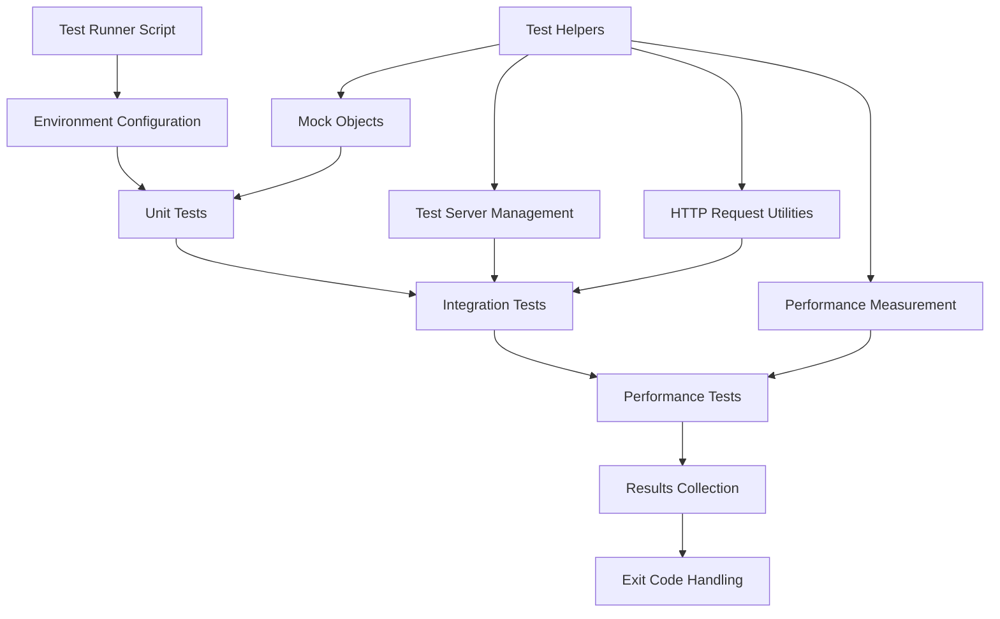

# Node.js Tutorial HTTP Server - Testing Guide

## 1. Introduction

This comprehensive testing guide provides detailed documentation for the testing strategy, methodology, and implementation details of the Node.js tutorial HTTP server project. The guide demonstrates how to validate server functionality, protocol compliance, error handling, and performance using only Node.js built-in modules and the project's own test helpers.

### Testing Philosophy

The Node.js tutorial application implementing a single '/hello' endpoint that returns "Hello world" operates as a **basic educational HTTP server** with a simplified testing approach that demonstrates fundamental testing concepts. Node.js now includes a full-featured test runner that covers most testing needs without any external dependencies.

Our testing philosophy emphasizes:
- **Educational Clarity**: Tests serve as learning examples for Node.js testing concepts
- **Zero External Dependencies**: Using only Node.js built-in modules and project utilities
- **Comprehensive Coverage**: Unit, integration, and performance testing layers
- **Protocol Compliance**: Validating HTTP/1.1 standards and response correctness

### Test Environment Configuration

The testing framework utilizes standardized configuration constants defined in `src/test/utils/testHelpers.mjs`:

```javascript
// Test server configuration constants
export const TEST_PORT = 3100;
export const TEST_HOST = '127.0.0.1';
export const RESPONSE_TIME_THRESHOLD_MS = 100;
```

These constants ensure consistent test environments and prevent conflicts with the main server running on port 3000.

## 2. Testing Strategy Overview

### Layered Testing Approach

The testing strategy follows a layered approach that provides comprehensive coverage while maintaining educational clarity:

| Test Layer | Purpose | Tools | Files |
|------------|---------|--------|-------|
| **Unit Tests** | Isolated logic validation | Node.js built-in test runner, assert | `src/test/unit/*.test.mjs` |
| **Integration Tests** | HTTP request-response cycles | Real HTTP server, httpRequest utility | `src/test/integration/*.test.mjs` |
| **Performance Tests** | Response time validation | measureTime utility, performance monitoring | `src/test/performance/*.test.mjs` |

### Test Framework Selection

The project uses **Node.js built-in test runner** introduced in Node.js 18 and stabilized in Node.js 20:

```javascript
// Node.js built-in test runner and assertion library
import { test, describe } from 'node:test'; // Node.js 22.x (built-in)
import assert from 'node:assert'; // Node.js 22.x (built-in)
```

**Benefits of Node.js Built-in Test Runner:**
- Zero external dependencies for educational clarity
- Native integration with Node.js runtime
- Built-in assertion library and mocking capabilities
- Experimental code coverage support with `--experimental-test-coverage`

### Test Execution Architecture



## 3. Unit Testing

### Unit Testing Methodology

Unit tests validate individual functions and modules in isolation using mock objects and controlled environments. The `src/test/utils/testHelpers.mjs` provides essential utilities for creating test doubles without external mocking libraries.

#### Mock Request Objects

The `mockRequest` function creates HTTP request objects for isolated testing:

```javascript
import { mockRequest } from '../test/utils/testHelpers.mjs';

// Create mock request for unit testing
const mockReq = mockRequest({
    method: 'GET',
    url: '/hello',
    headers: { 'user-agent': 'test-client' },
    body: ''
});
```

**Key Features:**
- EventEmitter-based design for event-driven testing
- Configurable HTTP method, URL, headers, and body
- Minimal read interface for body content simulation
- HTTP version and connection properties for complete simulation

#### Mock Response Objects

The `mockResponse` function creates HTTP response objects that capture all output:

```javascript
import { mockResponse } from '../test/utils/testHelpers.mjs';

// Create mock response for unit testing
const mockRes = mockResponse({
    statusCode: 200,
    headers: { 'content-type': 'text/plain' }
});

// Mock response captures all output for assertions
mockRes.setHeader('x-test-header', 'test-value');
mockRes.write('Hello');
mockRes.end(' world');

// Access captured data for test assertions
const body = mockRes.getBody(); // "Hello world"
const headers = mockRes.getCapturedHeaders(); // { 'content-type': 'text/plain', 'x-test-header': 'test-value' }
```

#### Configuration Override Testing

The `withTestConfig` function enables testing different configurations:

```javascript
import { withTestConfig } from '../test/utils/testHelpers.mjs';

// Test with different environment variables
await withTestConfig(
    { NODE_ENV: 'test', PORT: '4000' },
    async () => {
        // Test code executes with overridden configuration
        const config = getConfig();
        assert.strictEqual(config.port, 4000);
        assert.strictEqual(config.env, 'test');
    }
);
// Original configuration automatically restored
```

### Unit Test Structure Example

```javascript
// test/unit/server.test.mjs
import { test, describe } from 'node:test';
import assert from 'node:assert';
import { mockRequest, mockResponse } from '../utils/testHelpers.mjs';

describe('Server Unit Tests', () => {
    test('should handle request routing correctly', async () => {
        // Arrange
        const mockReq = mockRequest({ method: 'GET', url: '/hello' });
        const mockRes = mockResponse();
        
        // Act
        await router(mockReq, mockRes);
        
        // Assert
        assert.strictEqual(mockRes.statusCode, 200);
        assert.strictEqual(mockRes.getBody(), 'Hello world');
    });
    
    test('should return 404 for unknown routes', async () => {
        // Arrange
        const mockReq = mockRequest({ method: 'GET', url: '/unknown' });
        const mockRes = mockResponse();
        
        // Act
        await router(mockReq, mockRes);
        
        // Assert
        assert.strictEqual(mockRes.statusCode, 404);
    });
});
```

## 4. Integration and End-to-End Testing

### Integration Testing Methodology

Integration tests validate the complete HTTP request-response cycle using real HTTP servers and actual network requests. The `startTestServer` and `httpRequest` utilities provide comprehensive integration testing capabilities.

#### Test Server Management

The `startTestServer` function creates real HTTP server instances for integration testing:

```javascript
import { startTestServer, httpRequest } from '../test/utils/testHelpers.mjs';

// Start a real HTTP server for integration testing
const testServer = await startTestServer(router);

// Server is now listening on TEST_HOST:TEST_PORT (127.0.0.1:3100)
// Ready to accept real HTTP requests
```

#### HTTP Request Testing

The `httpRequest` function performs actual HTTP requests to the test server:

```javascript
// Make real HTTP request to test server
const response = await httpRequest({
    method: 'GET',
    path: '/hello',
    headers: { 'user-agent': 'integration-test' }
});

// Response object contains: { status, headers, body }
assert.strictEqual(response.status, 200);
assert.strictEqual(response.body, 'Hello world');
```

### Integration Test Structure Example

```javascript
// test/integration/hello-endpoint.test.mjs
import { test, describe } from 'node:test';
import assert from 'node:assert';
import { startTestServer, httpRequest } from '../utils/testHelpers.mjs';
import { router } from '../../backend/routes/index.mjs';

describe('Hello Endpoint Integration Tests', () => {
    let testServer;
    
    // Setup: Start test server before each test
    beforeEach(async () => {
        testServer = await startTestServer(router);
    });
    
    // Teardown: Close test server after each test
    afterEach(async () => {
        if (testServer) {
            await new Promise(resolve => testServer.close(resolve));
        }
    });
    
    test('should return hello world for GET /hello', async () => {
        // Make real HTTP request
        const response = await httpRequest({
            method: 'GET',
            path: '/hello'
        });
        
        // Validate complete response
        assert.strictEqual(response.status, 200);
        assert.strictEqual(response.body, 'Hello world');
        assert.strictEqual(response.headers['content-type'], 'text/plain');
    });
    
    test('should return 404 for undefined routes', async () => {
        const response = await httpRequest({
            method: 'GET',
            path: '/undefined'
        });
        
        assert.strictEqual(response.status, 404);
    });
});
```

### End-to-End Testing Scenarios

End-to-end tests cover complete server lifecycle and error scenarios:

```javascript
// test/integration/error-handling.test.mjs
describe('Error Handling E2E Tests', () => {
    test('should handle server startup and shutdown gracefully', async () => {
        // Test complete server lifecycle
        const testServer = await startTestServer(router);
        
        // Verify server is responding
        const response = await httpRequest({ path: '/hello' });
        assert.strictEqual(response.status, 200);
        
        // Test graceful shutdown
        await new Promise(resolve => testServer.close(resolve));
    });
    
    test('should handle malformed requests gracefully', async () => {
        const testServer = await startTestServer(router);
        
        // Test with malformed path
        const response = await httpRequest({
            method: 'GET',
            path: '/hello/../secret'
        });
        
        // Should handle gracefully without crashing
        assert.strictEqual(response.status, 404);
        
        await new Promise(resolve => testServer.close(resolve));
    });
});
```

## 5. Performance Testing

### Performance Testing Methodology

Performance tests validate response time requirements using the `measureTime` utility, ensuring the '/hello' endpoint meets latency thresholds defined in the project requirements.

#### Time Measurement Utility

The `measureTime` function provides high-resolution performance measurement:

```javascript
import { measureTime } from '../test/utils/testHelpers.mjs';

// Measure execution time of async operations
const result = await measureTime(async () => {
    // Perform operation to be measured
    const response = await httpRequest({ path: '/hello' });
    return response;
});

// Result contains: { result: actualResult, ms: elapsedTime }
console.log(`Operation completed in ${result.ms}ms`);
```

#### Performance Thresholds

The project defines performance requirements with configurable thresholds:

```javascript
// Global performance threshold constant
const RESPONSE_TIME_THRESHOLD_MS = 100;

// Performance validation
assert.ok(result.ms < RESPONSE_TIME_THRESHOLD_MS, 
    `Response time ${result.ms}ms exceeds threshold ${RESPONSE_TIME_THRESHOLD_MS}ms`);
```

### Performance Test Structure Example

```javascript
// test/performance/response-time.test.mjs
import { test, describe } from 'node:test';
import assert from 'node:assert';
import { startTestServer, httpRequest, measureTime } from '../utils/testHelpers.mjs';

describe('Response Time Performance Tests', () => {
    let testServer;
    
    beforeEach(async () => {
        testServer = await startTestServer(router);
    });
    
    afterEach(async () => {
        if (testServer) {
            await new Promise(resolve => testServer.close(resolve));
        }
    });
    
    test('should respond to /hello within 100ms', async () => {
        // Measure response time using high-resolution timer
        const result = await measureTime(async () => {
            return await httpRequest({
                method: 'GET',
                path: '/hello'
            });
        });
        
        // Validate response correctness
        assert.strictEqual(result.result.status, 200);
        assert.strictEqual(result.result.body, 'Hello world');
        
        // Validate performance threshold
        assert.ok(result.ms < 100, 
            `Response time ${result.ms}ms exceeds 100ms threshold`);
    });
    
    test('should maintain performance under repeated requests', async () => {
        const requestCount = 10;
        const results = [];
        
        // Perform multiple requests to test consistency
        for (let i = 0; i < requestCount; i++) {
            const result = await measureTime(async () => {
                return await httpRequest({ path: '/hello' });
            });
            results.push(result.ms);
        }
        
        // Calculate average response time
        const averageTime = results.reduce((sum, time) => sum + time, 0) / results.length;
        
        // Validate average performance
        assert.ok(averageTime < 50, 
            `Average response time ${averageTime}ms exceeds 50ms threshold`);
    });
});
```

## 6. Test Automation and CI Integration

### Test Runner Script

The `src/test/scripts/run-tests.mjs` provides comprehensive test automation for all test suites:

```javascript
import { runAllTests } from '../test/scripts/run-tests.mjs';

// Execute all test suites (unit, integration, performance)
await runAllTests();
```

#### Test Execution Flow

The test runner implements a comprehensive execution workflow:

1. **Environment Configuration**: Sets up isolated test environment
2. **Process Spawning**: Uses Node.js child process to run tests
3. **Real-time Feedback**: Pipes stdout/stderr for immediate feedback
4. **Exit Code Handling**: Propagates success/failure to CI/CD pipelines

```javascript
// Test execution with environment isolation
await withTestConfig({
    NODE_ENV: 'test',
    TEST_TIMEOUT: '30000',
    LOG_LEVEL: 'info'
}, async () => {
    // Spawn test runner process
    const testProcess = spawn('node', [
        '--test',
        'src/test/unit/*.test.mjs',
        'src/test/integration/*.test.mjs',
        'src/test/performance/*.test.mjs'
    ], {
        stdio: 'pipe',
        env: { ...process.env, NODE_ENV: 'test' }
    });
    
    // Handle real-time output
    testProcess.stdout.on('data', data => process.stdout.write(data));
    testProcess.stderr.on('data', data => process.stderr.write(data));
});
```

### NPM Scripts Integration

The project integrates with NPM scripts for convenient test execution:

```json
{
  "scripts": {
    "test": "node src/test/scripts/run-tests.mjs",
    "test:unit": "node --test src/test/unit/*.test.mjs",
    "test:integration": "node --test src/test/integration/*.test.mjs",
    "test:performance": "node --test src/test/performance/*.test.mjs",
    "test:coverage": "node --test --experimental-test-coverage src/test/**/*.test.mjs"
  }
}
```

### CI/CD Pipeline Integration

The test runner is designed for seamless CI/CD integration:

```yaml
# Example CI/CD configuration
- name: Run Tests
  run: npm test
  
- name: Run Tests with Coverage
  run: npm run test:coverage
  
- name: Validate Exit Code
  run: |
    if [ $? -ne 0 ]; then
      echo "Tests failed"
      exit 1
    fi
```

## 7. Testing Utilities and Helpers

### Comprehensive Test Helper Library

The `src/test/utils/testHelpers.mjs` provides a complete set of testing utilities:

#### Mock Object Creation

```javascript
// Create mock HTTP request objects
const mockReq = mockRequest({
    method: 'GET',
    url: '/hello',
    headers: { 'user-agent': 'test-client' },
    body: ''
});

// Create mock HTTP response objects
const mockRes = mockResponse({
    statusCode: 200,
    headers: { 'content-type': 'text/plain' }
});
```

#### Test Server Management

```javascript
// Start real HTTP server for integration testing
const testServer = await startTestServer(requestHandler);

// Make HTTP requests to test server
const response = await httpRequest({
    method: 'GET',
    path: '/hello',
    headers: { 'accept': 'text/plain' }
});
```

#### Environment Configuration

```javascript
// Temporarily override configuration for tests
await withTestConfig(
    { NODE_ENV: 'test', PORT: '4000' },
    async () => {
        // Test code with overridden configuration
        const config = getConfig();
        assert.strictEqual(config.port, 4000);
    }
);
```

#### Performance Measurement

```javascript
// Measure execution time with high precision
const result = await measureTime(async () => {
    return await performOperation();
});

console.log(`Operation took ${result.ms}ms`);
```

### Test Utility Usage Examples

#### Unit Test with Mock Objects

```javascript
test('should handle request processing', async () => {
    const mockReq = mockRequest({ 
        method: 'GET', 
        url: '/hello' 
    });
    const mockRes = mockResponse();
    
    // Test the handler function
    await handleRequest(mockReq, mockRes);
    
    // Verify response
    assert.strictEqual(mockRes.statusCode, 200);
    assert.strictEqual(mockRes.getBody(), 'Hello world');
});
```

#### Integration Test with Real Server

```javascript
test('should handle real HTTP requests', async () => {
    const testServer = await startTestServer(router);
    
    const response = await httpRequest({
        method: 'GET',
        path: '/hello'
    });
    
    assert.strictEqual(response.status, 200);
    assert.strictEqual(response.body, 'Hello world');
    
    await new Promise(resolve => testServer.close(resolve));
});
```

## 8. Best Practices and Troubleshooting

### Testing Best Practices

#### Test Organization

- **File Naming**: Use `*.test.mjs` pattern for test files
- **Test Structure**: Follow Arrange-Act-Assert pattern
- **Descriptive Names**: Use behavior-driven test descriptions
- **Test Isolation**: Ensure tests don't depend on each other

#### Error Handling

```javascript
test('should handle errors gracefully', async () => {
    // Test error scenarios
    await assert.rejects(
        async () => {
            await invalidOperation();
        },
        { name: 'Error', message: 'Expected error message' }
    );
});
```

#### Async Testing

```javascript
test('should handle async operations', async () => {
    // Use async/await for asynchronous operations
    const result = await asyncFunction();
    assert.ok(result);
});
```

### Common Troubleshooting Issues

#### Port Conflicts

**Issue**: `EADDRINUSE` error when running tests

**Solution**: Ensure `TEST_PORT` (3100) is available or use dynamic port allocation:

```javascript
// Use dynamic port allocation if needed
const testServer = await startTestServer(router);
const actualPort = testServer.address().port;
```

#### Test Timeout Issues

**Issue**: Tests timeout or hang indefinitely

**Solution**: Implement proper cleanup and timeout handling:

```javascript
test('should complete within timeout', async () => {
    const controller = new AbortController();
    const timeoutId = setTimeout(() => controller.abort(), 5000);
    
    try {
        await operationWithTimeout({ signal: controller.signal });
    } finally {
        clearTimeout(timeoutId);
    }
});
```

#### Environment Variable Conflicts

**Issue**: Tests fail due to environment variable conflicts

**Solution**: Use `withTestConfig` for proper isolation:

```javascript
await withTestConfig(
    { NODE_ENV: 'test', PORT: undefined },
    async () => {
        // Test with clean environment
        const config = getConfig();
        assert.strictEqual(config.port, 3000); // Default port
    }
);
```

### Performance Troubleshooting

#### Memory Leaks

Monitor memory usage during tests:

```javascript
test('should not leak memory', async () => {
    const initialMemory = process.memoryUsage().heapUsed;
    
    // Perform operations
    for (let i = 0; i < 1000; i++) {
        await performOperation();
    }
    
    // Force garbage collection if available
    if (global.gc) {
        global.gc();
    }
    
    const finalMemory = process.memoryUsage().heapUsed;
    const memoryIncrease = finalMemory - initialMemory;
    
    // Verify memory usage is reasonable
    assert.ok(memoryIncrease < 10_000_000, 
        `Memory increased by ${memoryIncrease} bytes`);
});
```

## 9. Extending the Test Suite

### Adding New Test Cases

#### New Endpoint Testing

When adding new endpoints to the server:

```javascript
// test/integration/new-endpoint.test.mjs
describe('New Endpoint Tests', () => {
    test('should handle new endpoint correctly', async () => {
        const testServer = await startTestServer(router);
        
        const response = await httpRequest({
            method: 'GET',
            path: '/new-endpoint'
        });
        
        assert.strictEqual(response.status, 200);
        // Add specific assertions for new endpoint
        
        await new Promise(resolve => testServer.close(resolve));
    });
});
```

#### Custom Test Utilities

Create project-specific test utilities:

```javascript
// test/utils/customHelpers.mjs
export function createTestData(options = {}) {
    return {
        id: options.id || 'test-id',
        name: options.name || 'test-name',
        value: options.value || 'test-value'
    };
}

export async function validateResponse(response, expectedData) {
    assert.strictEqual(response.status, 200);
    assert.deepStrictEqual(JSON.parse(response.body), expectedData);
}
```

### Test Configuration Extensions

#### Custom Environment Variables

```javascript
// test/config/testConfig.mjs
export const TEST_CONFIG = {
    // Custom test configuration
    TEST_TIMEOUT: 30000,
    MAX_RETRIES: 3,
    PERFORMANCE_THRESHOLD: 100
};

export async function withCustomConfig(config, testFn) {
    return await withTestConfig(config, testFn);
}
```

#### Extended Mock Objects

```javascript
// test/utils/advancedMocks.mjs
export function createAdvancedMockRequest(options) {
    const mockReq = mockRequest(options);
    
    // Add custom methods
    mockReq.getRemoteAddress = () => '127.0.0.1';
    mockReq.isSecure = () => false;
    
    return mockReq;
}
```

## 10. References

### Node.js Documentation

- [Node.js Test Runner](https://nodejs.org/api/test.html) - Official Node.js test runner documentation
- [Node.js Assert Module](https://nodejs.org/api/assert.html) - Built-in assertion library
- [Node.js HTTP Module](https://nodejs.org/api/http.html) - HTTP server and client functionality
- [Node.js Performance Hooks](https://nodejs.org/api/perf_hooks.html) - Performance measurement APIs

### Project Files Reference

- `src/backend/server.mjs` - Main HTTP server implementation
- `src/backend/config.mjs` - Configuration management
- `src/test/utils/testHelpers.mjs` - Test utilities and helpers
- `src/test/scripts/run-tests.mjs` - Test automation script

### Testing Framework Resources

- [Testing in Node.js](https://nodejs.org/en/docs/guides/testing/) - Official Node.js testing guide
- [Node.js Best Practices](https://github.com/goldbergyoni/nodebestpractices) - Testing best practices
- [HTTP Testing](https://developer.mozilla.org/en-US/docs/Web/HTTP/Testing) - HTTP protocol testing concepts

### Educational Resources

- [Node.js Tutorial](https://nodejs.org/en/docs/guides/getting-started-guide/) - Getting started with Node.js
- [HTTP Server Fundamentals](https://nodejs.org/en/docs/guides/anatomy-of-an-http-transaction/) - HTTP transaction anatomy
- [Testing Best Practices](https://github.com/goldbergyoni/javascript-testing-best-practices) - JavaScript testing guidelines

---

This testing guide serves as a comprehensive reference for understanding and implementing testing strategies for the Node.js tutorial HTTP server project. The guide is designed to be both educational and practical, providing concrete examples and best practices for testing Node.js applications using built-in modules and utilities.

For additional questions or contributions to the test suite, please refer to the project's main documentation and the specific test files mentioned throughout this guide.