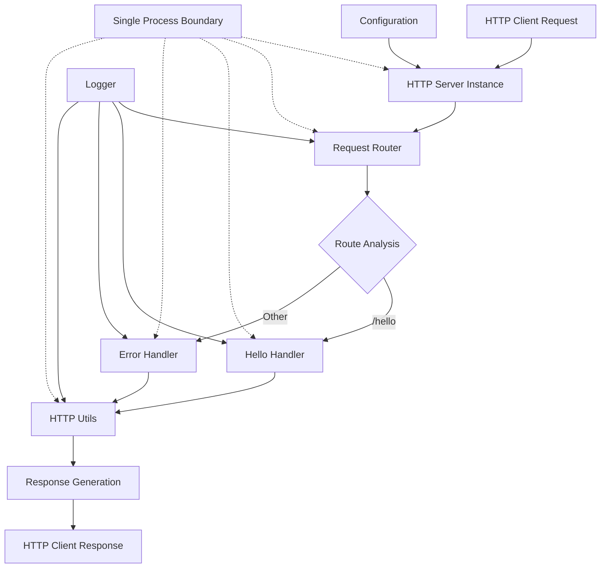
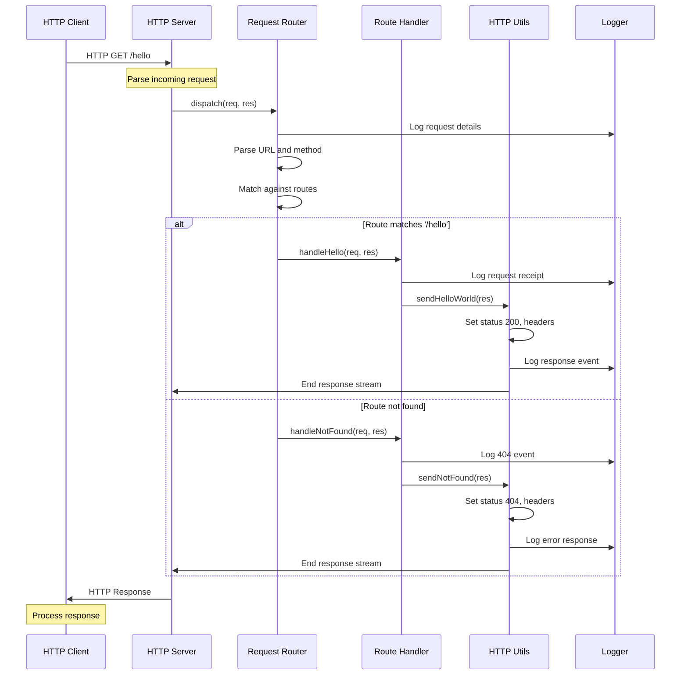
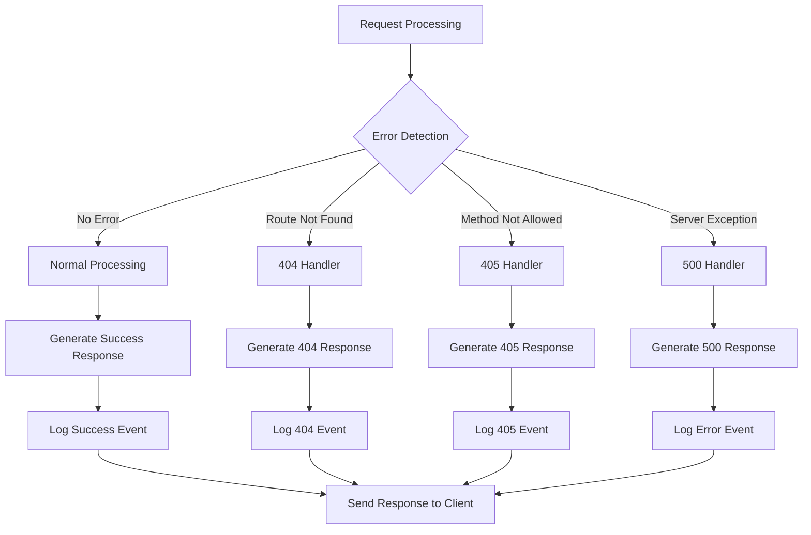

# Node.js Tutorial HTTP Server - Architecture Documentation

## Table of Contents
1. [Introduction](#introduction)
2. [System Overview](#system-overview)
3. [Component Breakdown](#component-breakdown)
4. [Data Flow and Request Lifecycle](#data-flow-and-request-lifecycle)
5. [Routing and Handler Logic](#routing-and-handler-logic)
6. [Error Handling Architecture](#error-handling-architecture)
7. [Configuration and Extensibility](#configuration-and-extensibility)
8. [Educational Rationale and Best Practices](#educational-rationale-and-best-practices)
9. [Cross-References](#cross-references)

## Introduction

This document provides a comprehensive architectural overview of the Node.js tutorial HTTP server, a minimalist educational application designed to demonstrate fundamental HTTP server concepts using Node.js built-in modules. The server implements a single `/hello` endpoint that returns "Hello world" responses, serving as a foundational example for developers learning Node.js and web server development.

### Architectural Goals

The architecture emphasizes **simplicity and educational clarity** by utilizing only Node.js built-in modules without external framework dependencies. The design follows a **minimalist single-threaded event-driven architecture** that demonstrates core HTTP server concepts including request processing, routing logic, response generation, and error handling.

### Event-Driven Design Rationale

Node.js employs a "Single Threaded Event Loop" design to manage concurrent clients, making it ideal for educational purposes where understanding core concepts takes precedence over production complexity. The Node.js HTTP API is deliberately low-level, dealing with stream handling and message parsing to provide direct exposure to fundamental web server mechanics.

## System Overview

### High-Level Architecture

The system follows a **monolithic architecture pattern** optimized for educational purposes and development environments. The architecture consists of five major components working together to process HTTP requests and generate appropriate responses:



### Core Components Summary

| Component | Primary Responsibility | Location |
|-----------|------------------------|----------|
| **HTTP Server** | Request reception and connection management | `server.mjs` |
| **Request Router** | URL parsing and handler dispatch | `routes/router.mjs` |
| **Hello Handler** | `/hello` endpoint response generation | `handlers/helloHandler.mjs` |
| **Error Handler** | 404/405 error response processing | `handlers/errorHandler.mjs` |
| **HTTP Utilities** | Standardized response formatting | `utils/httpUtils.mjs` |
| **Logger** | Structured logging and observability | `utils/logger.mjs` |
| **Configuration** | Environment-based server configuration | `config.mjs` |

## Component Breakdown

### HTTP Server Component

**Location**: `server.mjs`  
**Purpose**: Foundational component that creates and manages the HTTP server infrastructure using Node.js built-in HTTP module.

**Key Responsibilities**:
- HTTP server instance creation using `createServer()`
- Port binding and network interface management
- Request event handling and dispatch to router
- Server lifecycle management (startup/shutdown)
- Process signal handling for graceful termination

**Technology Stack**:
- Node.js HTTP module (`node:http`)
- ES Modules (ESM) for modern JavaScript standards
- Event-driven request processing architecture

### Request Router Component

**Location**: `routes/router.mjs`  
**Implementation**: `router(req, res)`

**Purpose**: Central dispatch mechanism that analyzes incoming HTTP requests and routes them to appropriate handlers based on URL path and HTTP method matching.

**Key Responsibilities**:
- URL parsing using WHATWG URL API
- Path normalization (trailing slash handling)
- HTTP method validation and case normalization
- Route matching against defined endpoint table
- Handler function dispatch with error handling
- Request logging for observability

**Routing Table Structure**:
```javascript
const ROUTES = {
    '/hello': {
        GET: handleHello
    }
};
```

**Request Processing Flow**:
1. Extract pathname from `req.url` using URL API
2. Normalize pathname (remove trailing slashes)
3. Extract and normalize HTTP method
4. Log incoming request details
5. Match pathname against ROUTES table
6. Validate HTTP method for matched route
7. Dispatch to appropriate handler or error handler

### Hello Handler Component

**Location**: `handlers/helloHandler.mjs`  
**Implementation**: `handleHello(req, res)`

**Purpose**: Processes HTTP GET requests to the `/hello` endpoint and generates the primary tutorial functionality - the "Hello world" response.

**Key Responsibilities**:
- Request receipt logging for observability
- Response generation via HTTP utilities
- Success event logging for request traceability
- Error handling for runtime issues

**Implementation Pattern**:
```javascript
export function handleHello(req, res) {
    logInfo('Received request to /hello endpoint - Method: %s, URL: %s', req.method, req.url);
    sendHelloWorld(res);
    logInfo('Successfully processed /hello request - Status: %d, Message: "%s"', 200, 'Hello world');
}
```

### Error Handler Component

**Location**: `handlers/errorHandler.mjs`  
**Implementation**: `handleNotFound(req, res)`, `handleMethodNotAllowed(req, res, allowedMethods)`, `handleServerError(req, res, error)`

**Purpose**: Provides comprehensive error handling for various HTTP error conditions while maintaining protocol compliance and security best practices.

**Key Responsibilities**:
- **404 Not Found**: Handles requests to undefined routes
- **405 Method Not Allowed**: Handles unsupported HTTP methods with required Allow header
- **500 Internal Server Error**: Handles server-side exceptions with secure error responses
- Error event logging for debugging and monitoring
- Information disclosure prevention through generic error messages

**Error Handling Strategy**:
- Generic error messages to prevent information leakage
- Proper HTTP status codes and headers
- Comprehensive error logging for debugging
- Fallback error handling for critical failures

### HTTP Utilities Component

**Location**: `utils/httpUtils.mjs`  
**Implementation**: `sendResponse()`, `sendNotFound()`, `sendHelloWorld()`, `setHeaders()`, `getStatusMessage()`

**Purpose**: Provides centralized HTTP response generation with consistent formatting, protocol compliance, and header management.

**Key Responsibilities**:
- Standardized response formatting across all endpoints
- HTTP status code and header management
- Protocol compliance with HTTP/1.1 standards
- Response logging for observability
- Error handling for response generation failures

**Default Headers Configuration**:
```javascript
export const DEFAULT_HEADERS = {
    'Content-Type': 'text/plain; charset=utf-8',
    'Connection': 'keep-alive'
};
```

### Logger Component

**Location**: `utils/logger.mjs`  
**Implementation**: `logInfo()`, `logWarn()`, `logError()`

**Purpose**: Provides structured logging with standardized formatting, timestamps, and appropriate output streams for different log levels.

**Key Responsibilities**:
- Standardized log message formatting with timestamps
- Log level differentiation (INFO, WARN, ERROR)
- Appropriate output stream routing (stdout/stderr)
- Variable interpolation using Node.js util.format
- Consistent log line structure for parsing and analysis

**Log Format Structure**:
```
[2024-01-15T10:30:45.123Z] [INFO] HTTP response sent - Status: 200, Message: "Hello world"
```

### Configuration Component

**Location**: `config.mjs`  
**Implementation**: `getConfig()`

**Purpose**: Centralized configuration management with environment variable support, validation, and fallback values.

**Key Responsibilities**:
- Environment variable parsing and validation
- Default value provisioning for missing configuration
- Port number validation (1025-65535 range)
- Host string validation and sanitization
- Node.js environment detection (development/production)
- Configuration loading logging and error handling

**Configuration Parameters**:
- **PORT**: Server binding port (default: 3000)
- **HOST**: Server binding host (default: localhost)
- **NODE_ENV**: Node.js environment (default: development)

## Data Flow and Request Lifecycle

### Request Processing Pipeline

The system processes HTTP requests through a linear pipeline that demonstrates the complete request-response cycle:



### Step-by-Step Request Lifecycle

1. **Request Reception**: Node.js HTTP server receives raw HTTP request data through TCP socket
2. **Request Object Creation**: HTTP module parses raw data into structured request object
3. **Router Dispatch**: Server invokes router function with request and response objects
4. **URL Parsing**: Router extracts pathname using WHATWG URL API and normalizes path
5. **Method Extraction**: Router extracts and normalizes HTTP method to uppercase
6. **Route Matching**: Router compares pathname against defined ROUTES table
7. **Handler Dispatch**: Router invokes appropriate handler function or error handler
8. **Response Generation**: Handler calls HTTP utilities to generate standardized response
9. **Header Setting**: Utilities set appropriate HTTP headers (Content-Type, Connection)
10. **Status Code Assignment**: Utilities set HTTP status code (200, 404, 405, 500)
11. **Body Writing**: Utilities write response body content to response stream
12. **Response Transmission**: Server sends complete HTTP response to client
13. **Logging**: Logger records request/response events for observability
14. **Connection Cleanup**: Server maintains or closes connection based on headers

### Data Transformation Points

**Raw HTTP to Request Object**: Node.js HTTP module transforms incoming byte stream into structured JavaScript object with properties for method, URL, headers, and body.

**URL String to Route Parameters**: Router extracts pathname from full URL, normalizes trailing slashes, and prepares for string comparison against route definitions.

**Handler Logic to HTTP Response**: Response generators transform application logic into HTTP-compliant format with proper status codes, headers, and body content.

## Routing and Handler Logic

### Routing Architecture

The routing system implements a **table-based approach** with exact string matching for educational clarity and simplicity:

```javascript
const ROUTES = {
    '/hello': {
        GET: handleHello
    }
};
```

### Route Matching Algorithm

1. **URL Normalization**: Remove trailing slashes (except root path)
2. **Method Normalization**: Convert HTTP method to uppercase
3. **Route Lookup**: Check if pathname exists in ROUTES table
4. **Method Validation**: Verify HTTP method is supported for matched route
5. **Handler Dispatch**: Call appropriate handler function or error handler

### Hello Endpoint Logic

The `/hello` endpoint demonstrates the complete request-response cycle:

**Request Validation**:
- Exact path match: `/hello` (case-sensitive)
- HTTP method validation: GET only
- Header extraction for logging purposes

**Response Generation**:
- Status code: 200 OK
- Content-Type: text/plain; charset=utf-8
- Connection: keep-alive
- Body content: "Hello world"

**Implementation Pattern**:
```javascript
// Route definition
'/hello': {
    GET: handleHello
}

// Handler implementation
export function handleHello(req, res) {
    logInfo('Received request to /hello endpoint - Method: %s, URL: %s', req.method, req.url);
    sendHelloWorld(res);
    logInfo('Successfully processed /hello request - Status: %d, Message: "%s"', 200, 'Hello world');
}
```

### Error Routing Logic

**404 Not Found**: Triggered when pathname doesn't exist in ROUTES table
- Generic "Not Found" message
- HTTP 404 status code
- Standard plain text headers

**405 Method Not Allowed**: Triggered when pathname exists but method is unsupported
- Generic "Method Not Allowed" message
- HTTP 405 status code
- Required Allow header with supported methods

## Error Handling Architecture

### Error Handling Strategy

The system implements **defense-in-depth error handling** with multiple layers of error detection, logging, and response generation:



### Error Categories and Handling

**Client Errors (4xx)**:
- **404 Not Found**: Undefined routes, logged as warnings
- **405 Method Not Allowed**: Unsupported methods with Allow header

**Server Errors (5xx)**:
- **500 Internal Server Error**: Unexpected exceptions, logged as errors
- Generic error messages to prevent information disclosure

**Network Errors**:
- Connection timeouts handled by Node.js HTTP module
- Socket errors logged and connections closed gracefully

### Security Considerations

**Information Disclosure Prevention**:
- Generic error messages without sensitive details
- Error details logged server-side only
- Stack traces never sent to clients

**Error Response Standardization**:
- Consistent response format across all error types
- Proper HTTP status codes and headers
- Secure default headers for all responses

## Configuration and Extensibility

### Configuration Management

The system implements **centralized configuration** through environment variables with comprehensive validation and fallback values:

```javascript
export function getConfig() {
    // PORT validation: 1025-65535 range
    // HOST validation: Non-empty string
    // NODE_ENV validation: Development/production
    return { port, host, env };
}
```

### Configuration Parameters

| Parameter | Environment Variable | Default Value | Validation |
|-----------|---------------------|---------------|------------|
| **Port** | `PORT` | 3000 | Integer, 1025-65535 range |
| **Host** | `HOST` | localhost | Non-empty string |
| **Environment** | `NODE_ENV` | development | Non-empty string |

### Extensibility Architecture

The current architecture supports future extensions through several design patterns:

**Route Expansion**:
```javascript
const ROUTES = {
    '/hello': { GET: handleHello },
    '/users': { GET: handleUsers, POST: createUser },
    '/health': { GET: handleHealth }
};
```

**Handler Modularity**:
- Handlers are modular functions that can be easily extended
- HTTP utilities provide consistent response formatting
- Logger provides structured logging for new endpoints

**Middleware Pattern Support**:
The router architecture can be extended to support middleware:
```javascript
const middleware = [authenticateUser, validateRequest, handleRoute];
```

**Configuration Extensions**:
- Additional environment variables can be added to `getConfig()`
- Validation logic can be extended for new parameters
- Default values can be customized for different environments

## Educational Rationale and Best Practices

### Architectural Choices for Learning

**Zero External Dependencies**:
- Relies exclusively on Node.js built-in modules
- Eliminates framework abstractions that could obscure learning
- Provides direct exposure to HTTP protocol mechanics

**Event-Driven Processing**:
- Demonstrates Node.js core architectural principles
- Shows asynchronous, non-blocking I/O operations
- Illustrates single-threaded event loop design

**Modular Component Design**:
- Separates concerns into logical modules
- Enables incremental learning of each component
- Facilitates code reuse and maintainability

### Best Practices Demonstrated

**HTTP Protocol Compliance**:
- Proper status codes and reason phrases
- Standard HTTP headers (Content-Type, Connection)
- Protocol-compliant error responses

**Error Handling Patterns**:
- Comprehensive error detection and logging
- Graceful degradation for edge cases
- Security-conscious error response design

**Logging and Observability**:
- Structured logging with timestamps and levels
- Request/response cycle traceability
- Error event tracking for debugging

**Configuration Management**:
- Environment variable support for deployment flexibility
- Validation and fallback for robust operation
- Centralized configuration loading

### Code Quality Standards

**Documentation**:
- Comprehensive inline comments explaining concepts
- Educational purpose statements for each component
- Design principle documentation

**Testing Readiness**:
- Modular design enables unit testing
- Clear separation of concerns
- Deterministic behavior for test scenarios

**Maintainability**:
- Consistent code style and patterns
- Clear naming conventions
- Logical file organization

## Cross-References

### Related Documentation

**API Documentation**: [`src/backend/docs/api.md`](./api.md)
- Endpoint specifications and usage examples
- Request/response format documentation
- Error code reference and handling

**Technical Specifications**: Project technical specification document
- Detailed requirements and acceptance criteria
- System architecture diagrams
- Performance and scalability considerations

### Code References

**Main Server Entry Point**: [`src/backend/server.mjs`](../server.mjs)
- Server initialization and lifecycle management
- Process signal handling and graceful shutdown
- Request handler integration with router

**Request Router**: [`src/backend/routes/router.mjs`](../routes/router.mjs)
- Central routing logic and handler dispatch
- URL parsing and method validation
- Route matching algorithm implementation

**Hello Handler**: [`src/backend/handlers/helloHandler.mjs`](../handlers/helloHandler.mjs)
- Primary endpoint implementation
- Response generation and logging
- Educational request processing example

**Error Handler**: [`src/backend/handlers/errorHandler.mjs`](../handlers/errorHandler.mjs)
- Comprehensive error handling patterns
- HTTP protocol compliance for error responses
- Security-conscious error message generation

**HTTP Utilities**: [`src/backend/utils/httpUtils.mjs`](../utils/httpUtils.mjs)
- Standardized response formatting
- HTTP header management
- Protocol compliance utilities

**Logger**: [`src/backend/utils/logger.mjs`](../utils/logger.mjs)
- Structured logging implementation
- Log level management and formatting
- Output stream routing

**Configuration**: [`src/backend/config.mjs`](../config.mjs)
- Environment variable processing
- Configuration validation and defaults
- Server parameter management

### Learning Resources

**Node.js Documentation**: [Node.js Official Documentation](https://nodejs.org/docs/)
- HTTP module reference and examples
- Event loop and asynchronous programming
- Built-in modules and API reference

**HTTP/1.1 Specification**: [RFC 7230-7235](https://tools.ietf.org/html/rfc7230)
- Protocol standards and compliance requirements
- Status codes and header specifications
- Request/response format documentation

**JavaScript Standards**: [ECMAScript Specification](https://tc39.es/ecma262/)
- ES Modules and import/export syntax
- Modern JavaScript features and patterns
- Language specification reference

---

*This architectural documentation serves as a comprehensive guide for understanding the Node.js tutorial HTTP server design, implementation, and educational objectives. The architecture demonstrates fundamental web server concepts while maintaining simplicity and clarity for learning purposes.*